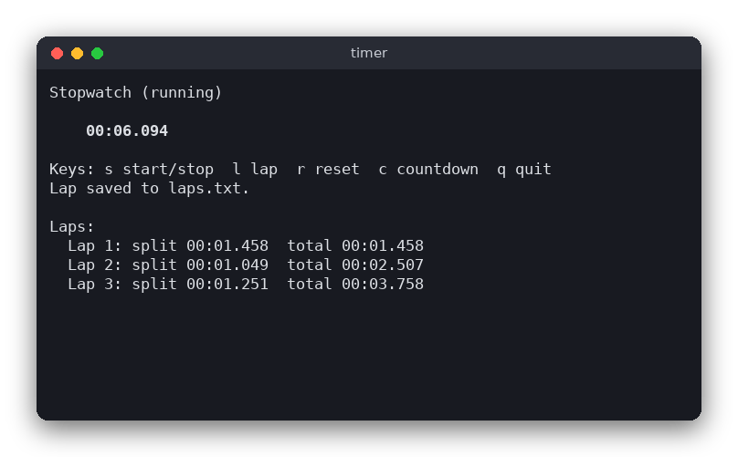
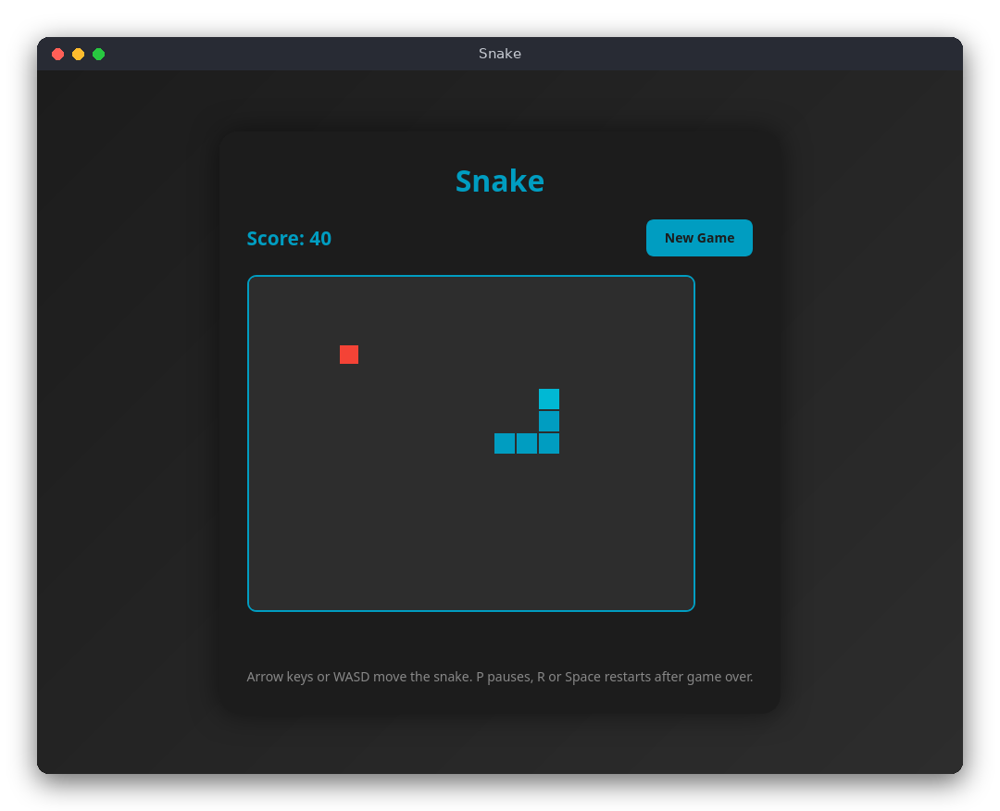
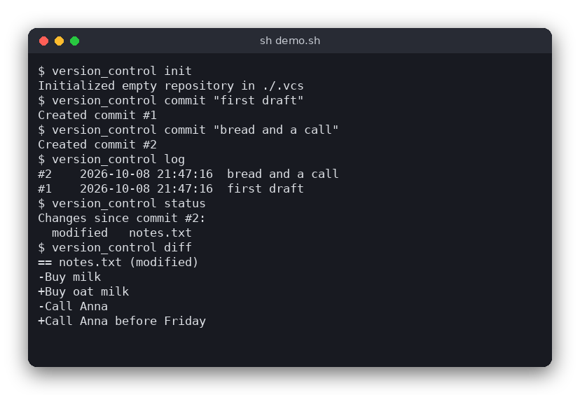
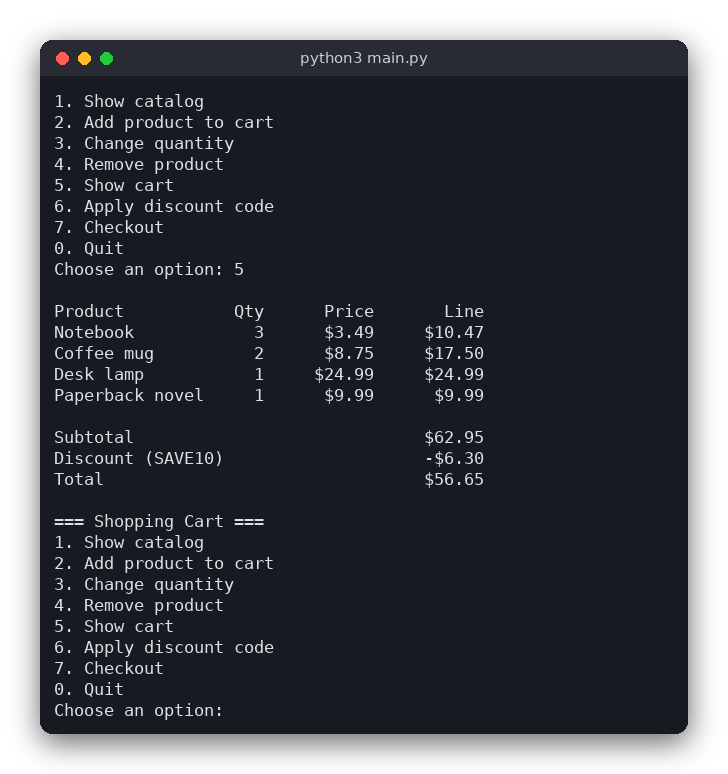
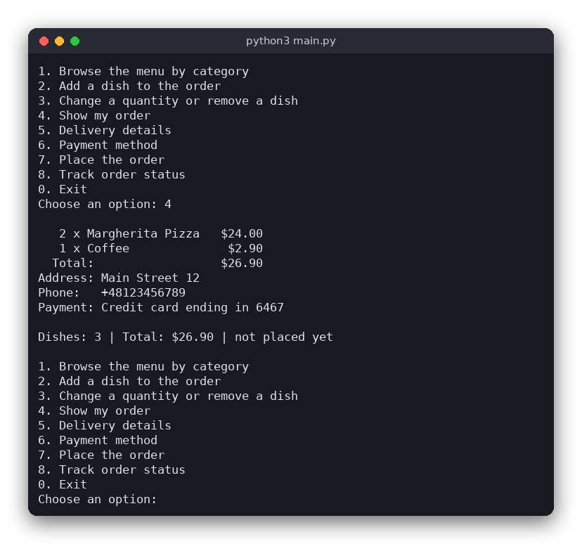
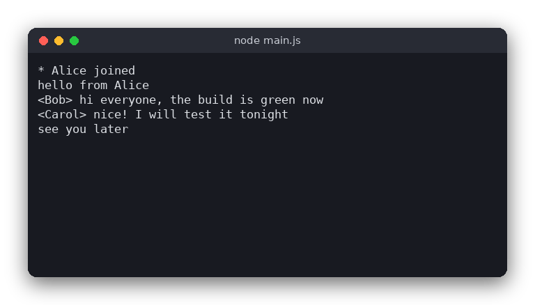

<div align="center">

# 🚀 Proste Projekty

### *Twój przewodnik po świecie programowania*

[](https://github.com/djeada/Proste-Projekty/stargazers)
[](https://github.com/djeada/Proste-Projekty/network/members)
[](https://github.com/djeada/Proste-Projekty/issues)
[](https://www.gnu.org/licenses/gpl-3.0)
[](http://makeapullrequest.com)

**Kompleksowy zbiór porad, zasobów i gotowych projektów dla początkujących programistów**

*Zawiera szczegółowe wytyczne, przykłady realizacji projektów oraz szablony startowe w najpopularniejszych technologiach*

[🎯 Rozpocznij naukę](#-jak-efektywnie-rozpocząć-swój-pierwszy-projekt) • [📚 Dobre praktyki](#-tak-zwane-dobre-praktyki-programowania) • [🎮 Projekty](#-lista-projektów-programistycznych) • [📦 Szablony](#-szablony-projektów) • [🔗 Zasoby](#-dodatkowe-materiały)

---

</div>

## 📋 Spis Treści

- [🎯 Jak efektywnie rozpocząć swój pierwszy projekt?](#-jak-efektywnie-rozpocząć-swój-pierwszy-projekt)
- [✨ Tak zwane dobre praktyki programowania](#-tak-zwane-dobre-praktyki-programowania)
  - [🎁 Korzyści z dobrych praktyk](#-korzyści-z-dobrych-praktyk)
  - [📂 Organizacja projektu](#-organizacja-projektu)
  - [🔤 Zmienne](#-zmienne)
  - [🔀 Warunki](#-warunki)
  - [⚙️ Funkcje](#️-funkcje)
  - [📦 Klasy](#-klasy-1)
  - [💬 Komentarze](#-komentarze)
  - [🛡️ Obsługa błędów](#️-obsługa-błędów)
  - [🗂️ Struktury danych](#️-struktury-danych)
  - [🧪 Testy](#-testy)
- [🏗️ Jak zorganizować projekt](#️-jak-zorganizować-projekt)
- [🎮 Lista projektów programistycznych](#-lista-projektów-programistycznych)
- [📦 Szablony projektów](#-szablony-projektów)
- [📚 Dodatkowe materiały](#-dodatkowe-materiały)
- [🤝 Jak możesz pomóc?](#-jak-możesz-pomóc)
- [📜 Licencja](#-licencja)

---

## 🎯 Jak efektywnie rozpocząć swój pierwszy projekt?

<div align="center">

*Przewodnik krok po kroku dla początkujących programistów*

</div>

<table>
<tr>
<td width="60"><div align="center">📚</div></td>
<td>
<b>Opanuj podstawy</b><br/>
Kiedy rozpoczynamy naukę programowania, opanowanie <i>podstaw</i> pozwala zrozumieć takie elementy jak zmienne czy pętle, a ich brak prowadzi do trudności w rozwiązywaniu nawet prostych zadań.
<br/><br/>
<details>
<summary>💡 Przykład</summary>
Nieznajomość instrukcji warunkowych uniemożliwia stworzenie prostego kalkulatora, który reaguje różnie w zależności od wybranej operacji.
</details>
</td>
</tr>

<tr>
<td width="60"><div align="center">💡</div></td>
<td>
<b>Znajdź inspirację</b><br/>
Inspiracja codziennymi problemami ułatwia wybór <i>tematu</i> projektu, podczas gdy brak kierunku skutkuje odkładaniem pracy.
<br/><br/>
<details>
<summary>💡 Przykład</summary>
Prostym przykładem może być stworzenie programu do zarządzania listą zakupów lub organizowania codziennych zadań.
</details>
</td>
</tr>

<tr>
<td width="60"><div align="center">🎨</div></td>
<td>
<b>Bądź oryginalny</b><br/>
Tworzenie unikalnych rozwiązań rozwija <i>oryginalność</i>, natomiast kopiowanie cudzych projektów ogranicza kreatywność.
<br/><br/>
<details>
<summary>💡 Przykład</summary>
Dobrym przykładem jest modyfikacja istniejącej gry, aby dodać nowe zasady, tryby gry lub własne grafiki.
</details>
</td>
</tr>

<tr>
<td width="60"><div align="center">🎯</div></td>
<td>
<b>Oceń możliwości</b><br/>
Ocena własnych możliwości wspiera <i>realność</i> projektu, a jej brak prowadzi do frustracji i porzucenia pracy.
<br/><br/>
<details>
<summary>💡 Przykład</summary>
Lepiej zacząć od prostego kalkulatora zamiast od razu budować pełną aplikację społecznościową z bazą danych i autoryzacją.
</details>
</td>
</tr>

<tr>
<td width="60"><div align="center">💻</div></td>
<td>
<b>Skonfiguruj środowisko</b><br/>
Pobranie i konfiguracja <i>środowiska programistycznego</i> umożliwia sprawną pracę, a jego brak utrudnia pisanie i uruchamianie kodu.
<br/><br/>
<details>
<summary>💡 Przykład</summary>
Użycie VS Code z rozszerzeniami dla danego języka zamiast zwykłego edytora tekstowego znacznie przyspiesza rozwój projektu.
</details>
</td>
</tr>

<tr>
<td width="60"><div align="center">📁</div></td>
<td>
<b>Uporządkuj strukturę</b><br/>
Przygotowanie logicznej <i>struktury projektu</i> ułatwia zarządzanie plikami, a jej brak prowadzi do chaosu w kodzie.
<br/><br/>
<details>
<summary>💡 Przykład</summary>
Podział aplikacji na foldery „src" (kod źródłowy), „tests" (testy), „docs" (dokumentacja) i „assets" (zasoby graficzne).
</details>
</td>
</tr>

<tr>
<td width="60"><div align="center">📝</div></td>
<td>
<b>Zacznij dokumentację</b><br/>
Rozpoczęcie pracy nad <i>dokumentacją</i> wspiera czytelność projektu, a jej brak utrudnia innym zrozumienie jego działania.
<br/><br/>
<details>
<summary>💡 Przykład</summary>
Dodanie pliku README.md z opisem projektu, instrukcją instalacji i przykładami użycia już na początku pracy.
</details>
</td>
</tr>

<tr>
<td width="60"><div align="center">🔄</div></td>
<td>
<b>Używaj Git</b><br/>
Wdrożenie <i>Git</i> zapewnia kontrolę wersji kodu, a jego brak utrudnia cofnięcie się do stabilnych rozwiązań.
<br/><br/>
<details>
<summary>💡 Przykład</summary>
Zapisanie każdej nowej funkcji w osobnym commicie pozwala łatwo cofnąć zmiany, które wprowadzają błędy.
</details>
</td>
</tr>

<tr>
<td width="60"><div align="center">☕</div></td>
<td>
<b>Rób przerwy</b><br/>
Krótka przerwa sprzyja <i>refleksji</i>, podczas gdy jej brak powoduje utratę świeżego spojrzenia.
<br/><br/>
<details>
<summary>💡 Przykład</summary>
Po godzinie kodowania zrób 15-minutową przerwę – często wtedy zauważysz proste błędy, których wcześniej nie widziałeś.
</details>
</td>
</tr>

<tr>
<td width="60"><div align="center">➕</div></td>
<td>
<b>Rozwijaj stopniowo</b><br/>
Stopniowe dodawanie <i>funkcjonalności</i> zgodnie z listą zadań zapewnia systematyczny rozwój projektu, a brak planu prowadzi do chaotycznego kodu.
<br/><br/>
<details>
<summary>💡 Przykład</summary>
Zaimplementuj najpierw logowanie użytkownika, potem panel zarządzania kontem, a dopiero na końcu zaawansowane funkcje.
</details>
</td>
</tr>

<tr>
<td width="60"><div align="center">🧪</div></td>
<td>
<b>Testuj regularnie</b><br/>
Regularne <i>testowanie</i> pozwala wykrywać błędy na wczesnym etapie, a jego brak skutkuje awariami podczas użycia.
<br/><br/>
<details>
<summary>💡 Przykład</summary>
Napisz testy jednostkowe dla funkcji obliczającej podatek – sprawdź przypadki brzegowe jak ujemne wartości czy zero.
</details>
</td>
</tr>

<tr>
<td width="60"><div align="center">📌</div></td>
<td>
<b>Dokumentuj zmiany</b><br/>
Dokumentowanie zmian poprzez <i>commity</i> w Git ułatwia śledzenie postępów, a brak zapisów uniemożliwia powrót do starszej wersji.
<br/><br/>
<details>
<summary>💡 Przykład</summary>
Używaj opisowych komunikatów commitów jak „Dodaj walidację formularza kontaktowego" zamiast „fix" czy „update".
</details>
</td>
</tr>

<tr>
<td width="60"><div align="center">🌐</div></td>
<td>
<b>Szukaj pomocy</b><br/>
Korzystanie z internetowych <i>źródeł pomocy</i> przyspiesza rozwiązywanie problemów, a izolacja wydłuża proces nauki.
<br/><br/>
<details>
<summary>�� Przykład</summary>
Stack Overflow, dokumentacja oficjalna i fora dyskusyjne to świetne miejsca do znajdowania rozwiązań typowych problemów.
</details>
</td>
</tr>

<tr>
<td width="60"><div align="center">🚀</div></td>
<td>
<b>Publikuj projekt</b><br/>
Udostępnienie <i>projektu</i> innym zwiększa jego użyteczność, a brak publikacji ogranicza zasięg.
<br/><br/>
<details>
<summary>�� Przykład</summary>
Opublikuj aplikację na GitHub, uruchom ją na platformie Heroku lub Netlify i podziel się linkiem ze znajomymi.
</details>
</td>
</tr>

<tr>
<td width="60"><div align="center">🏆</div></td>
<td>
<b>Dziel się sukcesami</b><br/>
Dzielenie się własnymi <i>osiągnięciami</i> buduje motywację, a brak prezentacji prowadzi do utraty satysfakcji.
<br/><br/>
<details>
<summary>💡 Przykład</summary>
Pokaż znajomym swoją aplikację do planowania treningów lub napisz o niej wpis na blogu czy w mediach społecznościowych.
</details>
</td>
</tr>

</table>

---

## ✨ Tak zwane dobre praktyki programowania

<div align="center">

**Zestaw uniwersalnych wytycznych mających na celu poprawę jakości kodu i ułatwienie jego rozwoju**

*Bez względu na język programowania – te zasady działają wszędzie*

</div>

Dobre praktyki programowania to zestaw wytycznych mających na celu poprawę jakości kodu i ułatwienie jego rozwoju, bez względu na język programowania. 

### 🎁 Korzyści z dobrych praktyk

Stosowanie tych praktyk przynosi szereg korzyści, takich jak:

* Pisanie w sposób ułatwiający *czytelność* sprawia, że inni programiści mogą szybko zrozumieć kod, a jego brak prowadzi do długiego analizowania prostych fragmentów; przykładem jest stosowanie opisowych nazw funkcji zamiast jednoliterowych.
* Gdy kod jest napisany z myślą o łatwej *modyfikacji*, wprowadzanie zmian przebiega sprawnie, podczas gdy brak takiego podejścia wydłuża aktualizacje; przykładem jest możliwość szybkiego dodania nowej opcji do formularza dzięki modularnej strukturze.
* Zwięzła forma kodu wspiera *zmniejszenie objętości*, a jej brak powoduje powielanie tych samych rozwiązań w wielu miejscach; przykładem jest wykorzystanie funkcji pomocniczej zamiast kopiowania tego samego fragmentu kodu.
* W pracy zespołowej jasna *organizacja* kodu pozwala wielu osobom na wspólne rozwijanie projektu, a jej brak prowadzi do nieporozumień; przykładem jest przestrzeganie ustalonego stylu kodowania w repozytorium grupowym.
* Struktura wspierająca *testowanie* umożliwia szybkie wykrywanie błędów, a jej brak utrudnia sprawdzanie poprawności działania; przykładem jest łatwość napisania testów jednostkowych dla funkcji, gdy kod jest podzielony na małe moduły.

### 📂 Organizacja projektu

Aby efektywnie zarządzać projektem, warto stosować się do następujących zasad:

* Regularne korzystanie z *kontroli wersji* umożliwia śledzenie zmian i łatwe cofanie się do wcześniejszych etapów, a jej brak prowadzi do utraty postępów; przykładem jest użycie gałęzi „feature branch” do testowania nowej funkcji bez ryzyka uszkodzenia głównego kodu.
* Systematyczna *analiza* i poprawa istniejącego kodu pozwala zwiększyć wydajność i stabilność, podczas gdy brak przeglądu skutkuje nagromadzeniem błędów; przykładem jest refaktoryzacja funkcji na podstawie wyników testów jednostkowych.
* Tworzenie bieżącej *dokumentacji* ułatwia zrozumienie kodu w przyszłości, a jej brak powoduje konieczność czasochłonnej analizy; przykładem jest zapisanie instrukcji konfiguracji środowiska w pliku README.md.
* Dbałość o *czytelność* i spójny styl kodu ułatwia jego utrzymanie, a brak formatowania utrudnia współpracę; przykładem jest użycie narzędzia Black w Pythonie do automatycznego formatowania.
* Podział programu na *funkcje* i klasy upraszcza jego strukturę i wspiera ponowne wykorzystanie, podczas gdy brak modularności prowadzi do trudnego w utrzymaniu monolitu; przykładem jest osobna klasa do obsługi logowania w aplikacji.
* Świadome korzystanie z *zewnętrznego kodu* pozwala na jego bezpieczne dostosowanie, a kopiowanie bez zrozumienia prowadzi do błędów trudnych do naprawienia; przykładem jest adaptacja algorytmu z internetu do własnej bazy danych zamiast bezpośredniego wklejenia.
* Usuwanie *martwego kodu* zmniejsza ryzyko niepotrzebnego obciążenia i niejasności, a jego pozostawienie utrudnia analizę; przykładem jest eliminacja nieużywanych zmiennych po refaktoryzacji.
* Reagowanie na *ostrzeżenia kompilatora* pozwala wcześnie wykrywać problemy, a ich ignorowanie prowadzi do trudnych do znalezienia błędów; przykładem jest poprawienie ostrzeżenia o możliwej dereferencji pustego wskaźnika w C++.

### 🔤 Zmienne

* Nadawanie opisowych *nazw zmiennym* sprawia, że kod staje się łatwiejszy do zrozumienia, a brak jasności prowadzi do pomyłek podczas dalszej pracy; przykładem jest użycie `total_salary` zamiast `x`.
* Konsekwentne stosowanie wybranej *konwencji nazewnictwa* zapewnia spójność projektu, a jej mieszanie utrudnia czytanie kodu; przykładem jest użycie `snake_case` we wszystkich funkcjach w Pythonie zamiast łączenia go z `camelCase`.
* Eliminowanie *zbędnych zmiennych* pozwala uprościć kod, podczas gdy ich nadmiar wprowadza chaos; przykładem jest zapisanie wyniku obliczenia bezpośrednio w instrukcji warunkowej zamiast tworzenia niepotrzebnej zmiennej pośredniej.
* Zachowanie *stałości znaczenia* zmiennej ułatwia śledzenie logiki, a zmiana jej przeznaczenia powoduje błędy trudne do wykrycia; przykładem jest niewykorzystywanie `suma` raz do sumy, a innym razem do liczby elementów.
* Ograniczenie *zmiennych globalnych* zmniejsza ryzyko nieoczekiwanych efektów ubocznych, a ich nadużycie utrudnia debugowanie; przykładem jest przekazywanie danych do funkcji przez argumenty zamiast odwoływania się do globalnego stanu.
* Deklarowanie *zmiennych* w miejscu ich pierwszego użycia poprawia czytelność i zmniejsza ryzyko błędów, a przedwczesne deklaracje mogą prowadzić do niepotrzebnego zajmowania pamięci; przykładem jest stworzenie zmiennej licznikowej dopiero wewnątrz pętli, w której jest używana.

### 🔀 Warunki

* Pisanie warunków w sposób *prosty* poprawia ich czytelność, a nadmierna złożoność utrudnia zrozumienie logiki programu; przykładem jest podział długiego wyrażenia logicznego na dwie mniejsze funkcje pomocnicze.
* Zamiast głębokiego *zagnieżdżenia* instrukcji warunkowych lepiej stosować klauzule ochronne, ponieważ pozwalają one szybciej zakończyć funkcję, a brak takiego podejścia prowadzi do trudnych w śledzeniu bloków kodu; przykładem jest użycie `if not user: return` zamiast wielokrotnego `else`.
* Rozdzielenie *zadań* na osobne funkcje sprawia, że kod staje się modularny, podczas gdy wiele warunków pod rząd obniża przejrzystość; przykładem jest przeniesienie logiki weryfikacji formularza do osobnej funkcji.
* Wykorzystanie wyników *wartości logicznych* bezpośrednio w warunkach upraszcza kod, a ich dodatkowe porównywanie wydłuża zapis; przykładem jest zapis `if is_valid:` zamiast `if is_valid == True:`.
* Dodawanie *nawiasów* wokół warunków eliminuje wątpliwości co do kolejności działań, a ich brak może prowadzić do błędnej interpretacji; przykładem jest zapis `(a and b) or c` zamiast `a and b or c`.
* Formułowanie warunków w sposób *pozytywny* poprawia czytelność, podczas gdy złożone negacje wprowadzają zamieszanie; przykładem jest `if has_access:` zamiast `if not no_access:`.

### ⚙️ Funkcje

* Nadawanie funkcjom jasnych *nazw* pozwala od razu zrozumieć ich działanie, a brak tego prowadzi do mylącej interpretacji; przykładem jest `calculate_tax()` zamiast `processData()`.
* Funkcja o *jednoznacznym celu* jest łatwa do przetestowania i utrzymania, podczas gdy funkcja realizująca wiele zadań staje się trudna do analizy; przykładem jest oddzielenie weryfikacji danych od ich zapisu do bazy.
* Unikanie *mylących nazw* zapobiega błędnym oczekiwaniom, a nieadekwatne nazwy utrudniają debugowanie; przykładem jest niewłaściwe nazwanie funkcji `delete_user()` jako `update_user()`.
* Stosowanie zasady *DRY* ogranicza powtarzalność kodu, a jej brak prowadzi do nadmiarowych fragmentów trudnych w utrzymaniu; przykładem jest wydzielenie wspólnej weryfikacji formularza do jednej funkcji używanej w wielu modułach.
* Krótkie *funkcje* zwiększają czytelność i łatwość testowania, a długie definicje komplikują pracę; przykładem jest funkcja licząca średnią w kilku linijkach zamiast w kilkudziesięciu.
* Ukrywanie *implementacji* sprawia, że użytkownik funkcji widzi tylko jej efekt, a brak enkapsulacji zmusza do analizy wewnętrznej logiki; przykładem jest użycie publicznej funkcji `sort()` bez znajomości algorytmu sortowania.
* Optymalne *przekazywanie argumentów* przez referencję zwiększa wydajność, a kopiowanie dużych struktur danych spowalnia działanie programu; przykładem jest przekazanie listy do funkcji w Pythonie bez jej duplikowania.
* Zachowanie *spójności danych* między funkcjami minimalizuje ryzyko błędów, a brak tego prowadzi do niespójnych wyników; przykładem jest zapewnienie, że każda funkcja otrzymuje datę w tym samym formacie.
* Uwzględnianie *przypadków brzegowych* zwiększa odporność funkcji, a ich pominięcie prowadzi do awarii w nietypowych sytuacjach; przykładem jest obsługa pustej listy w funkcji obliczającej średnią.
* Unikanie *argumentów logicznych* poprawia przejrzystość, a ich stosowanie komplikuje logikę; przykładem jest zastąpienie funkcji `generateReport(isPDF)` dwiema funkcjami: `generatePdfReport()` i `generateHtmlReport()`.
* Ograniczenie liczby *argumentów* ułatwia zrozumienie funkcji, a ich nadmiar wymaga śledzenia wielu zależności; przykładem jest przekazanie obiektu konfiguracyjnego zamiast pięciu oddzielnych parametrów.
* Tworzenie *funkcji bez efektów ubocznych* poprawia przewidywalność programu, a modyfikowanie stanu globalnego prowadzi do trudnych do wykrycia błędów; przykładem jest zwracanie nowej listy zamiast zmiany istniejącej globalnej zmiennej.

### 📦 Klasy

* Nadawanie klasom jasnych *nazw* w formie rzeczowników poprawia ich czytelność, a brak tego wprowadza niejasność co do roli; przykładem jest `User` zamiast `ProcessData`.
* Tworzenie prostego interfejsu i *ukrywanie złożoności* sprawia, że klasa jest łatwa w użyciu, a brak tego czyni pracę z nią bardziej skomplikowaną niż manipulowanie danymi bezpośrednio; przykładem jest klasa `Database` oferująca metody `connect()` i `query()` zamiast ujawniania pełnych procedur połączenia.
* Stosowanie *enkapsulacji* chroni dane przed niepożądanymi zmianami, a jej brak prowadzi do naruszania logiki wewnętrznej obiektu; przykładem jest prywatne pole `balance` z metodami `deposit()` i `withdraw()` zamiast bezpośredniego dostępu.
* Odpowiednie *grupowanie danych* w klasie zwiększa spójność, a tworzenie klas-monolitów powoduje trudności w utrzymaniu; przykładem jest rozdzielenie `Order` i `Customer` zamiast łączenia wszystkich danych w jednej klasie.
* Unikanie *niepotrzebnych klas* pozwala zachować prostotę, a ich nadmiar prowadzi do przeintelektualizowanego projektu; przykładem jest użycie zwykłej funkcji do konwersji walut zamiast tworzenia pełnej klasy.
* Kontrolowanie *stanu obiektu* sprawia, że jego zachowanie jest przewidywalne, a brak tego utrudnia debugowanie; przykładem jest metoda `set_status("active")` działająca w sposób powtarzalny zamiast zmieniająca różne pola w tle.
* Zachowanie *spójności nazewnictwa funkcji* ułatwia rozumienie projektu, a brak jednolitości prowadzi do nieporozumień; przykładem jest używanie `to_json()` we wszystkich klasach zamiast raz `export()` a raz `convertToJson()`.
* Minimalizowanie *pustych pól* poprawia przejrzystość klas, a ich obecność zwiększa ryzyko błędów; przykładem jest rozdzielenie klas `Car` i `Bike` zamiast jednej klasy z wieloma nieużywanymi polami.
* Unikanie *redundancji* zmniejsza powtarzalność, a tworzenie wielu podobnych klas utrudnia utrzymanie; przykładem jest jedna klasa `Product` z polem `category` zamiast osobnych klas `BookProduct`, `FoodProduct` i `TechProduct`.

### 💬 Komentarze

* Umieszczanie komentarzy w formie *docstrings* pozwala generować dokumentację API, a ich brak utrudnia użytkownikom zrozumienie sposobu korzystania z funkcji; przykładem jest opis parametrów i zwracanej wartości w Pythonie.
* Pisanie komentarzy wyjaśniających *dlaczego* ułatwia zrozumienie decyzji projektowych, a nadmiar komentarzy tłumaczących składnię nie wnosi wartości; przykładem jest komentarz „// użycie algorytmu sortowania szybkiego ze względu na wydajność” zamiast „// pętla for iteruje po elementach”.
* Aktualizowanie komentarzy zapobiega *dezinformacji*, a ich zaniedbanie prowadzi do niezgodności między kodem a opisem; przykładem jest zmiana nazwy funkcji bez poprawienia komentarza, co może zmylić kolejnego programistę.
* Stosowanie komentarzy *TODO* pomaga śledzić zadania do wykonania, a ich brak utrudnia planowanie rozwoju; przykładem jest „// TODO: dodać weryfikację danych wejściowych”.
* Wyjaśnianie *skomplikowanego kodu* komentarzami ułatwia zrozumienie trudnych fragmentów, a ich brak zmusza do szczegółowej analizy algorytmu; przykładem jest opisanie działania algorytmu dynamicznego programowania w komentarzu nad funkcją.
* Tworzenie *krótkich i zwięzłych* komentarzy poprawia przejrzystość, a nadmiar tekstu utrudnia szybkie przyswajanie informacji; przykładem jest jednozdaniowy opis logiki zamiast wieloakapitu tłumaczenia.
* Pisanie testów w sposób samoopisujący eliminuje potrzebę *komentarzy* w ich treści, a dodatkowe wyjaśnienia sygnalizują słabą czytelność testu; przykładem jest test nazwany `test_calculate_discount_for_senior_customers` zamiast dodawania komentarza „// sprawdza rabat dla seniorów”.

### 🛡️ Obsługa błędów

* Dostosowanie *strategii obsługi błędów* do konkretnego języka zapewnia spójność z jego paradygmatami, a brak tego prowadzi do nieefektywnych lub nietypowych rozwiązań; przykładem jest używanie wyjątków w Javie zamiast konwencji kodów błędów znanych z C.
* Stosowanie *wyjątków* zamiast kodów błędów lub wartości `NULL/None` poprawia czytelność i upraszcza logikę programu, podczas gdy zwracanie kodów wymaga dodatkowej obsługi w każdym wywołaniu; przykładem jest `raise FileNotFoundError` zamiast zwracania `-1`.
* Ograniczenie stosowania *wyjątków* do sytuacji, w których funkcja nie może zakończyć się w przewidywalny sposób, zwiększa przejrzystość kodu, a nadużywanie ich jako kontroli przepływu spowalnia program i utrudnia zrozumienie; przykładem jest zgłaszanie wyjątku przy braku pliku zamiast przy zwykłej iteracji po pustej liście.
* Wyjątki zawierające jasne *informacje* o rodzaju i przyczynie błędu ułatwiają diagnozowanie problemów, a ogólne komunikaty utrudniają debugowanie; przykładem jest `ValueError("Wiek musi być liczbą dodatnią")` zamiast `ValueError("Błąd")`.
* Odpowiednia *obsługa wyjątków* podczas wywoływania funkcji zapobiega awariom, a jej brak prowadzi do nieprzewidzianego zakończenia programu; przykładem jest użycie `try...except` przy otwieraniu pliku, który może nie istnieć.
* Unikanie przekazywania *NULL/None* do funkcji zmniejsza ryzyko błędów wykonania, a poleganie na takich wartościach często prowadzi do `NullPointerException`; przykładem jest stosowanie obiektów opcjonalnych (`Optional` w Javie czy `Option` w Scali) zamiast surowych `null`.

### 🗂️ Struktury danych

* Wybór odpowiedniej *struktury danych* umożliwia efektywne rozwiązanie problemu, a jej nieprzemyślany dobór prowadzi do spadku wydajności; przykładem jest użycie tablicy mieszającej do wyszukiwania elementów zamiast przeszukiwania listy liniowej.
* Korzystanie z *prostych struktur* takich jak listy lub tablice sprawdza się w wielu przypadkach, a ich nadmierne komplikowanie niepotrzebnie zwiększa złożoność; przykładem jest lista przechowująca wyniki pomiarów zamiast drzewa binarnego.
* Użycie *słowników* lub map pozwala na szybki dostęp do danych za pomocą kluczy, a brak takiego rozwiązania wymaga przeszukiwania całej kolekcji; przykładem jest słownik z numerami telefonów przypisanymi do nazwisk.
* Zastosowanie *zbiorów* eliminuje duplikaty i ułatwia sprawdzanie przynależności, a korzystanie z listy w tym celu prowadzi do nadmiarowych danych; przykładem jest zbiór adresów e-mail zapisanych unikalnie.
* W dużych kolekcjach danych *drzewa binarne* lub tablice mieszające przyspieszają wyszukiwanie, a brak ich użycia powoduje znaczny wzrost czasu operacji; przykładem jest drzewo binarne do sortowania elementów w czasie rzeczywistym.
* Stosowanie *kolejek* zapewnia zachowanie kolejności operacji, a ich brak utrudnia przetwarzanie danych w systemach kolejkowych; przykładem jest kolejka zadań w systemie drukowania dokumentów.
* Wykorzystanie *stosów* pozwala na obsługę w modelu LIFO, a użycie innej struktury wymaga dodatkowej logiki; przykładem jest stos do śledzenia wywołań funkcji w czasie działania programu.
* *Krotki* pozwalają przechowywać niemodyfikowalne zestawy wartości, a brak takiej struktury zmusza do używania bardziej rozbudowanych typów; przykładem jest krotka `(x, y)` reprezentująca współrzędne punktu.
* *Listy powiązane* ułatwiają dynamiczne modyfikowanie dużych zbiorów, a brak ich użycia zmusza do kosztownego przesuwania elementów w tablicach; przykładem jest implementacja edytora tekstu przechowującego linie w liście powiązanej.
* Reprezentacja zależności poprzez *grafy* umożliwia analizę złożonych relacji, a brak tej struktury utrudnia modelowanie sieci; przykładem jest graf opisujący połączenia między użytkownikami w mediach społecznościowych.
* *Kolejki priorytetowe* pozwalają na obsługę elementów według określonej wagi, a korzystanie ze zwykłej kolejki wymaga dodatkowego sortowania; przykładem jest planowanie zadań w systemie operacyjnym.

### 🧪 Testy

* Pisanie *testów jednostkowych* pozwala sprawdzić, czy poszczególne funkcje spełniają swoje cele, a ich brak zwiększa ryzyko ukrytych błędów; przykładem jest test dla funkcji obliczającej podatek od ceny.
* Eliminowanie *duplikacji testów* zapobiega nadmiarowemu sprawdzaniu tego samego scenariusza, a jej brak prowadzi do niepotrzebnie długiego procesu testowania; przykładem jest pojedynczy test sprawdzający poprawność logowania zamiast kilku niemal identycznych przypadków.
* Traktowanie *testów* jako równorzędnych kodowi produkcyjnemu zapewnia wysoką jakość projektu, a ich marginalizowanie skutkuje trudnościami w utrzymaniu; przykładem jest systematyczne aktualizowanie testów wraz ze zmianami w funkcjach.
* Dbanie o *czytelność i organizację* testów ułatwia ich rozumienie i rozwój, a brak struktury powoduje chaos; przykładem jest grupowanie testów w oddzielnych modułach odpowiadających komponentom aplikacji.
* Zapewnienie *szybkości wykonania* testów jednostkowych pozwala na częste ich uruchamianie, a długie testy spowalniają procesy CI/CD; przykładem jest testowanie pojedynczych metod zamiast pełnych procesów biznesowych.
* Tworzenie *niezależnych testów* sprawia, że każdy można uruchomić osobno, a ich zależność prowadzi do trudnych w diagnozie błędów; przykładem jest test bazy danych działający na izolowanym zbiorze danych zamiast współdzielonej instancji.
* Oprócz testów jednostkowych warto stosować *testy integracyjne i akceptacyjne*, które sprawdzają współdziałanie modułów i zgodność z wymaganiami; przykładem jest test pełnego procesu rejestracji użytkownika w aplikacji webowej.
* Unikanie użycia *assert* w kodzie produkcyjnym zmniejsza ryzyko niepożądanego przerwania działania programu, a ich stosowanie poza testami prowadzi do niekontrolowanych awarii; przykładem jest zastąpienie `assert balance >= 0` walidacją z obsługą wyjątku.

## 🏗️ Jak zorganizować projekt

<div align="center">

**Jedna budowa dla każdego projektu i każdego języka**

*Gdy poznasz ją w jednym projekcie, odnajdziesz się w każdym kolejnym*

</div>

Dobre praktyki z poprzedniej sekcji mówią, jak pisać pojedyncze funkcje i klasy. Ta sekcja dotyczy całości: jak podzielić program na pliki, gdzie umieścić testy, co powinno znaleźć się w repozytorium, a co nie. Wszystkie projekty w katalogu [`src/`](src/) są zbudowane według tych samych zasad, a [szablony](#-szablony-projektów) pozwalają od nich zacząć.

### 🧩 Logika osobno, interfejs osobno

Każdy program składa się z dwóch części:

* **Logika** to zasady programu: dane (np. plansza 4×4 w grze 2048) i funkcje, które je zmieniają (np. przesunięcie kafelków w lewo). Funkcje logiki dostają argumenty i zwracają wynik. Nie czytają z klawiatury, nic nie wypisują i nie rysują.
* **Interfejs** to wszystko, co łączy program z człowiekiem: odczyt klawiszy i kliknięć, wypisywanie tekstu, rysowanie w terminalu, w oknie albo na stronie.

Program działa w pętli: interfejs odczytuje akcję użytkownika → logika zmienia stan → interfejs rysuje nowy stan.

Taki podział daje trzy korzyści:

* **Testy są proste.** Funkcję `move(board, direction)` można wywołać w teście i porównać wynik z oczekiwaną planszą. Nie trzeba udawać naciskania klawiszy.
* **Interfejs można wymienić.** Te same zasady gry mogą działać w terminalu, w oknie i w przeglądarce. Właśnie dlatego projekty w tym repozytorium łatwo porównywać między językami.
* **Kod jest czytelny.** Zasady gry nie giną między instrukcjami rysowania.

Sygnały, że logika i interfejs są wymieszane: `printf` albo `print` w funkcji sprawdzającej wygraną, zasady gry wewnątrz obsługi kliknięcia, zmienne globalne używane w każdym pliku.

### 📁 Struktura katalogów

Każdy projekt ma osobny katalog dla każdego języka, o tej samej nazwie: `src/c/snake`, `src/python/snake`, `src/vanilla_js/snake`.

<table>
<tr><th>C</th><th>Python</th><th>JavaScript</th></tr>
<tr>
<td>

```
snake/
├── CMakeLists.txt
├── README.md
├── screenshot.png
├── src/
│   ├── snake.h
│   ├── snake.c
│   └── main.c
└── tests/
    └── test_snake.c
```

</td>
<td>

```
snake/
├── README.md
├── screenshot.png
├── requirements.txt
├── pyproject.toml
├── src/
│   ├── snake.py
│   └── main.py
└── tests/
    └── test_snake.py
```

</td>
<td>

```
snake/
├── README.md
├── screenshot.png
├── package.json
├── src/
│   ├── index.html
│   ├── style.css
│   ├── snake.js
│   └── main.js
└── tests/
    └── snake.test.js
```

</td>
</tr>
</table>

| Element | C | Python | JavaScript |
|---|---|---|---|
| Logika | `src/snake.c` i nagłówek `src/snake.h` | `src/snake.py` | `src/snake.js` |
| Interfejs | `src/main.c` (terminal, ncurses, SDL) | `src/main.py` (terminal, tkinter, pygame) | `src/main.js`, `src/index.html`, `src/style.css` (przeglądarka) albo sam `src/main.js` (program dla Node.js) |
| Testy | `tests/test_snake.c` z `assert()`, uruchamiane przez CTest | `tests/test_snake.py`, pytest | `tests/snake.test.js`, wbudowany `node:test` |
| Konfiguracja | `CMakeLists.txt`: jak zbudować program i testy | `requirements.txt`: potrzebne biblioteki; `pyproject.toml`: ustawienia pytest | `package.json`: nazwa projektu i polecenie `npm test` |
| Uruchomienie | `cmake -S . -B build && cmake --build build && ./build/snake` | `python3 src/main.py` | otwórz `src/index.html` |
| Testy | `cd build && ctest` | `pytest` | `npm test` |
| Nie dodawaj do repozytorium | `build/` | `__pycache__/`, `.venv/` | `node_modules/` |

Kilka zasad, które za tym stoją:

* **Kod w `src/`, testy w `tests/`.** Od razu widać, co jest programem, a co go sprawdza.
* **Plik nagłówkowy w C** (`snake.h`) to spis tego, co moduł udostępnia innym plikom: deklaracje funkcji i typów. Implementacja jest w `snake.c`. W Pythonie i JavaScripcie nie ma nagłówków: moduł udostępnia wszystko, co zdefiniuje (Python) albo co wyeksportuje (`module.exports` w JavaScripcie).
* **Program w przeglądarce** wczytuje skrypty zwykłymi znacznikami `<script>`: najpierw logikę, potem `main.js`. Dzięki temu stronę można otworzyć dwuklikiem, bez serwera.
* **Pliki konfiguracyjne** (`.editorconfig`, `.clang-format`, `.flake8`, `.gitignore`) ustalają wcięcia, styl kodu i listę plików, których Git ma nie śledzić. Są małe, a oszczędzają wielu sporów i przypadkowych commitów.
* **Pliki generowane** (skompilowane programy, katalog `build/`, `__pycache__`, `node_modules`) nie trafiają do repozytorium, bo każdy może je odtworzyć jednym poleceniem.

### 🏷️ Nazewnictwo

* Katalogi i pliki nazywamy małymi literami z podkreśleniami (`snake_case`): `fifteen_puzzle`, `test_fifteen_puzzle.c`. Nazwa nie może zaczynać się od cyfry (`game_2048`, a nie `2048`), bo w Pythonie nazwa pliku staje się nazwą modułu, a moduł `2048` nie dałby się zaimportować.
* Każdy język ma swoją konwencję dla kodu i warto się jej trzymać: w C i Pythonie `snake_case` (`move_left`), w JavaScripcie `camelCase` (`moveLeft`), stałe wielkimi literami (`BOARD_SIZE`).
* Program wykonywalny nazywa się tak jak projekt (`./build/snake`, a nie `./build/main`).

### 🧪 Co testować

* **Testuj logikę, nie interfejs.** Zasady, przypadki brzegowe (pusta plansza, pełna plansza, ruch poza planszę), wygraną i przegraną, odrzucanie błędnych danych.
* **Testy muszą działać same.** Bez klawiatury, bez okna, bez internetu. Jeśli logika używa losowości, pozwól przekazać jej ziarno albo gotowe wartości, żeby wynik był powtarzalny.
* **Testy mają być szybkie**, żeby uruchamiać je po każdej zmianie. Cały zestaw powinien trwać sekundy.
* Nazwa testu mówi, co sprawdza: `test_merging_tiles_adds_score` zamiast `test2`.

### ✂️ Prostota

Mały projekt ma być mały. Oto najczęstsze oznaki przekombinowania:

* pakiety i katalogi z jednym krótkim plikiem w każdym (`logic/`, `utils/`, `gui/`),
* klasa „konfiguracji” dla trzech stałych,
* funkcje, które tylko przekazują wywołanie dalej,
* kod „na przyszłość”, którego nic nie używa,
* komentarze powtarzające kod (`i += 1  # zwiększ i o 1`).

Dobra orientacja dla prostej gry: logika 50–200 linii, interfejs 50–250 linii. Komentarz wyjaśnia, *dlaczego* coś jest zrobione w ten sposób. *Co* robi kod, mają mówić nazwy funkcji i zmiennych. Jedno zdanie na początku pliku o jego roli wystarczy.

### 📝 README i zrzut ekranu

Każdy projekt ma plik `README.md` z sekcjami: opis, zrzut ekranu, funkcje, sposób użycia, **jak to działa**, struktura plików, wymagania, uruchomienie, testy, porównanie z wersjami w innych językach i pomysły na rozbudowę. Szczegóły i wskazówki są w [szablonie README](dodatkowe_materialy/szablon_readme.md). Zrzut ekranu (`screenshot.png`) pokazuje program w trakcie działania, a nie pusty ekran startowy.

### 🔀 Jeden projekt, trzy języki

Ten sam projekt w C, Pythonie i JavaScripcie ma te same funkcje i zasady, więc różnice wynikają tylko z języka:

| | C | Python | JavaScript |
|---|---|---|---|
| Uruchomienie | kompilacja do pliku wykonywalnego, potem uruchomienie | interpreter wykonuje kod od razu | przeglądarka albo Node.js wykonują kod od razu |
| Pamięć | ręczna: tablice o stałym rozmiarze, `malloc` i `free` | automatyczna | automatyczna |
| Typy | deklarowane jawnie (`int`, `double`, `struct`) | dynamiczne | dynamiczne |
| Struktury danych | tablice i `struct`, resztę piszesz sam | listy, słowniki, zbiory, krotki | tablice, obiekty, `Map`, `Set` |
| Interfejs | terminal, ncurses, SDL | terminal, tkinter, pygame | strona HTML z obsługą zdarzeń, terminal w Node.js |
| Pętla programu | własna pętla `while` | własna pętla albo pętla zdarzeń tkintera | przeglądarka wywołuje funkcje przy zdarzeniach (klik, klawisz, `requestAnimationFrame`) |
| Szybkość | najszybszy | w obliczeniach kilkadziesiąt razy wolniejszy od C | kilka razy wolniejszy od C, dużo szybszy od Pythona dzięki kompilacji w trakcie działania (JIT) |

Każde README projektu kończy się porównaniem trzech wersji: rodzaj interfejsu, liczba linii logiki i interfejsu, liczba testów i najciekawsze różnice. Najdokładniejsze porównanie, łącznie z pomiarem szybkości, ma projekt [Efekty terminalowe](#efekty-terminalowe).

### 🚀 Nowy projekt krok po kroku

1. **Skopiuj szablon** dla wybranego języka z sekcji [Szablony projektów](#-szablony-projektów).
2. **Spisz zasady**: co program ma robić, jakie są reguły, kiedy się kończy. Pomoże [szablon specyfikacji](dodatkowe_materialy/szablon_specyfikacji.md).
3. **Napisz logikę i testy do niej.** Uruchamiaj testy po każdej zmianie.
4. **Dopisz interfejs**, który tylko woła funkcje logiki i pokazuje ich wynik.
5. **Uzupełnij README i zrób zrzut ekranu.**
6. **Commituj małymi krokami** z opisem, co i dlaczego się zmieniło.

## 🎮 Lista projektów programistycznych

<div align="center">

**Różnorodne projekty o różnym stopniu trudności – od podstawowych do zaawansowanych**

*Każdy projekt zawiera opis, przykładowe screenshoty i linki do implementacji*

</div>

Celem tej sekcji jest zainspirowanie i motywowanie czytelników do aktywnego uczestnictwa w nauce programowania poprzez praktyczne realizowanie różnorodnych projektów. Projekty te różnią się tematyką i stopniem trudności, co pozwala każdemu znaleźć coś dla siebie.

Każdy projekt istnieje w trzech wersjach: w C, Pythonie i JavaScripcie, z tymi samymi funkcjami, z testami i z własnym README po angielsku, które krok po kroku wyjaśnia, jak program działa. Wszystkie są zbudowane według zasad z sekcji [Jak zorganizować projekt](#️-jak-zorganizować-projekt). Tabela przy każdym projekcie pokazuje rodzaj interfejsu oraz liczbę niepustych linii logiki (zasad programu) i interfejsu w każdej wersji, a zdanie pod nią opisuje najciekawszą różnicę między językami.

### Szubienica

Komputer losuje słowo z wbudowanej listy 20 angielskich słów w czterech kategoriach i pokazuje je jako rząd podkreśleń. Gracz zgaduje litery: trafiona litera odsłania wszystkie swoje wystąpienia, a każda pomyłka dorysowuje kolejną część wisielca. Po sześciu pomyłkach gra się kończy. Projekt uczy przechowywania stanu gry (słowo, odgadnięte litery, liczba prób), sprawdzania danych od użytkownika i oddzielania zasad gry od interfejsu.

| | C | Python | JavaScript |
|---|---|---|---|
| Interfejs | terminal | okno tkinter | przeglądarka |
| Linie logiki | 93 | 58 | 46 |
| Linie interfejsu | 108 | 92 | 53 |

Wisielec jest rysowany na trzy sposoby: znakami ASCII w terminalu, na płótnie `Canvas` w tkinterze i jako SVG w przeglądarce. W C odgadnięte litery to tablica 26 wartości logicznych, w Pythonie zbiór (`set`).

#### Linki

<div align="center">

Screenshot | Technologie | Link
---|---|---
|  |  | **[Link](https://github.com/djeada/Proste-Projekty/tree/main/src/c/hangman)** |
|  |  | **[Link](https://github.com/djeada/Proste-Projekty/tree/main/src/python/hangman)** |
|  |  | **[Link](https://github.com/djeada/Proste-Projekty/tree/main/src/vanilla_js/hangman)** |

</div>

### Szyfr Cezara

Program szyfruje i odszyfrowuje tekst, przesuwając każdą literę o stałą liczbę miejsc w alfabecie. Klucz może być dowolną liczbą całkowitą, także ujemną lub większą niż 26. Wielkość liter zostaje zachowana, a inne znaki pozostają bez zmian. Funkcja łamania szyfru sprawdza wszystkie 26 kluczy i wybiera ten, przy którym tekst najbardziej przypomina angielski według częstości liter. Projekt uczy reszty z dzielenia, pracy ze znakami i podstaw kryptografii.

| | C | Python | JavaScript |
|---|---|---|---|
| Interfejs | argumenty wiersza poleceń | okno tkinter | przeglądarka |
| Linie logiki | 70 | 30 | 52 |
| Linie interfejsu | 62 | 60 | 34 |

W C i JavaScripcie wynik `%` dla liczby ujemnej jest ujemny, więc klucz trzeba poprawić wzorem `((k % 26) + 26) % 26`. W Pythonie `%` od razu daje wynik od 0 do 25. Wersja w przeglądarce przelicza wynik przy każdym naciśnięciu klawisza.

#### Linki

<div align="center">

Screenshot | Technologie | Link
---|---|---
|  |  | **[Link](https://github.com/djeada/Proste-Projekty/tree/main/src/c/caesar_cipher)** |
|  |  | **[Link](https://github.com/djeada/Proste-Projekty/tree/main/src/python/caesar_cipher)** |
|  |  | **[Link](https://github.com/djeada/Proste-Projekty/tree/main/src/vanilla_js/caesar_cipher)** |

</div>

### Kalkulator

Kalkulator oblicza wyrażenia takie jak `2 + 3 * (4 - 1)`: obsługuje cztery działania, nawiasy, minus przed liczbą, ułamki dziesiętne i kolejność działań, a błędy (dzielenie przez zero, niedomknięty nawias, nieznany znak) zgłasza czytelnym komunikatem. Wyrażenie analizuje parser zstępujący oparty na trzech regułach gramatyki: wyrażenie, składnik i czynnik. Projekt uczy rekurencji, analizy tekstu i tego, dlaczego nie należy używać `eval` do obliczania danych od użytkownika.

| | C | Python | JavaScript |
|---|---|---|---|
| Interfejs | terminal (REPL) | okno tkinter | przeglądarka |
| Linie logiki | 221 | 105 | 111 |
| Linie interfejsu | 31 | 77 | 52 |

Ten sam parser istnieje we wszystkich trzech językach. W C funkcje zwracają kod błędu, a komunikat trafia do bufora, w Pythonie i JavaScripcie błąd jest wyjątkiem, który sam wraca w górę stosu wywołań.

#### Linki

<div align="center">

Screenshot | Technologie | Link
---|---|---
|  |  | **[Link](https://github.com/djeada/Proste-Projekty/tree/main/src/c/calculator)** |
|  |  | **[Link](https://github.com/djeada/Proste-Projekty/tree/main/src/python/calculator)** |
|  |  | **[Link](https://github.com/djeada/Proste-Projekty/tree/main/src/vanilla_js/calculator)** |

</div>

### Lista zadań

Aplikacja do zarządzania zadaniami: każde zadanie ma tytuł, priorytet, opcjonalny termin i kategorię. Zadania można dodawać, edytować, usuwać i oznaczać jako wykonane, a lista jest sortowana według statusu, terminu i priorytetu, filtrowana według kategorii lub statusu, a zaległe zadania są wyróżnione. Wersje w C i Pythonie zapisują zadania w zwykłym pliku tekstowym, a wersja w przeglądarce w `localStorage`. Projekt uczy walidacji dat, sortowania według kilku kryteriów i zapisywania danych w prostym formacie bez bazy danych.

| | C | Python | JavaScript |
|---|---|---|---|
| Interfejs | polecenia w terminalu | polecenia w terminalu | przeglądarka |
| Linie logiki | 239 | 76 | 79 |
| Linie interfejsu | 273 | 136 | 180 |

Wersje w C i Pythonie używają tego samego pliku `tasks.txt` (jedno zadanie w wierszu, pola oddzielone tabulatorem), więc mogą pracować na tych samych danych. JavaScript zapisuje dane jako JSON.

#### Linki

<div align="center">

Screenshot | Technologie | Link
---|---|---
|  |  | **[Link](https://github.com/djeada/Proste-Projekty/tree/main/src/c/todo)** |
|  |  | **[Link](https://github.com/djeada/Proste-Projekty/tree/main/src/python/todo)** |
|  |  | **[Link](https://github.com/djeada/Proste-Projekty/tree/main/src/vanilla_js/todo)** |

</div>

### Pogoda

Program pokazuje aktualną pogodę i prognozę na trzy dni dla podanego miasta lub kodu pocztowego: temperaturę, temperaturę odczuwalną, wilgotność, wiatr, ciśnienie oraz godziny wschodu i zachodu słońca. Dane pobiera z darmowego serwisu wttr.in, który nie wymaga klucza API. Projekt uczy budowania adresów URL z kodowaniem znaków, odczytu danych JSON i obsługi błędów sieci.

| | C | Python | JavaScript |
|---|---|---|---|
| Interfejs | terminal (`curl`) | terminal | terminal (Node.js) |
| Linie logiki | 181 | 77 | 62 |
| Linie interfejsu | 100 | 33 | 50 |

Python i JavaScript mają w bibliotece standardowej pobieranie stron i parser JSON. W C odpowiedź pobiera program `curl`, a potrzebne wartości są wyszukiwane w tekście ręcznie, co dobrze pokazuje, ile pracy wykonują biblioteki.

#### Linki

<div align="center">

Screenshot | Technologie | Link
---|---|---
|  |  | **[Link](https://github.com/djeada/Proste-Projekty/tree/main/src/c/weather)** |
|  |  | **[Link](https://github.com/djeada/Proste-Projekty/tree/main/src/python/weather)** |
|  |  | **[Link](https://github.com/djeada/Proste-Projekty/tree/main/src/vanilla_js/weather)** |

</div>

### Stoper

Stoper z dokładnością do milisekund: start, zatrzymanie, wznowienie, reset i zapisywanie okrążeń, a do tego minutnik, który sam zatrzymuje się na zerze. Okrążenia można zapisać do pliku tekstowego. Czas jest mierzony zegarem monotonicznym, którego nie psuje zmiana godziny w systemie. Stan stopera zależy tylko od podanych chwil czasu, dzięki czemu testy nie muszą czekać. Projekt uczy pracy z czasem i obsługi zdarzeń.

| | C | Python | JavaScript |
|---|---|---|---|
| Interfejs | terminal | okno tkinter | przeglądarka |
| Linie logiki | 136 | 73 | 75 |
| Linie interfejsu | 199 | 105 | 102 |

Terminal w C trzeba przełączyć w tryb odczytu pojedynczych klawiszy i samemu przerysowywać ekran. W tkinterze i przeglądarce odświeżanie zapewnia pętla zdarzeń (`after`, `requestAnimationFrame`).

#### Linki

<div align="center">

Screenshot | Technologie | Link
---|---|---
|  |  | **[Link](https://github.com/djeada/Proste-Projekty/tree/main/src/c/timer)** |
|  |  | **[Link](https://github.com/djeada/Proste-Projekty/tree/main/src/python/timer)** |
|  |  | **[Link](https://github.com/djeada/Proste-Projekty/tree/main/src/vanilla_js/timer)** |

</div>

### Statki

Gra w statki z komputerem na dwóch planszach 10×10 z klasyczną flotą (5, 4, 3, 3, 2). Gracz ustawia statki sam lub losowo, a potem strzela na zmianę z komputerem. Komputer używa strategii „szukaj i dobijaj”: strzela losowo, a po trafieniu sprawdza sąsiednie pola, dopóki nie zatopi statku. Projekt uczy pracy z tablicami dwuwymiarowymi, sprawdzania poprawności ustawienia i prostej sztucznej inteligencji.

| | C | Python | JavaScript |
|---|---|---|---|
| Interfejs | terminal (ncurses) | okno tkinter | przeglądarka |
| Linie logiki | 180 | 89 | 119 |
| Linie interfejsu | 210 | 134 | 150 |

Logika plansz i strzałów jest taka sama we wszystkich wersjach. Różni się sposób wyboru pola: w terminalu kursorem sterowanym strzałkami, w oknie i przeglądarce kliknięciem.

#### Linki

<div align="center">

Screenshot | Technologie | Link
---|---|---
|  |  | **[Link](https://github.com/djeada/Proste-Projekty/tree/main/src/c/battleship)** |
|  |  | **[Link](https://github.com/djeada/Proste-Projekty/tree/main/src/python/battleship)** |
|  |  | **[Link](https://github.com/djeada/Proste-Projekty/tree/main/src/vanilla_js/battleship)** |

</div>

### Kółko i krzyżyk

Klasyczna gra na planszy 3×3 dla dwóch osób albo przeciwko komputerowi. Komputer korzysta z algorytmu minimax: sprawdza wszystkie możliwe dalsze ruchy i wybiera najlepszy, więc nigdy nie przegrywa. Program wykrywa wygraną i remis, podświetla zwycięską linię i liczy wyniki kolejnych rund. Projekt uczy rekurencji i tego, jak komputer przewiduje ruchy na wiele kroków naprzód.

| | C | Python | JavaScript |
|---|---|---|---|
| Interfejs | terminal (ncurses) | okno tkinter | przeglądarka |
| Linie logiki | 142 | 53 | 82 |
| Linie interfejsu | 163 | 73 | 68 |

W C plansza jest małą strukturą kopiowaną przy każdym wywołaniu minimaksu, bez alokacji pamięci. W Pythonie i JavaScripcie każda sprawdzana pozycja to nowa lista lub tablica.

#### Linki

<div align="center">

Screenshot | Technologie | Link
---|---|---
|  |  | **[Link](https://github.com/djeada/Proste-Projekty/tree/main/src/c/tic_tac_toe)** |
|  |  | **[Link](https://github.com/djeada/Proste-Projekty/tree/main/src/python/tic_tac_toe)** |
|  |  | **[Link](https://github.com/djeada/Proste-Projekty/tree/main/src/vanilla_js/tic_tac_toe)** |

</div>

### Saper

Saper w trzech poziomach trudności (9×9, 16×16 i 16×30). Liczby na odkrytych polach mówią, ile min leży wokół, a podejrzane pola można oznaczyć flagą. Pierwsze odkryte pole nigdy nie jest miną, bo miny są rozmieszczane dopiero po pierwszym ruchu. Odkrycie pola bez sąsiednich min otwiera cały pusty obszar algorytmem wypełniania (flood fill). Projekt uczy przeszukiwania planszy, obsługi myszy i zarządzania stanem gry.

| | C | Python | JavaScript |
|---|---|---|---|
| Interfejs | terminal | okno tkinter | przeglądarka |
| Linie logiki | 142 | 75 | 100 |
| Linie interfejsu | 118 | 87 | 88 |

Wszystkie trzy wersje mają te same zasady i te same 13 testów. Wersja w C przyjmuje polecenia tekstowe (`r 3 4`, `f 3 4`), a wersje graficzne obsługują lewy i prawy przycisk myszy.

#### Linki

<div align="center">

Screenshot | Technologie | Link
---|---|---
|  |  | **[Link](https://github.com/djeada/Proste-Projekty/tree/main/src/c/minesweeper)** |
|  |  | **[Link](https://github.com/djeada/Proste-Projekty/tree/main/src/python/minesweeper)** |
|  |  | **[Link](https://github.com/djeada/Proste-Projekty/tree/main/src/vanilla_js/minesweeper)** |

</div>

### 2048

Gra logiczna na planszy 4×4: każdy ruch przesuwa wszystkie kafelki w jednym kierunku, a dwa kafelki o tej samej wartości łączą się w jeden o podwójnej wartości. Po każdym ruchu, który coś zmienił, pojawia się nowy kafelek 2 lub 4. Celem jest kafelek 2048. Projekt pokazuje sprytny trik: wystarczy jedna funkcja przesuwająca wiersz w lewo, a pozostałe kierunki uzyskuje się, czytając planszę w innej kolejności.

| | C | Python | JavaScript |
|---|---|---|---|
| Interfejs | terminal (kolory ANSI) | okno tkinter | przeglądarka |
| Linie logiki | 139 | 87 | 107 |
| Linie interfejsu | 116 | 79 | 56 |

Najkrótszy kod ma Python, bo listy i `zip` dobrze opisują wiersze i kolumny. W C plansza to tablica o stałym rozmiarze, a losowość jest przekazywana jako wskaźnik do funkcji, żeby testy mogły ją podmienić.

#### Linki

<div align="center">

Screenshot | Technologie | Link
---|---|---
|  |  | **[Link](https://github.com/djeada/Proste-Projekty/tree/main/src/c/game_2048)** |
|  |  | **[Link](https://github.com/djeada/Proste-Projekty/tree/main/src/python/game_2048)** |
|  |  | **[Link](https://github.com/djeada/Proste-Projekty/tree/main/src/vanilla_js/game_2048)** |

</div>

### Apokalipsa Zombie

Gra akcji z widokiem z góry: gracz porusza się po planszy i strzela do zombie, które wychodzą z krawędzi i idą w jego stronę. Każda fala ma więcej i szybszych przeciwników, dotknięcie zombie odbiera zdrowie, a apteczki je przywracają. Cała logika jest jedną funkcją, która aktualizuje świat gry o upływ czasu, więc testy mogą symulować rozgrywkę bez ekranu. Projekt uczy pętli gry, wykrywania kolizji i sterowania przeciwnikami.

| | C | Python | JavaScript |
|---|---|---|---|
| Interfejs | terminal (ncurses) | okno pygame | przeglądarka (canvas) |
| Linie logiki | 291 | 202 | 224 |
| Linie interfejsu | 155 | 138 | 218 |

Wersja w terminalu strzela w kierunku ostatniego ruchu, a wersje graficzne w stronę kursora myszy. Ruch jest liczony na podstawie czasu, który upłynął, dzięki czemu gra działa tak samo szybko na każdym komputerze.

#### Linki

<div align="center">

Screenshot | Technologie | Link
---|---|---
|  |  | **[Link](https://github.com/djeada/Proste-Projekty/tree/main/src/c/zombie_apocalypse)** |
|  |  | **[Link](https://github.com/djeada/Proste-Projekty/tree/main/src/python/zombie_apocalypse)** |
|  |  | **[Link](https://github.com/djeada/Proste-Projekty/tree/main/src/vanilla_js/zombie_apocalypse)** |

</div>

### Piętnastka

Układanka 4×4 z piętnastoma numerowanymi kafelkami i jednym pustym polem. Gracz przesuwa kafelki strzałkami lub kliknięciem, a program liczy ruchy i ogłasza wygraną. Plansza jest tasowana losowymi poprawnymi ruchami z ułożonego stanu, więc zawsze da się ją rozwiązać. README wyjaśnia też regułę parzystości, która decyduje, które ustawienia są rozwiązywalne. Projekt uczy przechowywania planszy w tablicy i sprawdzania ruchów przy krawędziach.

| | C | Python | JavaScript |
|---|---|---|---|
| Interfejs | terminal (ncurses) | okno tkinter | przeglądarka |
| Linie logiki | 112 | 45 | 64 |
| Linie interfejsu | 68 | 60 | 38 |

Reguły, nazwy funkcji i testy są takie same, a różni się tylko obsługa wejścia: terminal musi przełączyć się w tryb odczytu klawiszy strzałek, a tkinter i przeglądarka dostarczają gotowe zdarzenia klawiatury i myszy.

#### Linki

<div align="center">

Screenshot | Technologie | Link
---|---|---
|  |  | **[Link](https://github.com/djeada/Proste-Projekty/tree/main/src/c/fifteen_puzzle)** |
|  |  | **[Link](https://github.com/djeada/Proste-Projekty/tree/main/src/python/fifteen_puzzle)** |
|  |  | **[Link](https://github.com/djeada/Proste-Projekty/tree/main/src/vanilla_js/fifteen_puzzle)** |

</div>

### Kości

Gra w kości Yahtzee dla 1–4 graczy. W każdej turze gracz rzuca pięcioma kośćmi do trzech razy, zostawiając wybrane kości między rzutami, a potem wpisuje wynik do jednej z 13 kategorii (np. full, mały i duży strit, Yahtzee). Za 63 punkty w górnej części karty jest premia 35 punktów. Program pokazuje, ile punktów dałyby obecne kości w każdej wolnej kategorii. Projekt uczy obsługi losowości i liczenia kombinacji.

| | C | Python | JavaScript |
|---|---|---|---|
| Interfejs | terminal | okno tkinter | przeglądarka |
| Linie logiki | 212 | 107 | 139 |
| Linie interfejsu | 171 | 121 | 110 |

Funkcje punktujące są niemal identyczne we wszystkich językach. Python opisuje je najkrócej dzięki zliczaniu elementów i operacjom na zbiorach; wersja w Pythonie zmalała z około 1500 do 230 linii.

#### Linki

<div align="center">

Screenshot | Technologie | Link
---|---|---
|  |  | **[Link](https://github.com/djeada/Proste-Projekty/tree/main/src/c/yahtzee)** |
|  |  | **[Link](https://github.com/djeada/Proste-Projekty/tree/main/src/python/yahtzee)** |
|  |  | **[Link](https://github.com/djeada/Proste-Projekty/tree/main/src/vanilla_js/yahtzee)** |

</div>

### Kurka wodna

Kaczki przelatują przez niebo, falując w górę i w dół, a gracz próbuje je zestrzelić: kliknięciem myszy albo, w terminalu, celownikiem przesuwanym strzałkami. Każda fala ma więcej i szybszych kaczek, a każda kaczka, która ucieknie, zabiera jedno z trzech żyć. Grafika jest rysowana z prostych kształtów, bez plików z obrazkami. Projekt uczy animacji zależnej od czasu, wykrywania trafień i poziomów trudności.

| | C | Python | JavaScript |
|---|---|---|---|
| Interfejs | terminal (ncurses) | okno pygame | przeglądarka (canvas) |
| Linie logiki | 140 | 103 | 114 |
| Linie interfejsu | 137 | 103 | 156 |

Wszystkie trzy wersje używają tego samego generatora liczb losowych i tych samych stałych, więc przy tym samym ziarnie wylatują te same kaczki. Różni się tylko rysowanie: znaki w terminalu, pygame i canvas.

#### Linki

<div align="center">

Screenshot | Technologie | Link
---|---|---
|  |  | **[Link](https://github.com/djeada/Proste-Projekty/tree/main/src/c/shooting_ducks)** |
|  |  | **[Link](https://github.com/djeada/Proste-Projekty/tree/main/src/python/shooting_ducks)** |
|  |  | **[Link](https://github.com/djeada/Proste-Projekty/tree/main/src/vanilla_js/shooting_ducks)** |

</div>

### Wąż

Klasyczny Wąż: gracz steruje wężem, zbiera jedzenie, żeby rosnąć i zdobywać punkty, i przegrywa po uderzeniu w ścianę lub własny ogon. Wąż nie może zawrócić w miejscu i przyspiesza w miarę wzrostu. Ciało węża jest listą pól, a jeden krok gry to dodanie nowej głowy i usunięcie ogona (chyba że wąż właśnie zjadł). Projekt uczy pętli gry, wykrywania kolizji i zarządzania stanem.

| | C | Python | JavaScript |
|---|---|---|---|
| Interfejs | terminal (ncurses) | okno pygame | przeglądarka (canvas) |
| Linie logiki | 128 | 55 | 79 |
| Linie interfejsu | 121 | 75 | 74 |

W C wąż jest tablicą o stałym rozmiarze, a czas i klawisze obsługuje program sam. Pygame i przeglądarka dostarczają gotowy zegar i zdarzenia klawiatury.

#### Linki

<div align="center">

Screenshot | Technologie | Link
---|---|---
|  |  | **[Link](https://github.com/djeada/Proste-Projekty/tree/main/src/c/snake)** |
|  |  | **[Link](https://github.com/djeada/Proste-Projekty/tree/main/src/python/snake)** |
|  |  | **[Link](https://github.com/djeada/Proste-Projekty/tree/main/src/vanilla_js/snake)** |

</div>

### Edytor tekstowy

Edytor zwykłego tekstu: otwieranie, edycja i zapisywanie plików, wyszukiwanie z przechodzeniem do kolejnych wystąpień, pasek stanu z numerem wiersza i kolumny oraz liczbą słów, a także ostrzeżenie przed utratą niezapisanych zmian. Formatowanie (pogrubienie, kursywa) jest pominięte, żeby wszystkie wersje robiły to samo. Projekt uczy obsługi klawiatury, plików i struktur danych przechowujących tekst.

| | C | Python | JavaScript |
|---|---|---|---|
| Interfejs | terminal (ncurses) | okno tkinter | przeglądarka |
| Linie logiki | 335 | 22 | 35 |
| Linie interfejsu | 355 | 156 | 157 |

Najciekawsza jest wersja w C: sam edytor jest tu zaimplementowany od podstaw, jako tablica wierszy z kursorem, wstawianiem, dzieleniem i łączeniem wierszy oraz przewijaniem. Python i przeglądarka mają gotowe pole tekstowe, więc ich logika to wyszukiwanie, liczenie i pozycje kursora.

#### Linki

<div align="center">

Screenshot | Technologie | Link
---|---|---
|  |  | **[Link](https://github.com/djeada/Proste-Projekty/tree/main/src/c/text_editor)** |
|  |  | **[Link](https://github.com/djeada/Proste-Projekty/tree/main/src/python/text_editor)** |
|  |  | **[Link](https://github.com/djeada/Proste-Projekty/tree/main/src/vanilla_js/text_editor)** |

</div>

### Obróbka grafiki

Mały program do rysowania na płótnie z pikseli: pędzel w trzech rozmiarach, gumka, linia, prostokąt, wypełnianie obszaru, pipeta, paleta 12 kolorów i cofanie zmian. Obraz można zapisać i otworzyć. Program pokazuje podstawowe algorytmy grafiki: linię Bresenhama, która wybiera piksele bez liczb zmiennoprzecinkowych, i wypełnianie obszaru z jawnym stosem zamiast rekurencji.

| | C | Python | JavaScript |
|---|---|---|---|
| Interfejs | okno SDL2 | okno tkinter | przeglądarka (canvas) |
| Linie logiki | 212 | 86 | 130 |
| Linie interfejsu | 389 | 187 | 249 |

C zapisuje obrazy w formacie BMP, bo tylko ten obsługuje sam SDL2, a każdą kopię płótna do cofania musi ręcznie zwolnić. Python zapisuje PNG przez tkinter, a przeglądarka pobiera PNG jako plik.

#### Linki

<div align="center">

Screenshot | Technologie | Link
---|---|---
|  |  | **[Link](https://github.com/djeada/Proste-Projekty/tree/main/src/c/graphics_editor)** |
|  |  | **[Link](https://github.com/djeada/Proste-Projekty/tree/main/src/python/graphics_editor)** |
|  |  | **[Link](https://github.com/djeada/Proste-Projekty/tree/main/src/vanilla_js/graphics_editor)** |

</div>

### System kontroli wersji

Małe narzędzie w stylu gita działające w bieżącym katalogu: `init` tworzy repozytorium, `commit` zapisuje kopię plików z opisem, `log` pokazuje historię, `status` zmienione pliki, `diff` zmienione wiersze, a `checkout` przywraca wybraną wersję. Różnice między wierszami są liczone metodą najdłuższego wspólnego podciągu (LCS). Projekt uczy pracy z plikami i katalogami oraz klasycznego algorytmu programowania dynamicznego.

| | C | Python | JavaScript |
|---|---|---|---|
| Interfejs | wiersz poleceń | wiersz poleceń | wiersz poleceń (Node.js) |
| Linie logiki | 397 | 107 | 158 |
| Linie interfejsu | 210 | 83 | 110 |

Wszystkie trzy wersje zapisują repozytorium w tym samym formacie, więc repozytorium utworzone jedną można obsługiwać pozostałymi. W C ręczne zarządzanie pamięcią sprawia, że logika jest kilka razy dłuższa.

#### Linki

<div align="center">

Screenshot | Technologie | Link
---|---|---
|  |  | **[Link](https://github.com/djeada/Proste-Projekty/tree/main/src/c/version_control)** |
|  |  | **[Link](https://github.com/djeada/Proste-Projekty/tree/main/src/python/version_control)** |
|  |  | **[Link](https://github.com/djeada/Proste-Projekty/tree/main/src/vanilla_js/version_control)** |

</div>

### Serwer HTTP

Serwer nasłuchuje na `http://127.0.0.1:8000/` i udostępnia pliki z katalogu `public/` z odpowiednim typem MIME, a do tego proste API notatek (`GET`, `POST`, `PUT`, `DELETE` pod `/api/notes`) z poprawnymi kodami odpowiedzi. Ścieżki wychodzące poza katalog są odrzucane. Strona demonstracyjna dodaje i wyświetla notatki przez `fetch()`. Projekt pokazuje, że HTTP to zwykły tekst wysyłany przez gniazdo sieciowe.

| | C | Python | JavaScript |
|---|---|---|---|
| Interfejs | gniazda POSIX | moduł `socket` | moduł `http` (Node.js) |
| Linie logiki | 424 | 159 | 133 |
| Linie interfejsu | 119 | 62 | 35 |

W C i Pythonie serwer sam czyta i składa żądania HTTP na gniazdach, więc protokół jest widoczny w kodzie. W Node.js moduł `http` robi to za nas i zostaje sama logika.

#### Linki

<div align="center">

Screenshot | Technologie | Link
---|---|---
|  |  | **[Link](https://github.com/djeada/Proste-Projekty/tree/main/src/c/http_server)** |
|  |  | **[Link](https://github.com/djeada/Proste-Projekty/tree/main/src/python/http_server)** |
|  |  | **[Link](https://github.com/djeada/Proste-Projekty/tree/main/src/vanilla_js/http_server)** |

</div>

### Koszyk z zakupami

Symulacja sklepu internetowego: katalog ośmiu produktów, koszyk z możliwością zmiany ilości i usuwania pozycji, dwa rodzaje kodów rabatowych oraz zamówienie z imieniem i adresem. Wszystkie kwoty są przechowywane w groszach jako liczby całkowite, bo liczby zmiennoprzecinkowe nie zapisują dokładnie wartości takich jak 0,10. Projekt uczy zarządzania stanem aplikacji i walidacji danych.

| | C | Python | JavaScript |
|---|---|---|---|
| Interfejs | menu w terminalu | menu w terminalu | przeglądarka |
| Linie logiki | 163 | 81 | 90 |
| Linie interfejsu | 265 | 130 | 205 |

C zwraca kody błędów i pracuje na tablicach o stałym rozmiarze, a Python i JavaScript używają klas, obiektów i wyjątków. Wersja w przeglądarce reaguje na kliknięcia zamiast czytać kolejne polecenia.

#### Linki

<div align="center">

Screenshot | Technologie | Link
---|---|---
|  |  | **[Link](https://github.com/djeada/Proste-Projekty/tree/main/src/c/shopping_cart)** |
|  |  | **[Link](https://github.com/djeada/Proste-Projekty/tree/main/src/python/shopping_cart)** |
|  |  | **[Link](https://github.com/djeada/Proste-Projekty/tree/main/src/vanilla_js/shopping_cart)** |

</div>

### Zamawianie jedzenia

Aplikacja do zamawiania jedzenia: menu w kategoriach, zamówienie z ilościami, adres i telefon do dostawy oraz płatność przez PayPal, kartą lub gotówką przy odbiorze. Numer karty jest sprawdzany algorytmem Luhna, a po złożeniu zamówienia jego status przechodzi kolejno przez etapy od przyjęcia do dostarczenia. Projekt uczy walidacji danych, obliczeń na pieniądzach i modelowania stanu zamówienia.

| | C | Python | JavaScript |
|---|---|---|---|
| Interfejs | menu w terminalu | menu w terminalu | przeglądarka |
| Linie logiki | 314 | 152 | 140 |
| Linie interfejsu | 237 | 168 | 158 |

Wersja w C ma teksty o stałej długości i sprawdza rozmiar przed każdym kopiowaniem. Python opisuje te same reguły klasami danych i typami wyliczeniowymi, a JavaScript dodaje stronę, która reaguje na kliknięcia.

#### Linki

<div align="center">

Screenshot | Technologie | Link
---|---|---
|  |  | **[Link](https://github.com/djeada/Proste-Projekty/tree/main/src/c/food_ordering)** |
|  |  | **[Link](https://github.com/djeada/Proste-Projekty/tree/main/src/python/food_ordering)** |
|  |  | **[Link](https://github.com/djeada/Proste-Projekty/tree/main/src/vanilla_js/food_ordering)** |

</div>

### Komunikator internetowy

Czat tekstowy dla sieci lokalnej: jeden program działa jako serwer, a kolejne jako klienci łączący się przez TCP z wybranym pseudonimem. Serwer przekazuje każdą wiadomość pozostałym klientom i ogłasza dołączenie, wyjście i zmianę pseudonimu, a polecenia `/nick`, `/list` i `/quit` pokazują prosty protokół tekstowy. Projekt uczy programowania sieciowego i pętli zdarzeń.

| | C | Python | JavaScript |
|---|---|---|---|
| Interfejs | terminal, gniazda POSIX | terminal, `selectors` | terminal (Node.js `net`) |
| Linie logiki | 167 | 43 | 68 |
| Linie interfejsu | 308 | 143 | 166 |

Wszystkie trzy wersje mówią tym samym protokołem, więc serwer w jednym języku obsłuży klientów w innym. W C trzeba samemu obsłużyć gniazda, listę klientów i bufory, w Node.js wszystko jest sterowane zdarzeniami.

#### Linki

<div align="center">

Screenshot | Technologie | Link
---|---|---
|  |  | **[Link](https://github.com/djeada/Proste-Projekty/tree/main/src/c/messenger)** |
|  |  | **[Link](https://github.com/djeada/Proste-Projekty/tree/main/src/python/messenger)** |
|  |  | **[Link](https://github.com/djeada/Proste-Projekty/tree/main/src/vanilla_js/messenger)** |

</div>

### Efekty terminalowe

Trzynaście małych programów, które zamieniają terminal w ekran: grafika 3D, fraktale, symulacje i algorytmy, które można oglądać w ruchu. Każdy efekt to jeden krótki plik, który da się przeczytać za jednym podejściem. Programy korzystają wyłącznie z biblioteki standardowej i sekwencji ANSI, bez żadnych zewnętrznych bibliotek. To dobry zestaw na start: zamiast jednego dużego projektu dostajesz wiele małych, a każdy z nich uczy czegoś innego.

Wszystkie efekty napisano w trzech językach: C, Pythonie i JavaScripcie (Node.js). Wszystkie trzy wersje wypisują **dokładnie te same klatki, bajt w bajt**, więc można je porównywać linijka po linijce.

<div align="center">

</div>

#### Lista efektów

| Efekt | Co widać | Czego się nauczysz | Poziom |
|---|---|---|---|
| `donut` | Obracający się torus (pączek) narysowany znakami ASCII | Powierzchnie parametryczne, obroty, rzutowanie perspektywiczne, bufor głębokości, oświetlenie z wektorów normalnych | ★★★ |
| `mandelbrot_zoom` | Prawie 12 000-krotne przybliżenie zbioru Mandelbrota | Liczby zespolone, algorytm czasu ucieczki, palety kolorów | ★★ |
| `fire` | Płomienie unoszące się z żarzących się węgli | Uśrednianie sąsiadów (rozmycie), palety | ★ |
| `plasma` | Płynące tęczowe kolory | Fale sinusoidalne, mieszanie kolorów RGB | ★ |
| `ray_tracer` | Błyszcząca kula nad szachownicą | Wektory, przecięcie promienia z kulą i płaszczyzną, cienie, odbicia, rekurencja | ★★★ |
| `matrix_rain` | Spadający zielony kod z filmu *Matrix* | Stan przechowywany osobno dla każdej kolumny, gradienty kolorów | ★ |
| `game_of_life` | Gra w życie Conwaya, komórki kolorowane według wieku | Automaty komórkowe, podwójne buforowanie, plansza zawijana na brzegach | ★ |
| `maze_solver` | Labirynt drążony na żywo, a potem rozwiązywany | Przeszukiwanie w głąb ze stosem, przeszukiwanie wszerz z kolejką, odtwarzanie ścieżki | ★★ |
| `quicksort_visualizer` | Sortowanie szybkie 64 słupków, jedna klatka na zamianę | Rekurencja, podział Lomuto, tasowanie Fishera–Yatesa | ★★ |
| `spinning_cube` | Oświetlony sześcian obracający się wokół trzech osi | Obroty w 3D, bufor głębokości, oświetlenie | ★★ |
| `warp_starfield` | Lot przez gwiazdy z coraz większą prędkością | Dzielenie perspektywiczne (x / z), smugi ruchu | ★ |
| `fireworks` | Rakiety rozpryskujące się w spadające iskry | Cząsteczki, prędkość, grawitacja, opór powietrza, zanikające ślady | ★★ |
| `langtons_ant` | Mrówka, której dwie reguły budują „autostradę” | Proste reguły dające złożone zachowanie | ★ |

#### Jak to działa?

**Rysowanie w terminalu.** Terminal rozumie specjalne ciągi bajtów zaczynające się od znaku ucieczki (`\033`). Efektom wystarczy kilka z nich: `\033[2J` czyści ekran, `\033[H` przenosi kursor do lewego górnego rogu, `\033[?25l` i `\033[?25h` ukrywają i pokazują kursor, `\033[38;2;R;G;Bm` i `\033[48;2;R;G;Bm` ustawiają kolor tekstu i tła w RGB, a `\033[0m` przywraca domyślne kolory. Każda klatka zaczyna się od `\033[H` i nadpisuje poprzednią, zamiast czyścić ekran, dzięki czemu obraz nie mruga. Cała klatka jest najpierw budowana, a potem wypisywana za jednym razem.

**Kwadratowe piksele z półbloków.** Komórka terminala jest mniej więcej dwa razy wyższa niż szersza. Znak `▀` (górna połówka bloku) ma górną część w kolorze tekstu, a dolną w kolorze tła, więc jedna komórka pokazuje dwa kwadratowe piksele. Obszar 64×22 znaków staje się płótnem 64×44 pikseli.

**Wspólny moduł `term`.** Kod obsługujący terminal jest w jednym małym module, a pliki z efektami zawierają tylko swój algorytm. Moduł udostępnia płótno pikseli `pixels[y][x]` (kolory zapisane jako `0xRRGGBB`), płótno tekstowe `text`/`ink`, funkcje `show_pixels` i `show_text`, które rysują klatkę z linią statusu, oraz generator liczb losowych `seed`/`rnd`. Pilnuje też tempa animacji: odejmuje od opóźnienia czas liczenia klatki, więc efekt działa z tą samą prędkością, dopóki komputer nadąża. Po naciśnięciu Ctrl+C przywraca kursor i kolory. Liczba podana po nazwie programu (np. `./donut 100`) kończy animację po tylu klatkach, a zmienna środowiskowa `NO_SLEEP=1` wyłącza czekanie między klatkami (korzystają z niej testy i pomiar szybkości).

**Te same klatki w trzech językach.** Żeby trzy wersje wypisywały identyczne bajty, przestrzegają kilku zasad:

- Każda wersja ma **własny generator liczb losowych**, ten sam w każdym języku: `state = state × 1103515245 + 12345 (mod 2³²)`, a `rnd(n)` zwraca bity 16–31 tej liczby modulo `n`. Wbudowane `rand()`, `random` i `Math.random` dają różne liczby.
- Wszystkie obliczenia używają **64-bitowych liczb zmiennoprzecinkowych** IEEE 754 (`double` w C). Dodawanie, mnożenie, dzielenie i pierwiastek są zaokrąglane dokładnie, więc dają te same bity w każdym języku. Kompilator C dostaje flagę `-ffp-contract=off`, żeby nie łączył `a * b + c` w jedną instrukcję z innym zaokrągleniem.
- **Zaokrąglanie jest takie samo:** `(int)x` w C, `int(x)` w Pythonie i `Math.trunc(x)` w JavaScripcie obcinają część ułamkową w stronę zera. Dzielenie całkowite jest wykonywane tylko na liczbach nieujemnych, dla których `/` w C, `//` w Pythonie i `Math.floor(a / b)` dają ten sam wynik.
- W C kolejność obliczania argumentów funkcji nie jest określona, dlatego liczby losowe nigdy nie są losowane dwa razy w jednym wywołaniu funkcji.

Skrypt [`scripts/compare-terminal-effects.sh`](scripts/compare-terminal-effects.sh) uruchamia każdy efekt we wszystkich trzech językach, sprawdza, czy wyniki są identyczne, i mierzy szybkość.

#### Porównanie języków

Wyniki skryptu dla 300 klatek na procesorze Intel i7-12700KF (gcc 13 z `-O3`, CPython 3.12, Node.js 24). Linie to niepuste linie kodu. Czas to średnia na klatkę i zawiera uruchomienie programu, więc wyniki trochę się wahają.

| Efekt | Linie C | Linie Python | Linie JS | C ms/klatkę | Python ms/klatkę | JS ms/klatkę |
|---|---:|---:|---:|---:|---:|---:|
| donut | 34 | 32 | 33 | 0,4 | 14 | 0,9 |
| mandelbrot_zoom | 38 | 31 | 34 | 0,7 | 19,5 | 3,8 |
| fire | 30 | 29 | 30 | 0,1 | 0,5 | 0,2 |
| plasma | 21 | 22 | 23 | 0,4 | 2,2 | 0,6 |
| ray_tracer | 55 | 69 | 56 | 0,2 | 9,1 | 0,7 |
| matrix_rain | 37 | 39 | 36 | <0,1 | 0,3 | 0,2 |
| game_of_life | 42 | 37 | 37 | 0,1 | 1,4 | 0,3 |
| maze_solver | 89 | 81 | 85 | 0,1 | 0,6 | 0,2 |
| quicksort_visualizer | 54 | 51 | 50 | 0,2 | 0,6 | 0,3 |
| spinning_cube | 55 | 49 | 51 | 0,1 | 4,5 | 0,3 |
| warp_starfield | 42 | 38 | 37 | 0,1 | 0,7 | 0,2 |
| fireworks | 60 | 55 | 57 | 0,1 | 0,7 | 0,2 |
| langtons_ant | 28 | 22 | 23 | 0,1 | 0,3 | 0,2 |
| moduł `term` | 96 | 72 | 62 | | | |

**Szybkość.** C jest najszybsze. JavaScript jest około 1,5–5 razy wolniejszy, bo silnik V8 w trakcie działania kompiluje często wykonywane pętle do kodu maszynowego. CPython interpretuje kod bajtowy i każdą liczbę trzyma w osobnym obiekcie, więc jest 5–45 razy wolniejszy od C, najbardziej przy intensywnych obliczeniach (`donut`, `mandelbrot_zoom`, `ray_tracer`). Większość efektów ma 30 ms na klatkę, więc wszystkie trzy wersje nadążają, ale `donut` i `mandelbrot_zoom` w Pythonie zużywają połowę tego czasu lub więcej.

**Długość kodu.** Wszystkie trzy wersje mają niemal tyle samo linii, bo większość kodu to sam algorytm. Python jest zwykle najkrótszy (krotki, `for … else`, brak nawiasów klamrowych), ale jego ray tracer jest najdłuższy, bo klasa wektora definiuje każdy operator jako osobną metodę. C wymaga deklaracji typów i tablic o stałym rozmiarze, a JavaScript słów `const`/`let` i przedrostków `Math.`.

| Zagadnienie | C | Python | JavaScript |
|---|---|---|---|
| Liczby | jawnie wybrane `int`, `uint32_t`, `double` | liczby całkowite dowolnej wielkości, `float` | jeden typ `number` (double), operacje bitowe na 32 bitach |
| Dzielenie całkowite | `/` obcina | `//` zaokrągla w dół | `Math.floor(a / b)` |
| Tablice | statyczne tablice o stałym rozmiarze | listy list | tablice tablic, `fill`, `Array.from` |
| Wektory (ray tracer) | `struct` przekazywany przez wartość | klasa z `__add__`, `__mul__`… | zwykłe obiekty i funkcje strzałkowe |
| Czekanie między klatkami | `nanosleep` wstrzymuje program | `time.sleep` wstrzymuje program | `await` na timerze, `await` na najwyższym poziomie modułu |
| Rekurencja, która rysuje (quicksort) | zwykła rekurencja | zwykła rekurencja | każda funkcja po drodze musi być `async` i wywoływana z `await` |
| Ctrl+C | obsługa sygnału ustawia flagę, `atexit` przywraca terminal | obsługa sygnału zgłasza `SystemExit`, `atexit` przywraca terminal | `process.on('SIGINT')` kończy program, zdarzenie `exit` przywraca terminal |
| Budowanie | kompilacja przez CMake lub `cc` | brak | brak |

Każdy katalog projektu ma własny plik README (po angielsku) z opisem każdego efektu krok po kroku, instrukcją uruchomienia i testów oraz pomysłami na rozbudowę: inne algorytmy sortowania lub generowania labiryntu, sterowanie klawiaturą, dopasowanie do rozmiaru terminala czy zupełnie nowe efekty.

#### Linki

<div align="center">

Screenshot | Technologie | Link
---|---|---
|  |  | **[Link](https://github.com/djeada/Proste-Projekty/tree/main/src/c/terminal_effects)** |
|  |  | **[Link](https://github.com/djeada/Proste-Projekty/tree/main/src/python/terminal_effects)** |
|  |  | **[Link](https://github.com/djeada/Proste-Projekty/tree/main/src/vanilla_js/terminal_effects)** |

</div>

## 📦 Szablony projektów

<div align="center">

**Gotowe szablony do szybkiego startu w najpopularniejszych technologiach**

</div>

Szablony to najmniejsze kompletne projekty zbudowane według zasad z sekcji [Jak zorganizować projekt](#️-jak-zorganizować-projekt). Każdy zawiera ten sam przykład, przelicznik temperatur, z logiką oddzieloną od interfejsu, testami i automatycznym sprawdzaniem na GitHubie (GitHub Actions). README każdego szablonu jest po polsku i wyjaśnia rolę każdego pliku.

<div align="center">

Szablon | Interfejs | Testy | Link
---|---|---|---
C z CMake | program w terminalu | `assert()` + CTest, sprawdzanie formatowania clang-format | [Link](dodatkowe_materialy/szablony_projektow/c/)
Python | program w terminalu | pytest, sprawdzanie stylu flake8 | [Link](dodatkowe_materialy/szablony_projektow/python/)
JavaScript | strona w przeglądarce, bez frameworków i pakietów npm | wbudowany `node:test` | [Link](dodatkowe_materialy/szablony_projektow/vanilla_js/)

</div>

Szybki start:
1. Skopiuj katalog szablonu do nowego repozytorium lub folderu projektu.
2. Zmień nazwę `converter` na nazwę swojego projektu w plikach i ich zawartości.
3. Uruchom testy zgodnie z README szablonu, a potem zastąp przykład własną logiką, testami i interfejsem.

Do tego dwa szablony dokumentów: [szablon README](dodatkowe_materialy/szablon_readme.md) z opisem, co wpisać w każdej sekcji, oraz [szablon specyfikacji](dodatkowe_materialy/szablon_specyfikacji.md) do spisania zasad projektu przed rozpoczęciem pracy.

**Uwaga:** szablony i ich README są po polsku, żeby ułatwić start. Właściwe projekty w katalogu [`src/`](src/) mają kod i README po angielsku, żeby można je było dołączyć gdziekolwiek.

## 📚 Dodatkowe materiały

<div align="center">

**Starannie wyselekcjonowane zasoby, które pomogą Ci w nauce i rozwoju**

</div>

W tej sekcji znajdziesz przydatne materiały, które pomogą Ci w nauce, planowaniu i realizacji własnych projektów:

### 📦 Szablony projektów

Szablony znajdziesz w sekcji [📦 Szablony projektów](#-szablony-projektów).

### Przykłady specyfikacji projektów
- [Functional specification – Wikipedia](https://en.wikipedia.org/wiki/Functional_specification)
- [Challenging projects – blog](https://web.eecs.utk.edu/~azh/blog/challengingprojects.html)
- [The Odin Project – ścieżki projektowe](https://www.theodinproject.com/paths/full-stack-javascript)
- [KTH – projekty inżynierskie](https://people.kth.se/~johanmon/dse.html)
- [Przykładowa specyfikacja (gist)](https://gist.github.com/MWins/41c6fec2122dd47fdfaca31924647499)
- [DJ4E – przegląd projektów](https://www.dj4e.com/project/00_overview.md)
- [Rutgers – projekty SE](https://www.ece.rutgers.edu/~marsic/books/SE/projects/)
- [Stanford – projekty C](http://cslibrary.stanford.edu/112/)
- [Minesweeper – projekt PDF](https://itp.uni-frankfurt.de/~mwagner/teaching/C_WS17/projects/Minesweeper.pdf)

### Przykłady dobrych plików README
- [Portfolio template](https://github.com/alecortega/portfolio-template)
- [Best-README-Template](https://github.com/othneildrew/Best-README-Template)

### Inspiracje i pełne implementacje projektów
- [Python mini-projects](https://github.com/Python-World/python-mini-projects) – zbiór małych projektów w Pythonie
- [C# Data Visualization](https://github.com/swharden/Csharp-Data-Visualization) – wizualizacje danych w C#
- [Project-based learning](https://github.com/practical-tutorials/project-based-learning) – projekty do nauki przez praktykę
- [50 Projects 50 Days](https://github.com/bradtraversy/50projects50days) – 50 małych projektów webowych

### Inne przydatne zasoby
- [Nauka programowania – repozytorium z ćwiczeniami](https://github.com/djeada/Nauka-Programowania)
- [Stack Overflow](https://stackoverflow.com/) – pytania i odpowiedzi programistyczne
- [VS Code](https://code.visualstudio.com/) – edytor kodu
- [Heroku](https://devcenter.heroku.com/) – darmowy hosting aplikacji webowych

Jeśli masz własne propozycje ciekawych materiałów lub chcesz podzielić się swoim projektem, otwórz issue lub pull request!


---

## 🤝 Jak możesz pomóc?

Twój wkład jest mile widziany! Oto kilka sposobów, jak możesz pomóc:

<table>
<tr>
<td width="60"><div align="center">⭐</div></td>
<td><b>Gwiazdka</b><br/>Jeśli projekt Ci się podoba, zostaw gwiazdkę na GitHub!</td>
</tr>

<tr>
<td width="60"><div align="center">🐛</div></td>
<td><b>Zgłoś błąd</b><br/>Znalazłeś błąd? Otwórz issue i opisz problem.</td>
</tr>

<tr>
<td width="60"><div align="center">💡</div></td>
<td><b>Zaproponuj projekt</b><br/>Masz pomysł na ciekawy projekt? Podziel się nim!</td>
</tr>

<tr>
<td width="60"><div align="center">📝</div></td>
<td><b>Popraw dokumentację</b><br/>Widzisz literówkę lub niejasny opis? Wyślij pull request!</td>
</tr>

<tr>
<td width="60"><div align="center">💻</div></td>
<td><b>Dodaj implementację</b><br/>Zaimplementowałeś projekt w innym języku? Dodaj go do repozytorium!</td>
</tr>

<tr>
<td width="60"><div align="center">🌍</div></td>
<td><b>Udostępnij projekt</b><br/>Pomóż innym odkryć ten zasób – podziel się linkiem!</td>
</tr>

</table>

---

## 📜 Licencja

Ten projekt jest udostępniony na licencji [GNU General Public License v3.0](LICENSE).

---

<div align="center">

**Wykonane z ❤️ dla społeczności programistów**

⭐ Zostaw gwiazdkę jeśli projekt Ci się podoba! ⭐

[⬆ Powrót do góry](#-proste-projekty)

</div>
