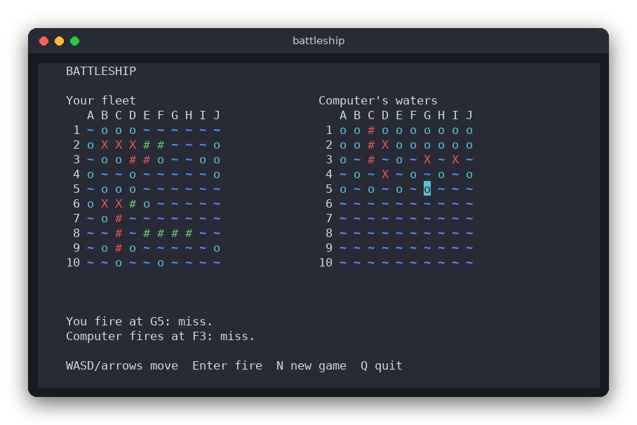

# Battleship (C)

Battleship for the terminal, written in C with ncurses. You place a classic fleet of five ships on a 10×10 board, then take turns with the computer, which fires at your board. The first side to sink the whole fleet wins.



## Features

- Two 10×10 boards with the classic fleet: ships of length 5, 4, 3, 3 and 2
- Place ships yourself: choose a cell and an orientation, or let the game place the whole fleet at random
- Ships may touch but never overlap or leave the board
- Hits, misses and sunk ships are reported after every shot
- The computer hunts your ships with a hunt-and-target strategy
- Win/lose screen at the end, and a new game at any time

## How to play

Controls:

| Key | Action |
|---|---|
| `W` `A` `S` `D` or arrow keys | Move the cursor |
| `R` | Rotate the ship being placed (horizontal / vertical) |
| `Enter` | Place a ship on the cursor (placement) or fire at the cursor (battle) |
| `X` | Random fleet: place all five ships at random and start the battle |
| `N` | New game |
| `Q` | Quit |

Example session:

```
Place your ships. Next ship: length 5.   -> move to A1, press Enter
Ship placed. Next ship: length 4.        -> move, press R to rotate, Enter
...
All ships placed. Battle! Fire at the right board.
You fire at D5: miss. Computer fires at B2: hit.
You fire at D6: hit. Computer fires at B3: sunk a ship of length 2.
```

Marks: `X` is a hit, `#` (red) is a sunk ship, `o` is a miss, `~` is unknown water. On your own board a green `#` is one of your ships that has not been hit. The computer's ships stay hidden until the game ends.

## How it works

**Data.** A `Board` holds the five `Ship` records (length, hits, placed) and two 10×10 arrays: `ship_at[y][x]` is the index of the ship on a cell (or `NO_SHIP`, which is -1), and `shot[y][x]` says whether the cell was fired at. Both files are in `src/`: `battleship.h` declares the types, and `battleship.c` implements them.

**Placement.** `board_place()` checks that every cell of the ship is on the board and empty (`board_can_place()`). Touching is allowed because only occupied cells are checked. A ship can be placed only once.

**Random placement.** `board_place_random()` clears the board and tries to put each ship on a random cell with a random orientation (up to 1000 tries per ship). If a ship cannot be placed, the whole fleet is restarted. The random source is a small `Rng` struct (xorshift) that is seeded by the caller. The game seeds it with the time; the tests use a fixed seed, so their results are always the same.

**Firing.** `board_fire()` returns one of:

- `SHOT_INVALID`: outside the board (nothing changes)
- `SHOT_REPEAT`: the cell was already fired at (nothing changes, and you may choose again)
- `SHOT_MISS`: water
- `SHOT_HIT`: a ship was hit, but it is not sunk yet
- `SHOT_SUNK`: the hit sank the ship (`hits == length`)

`board_all_sunk()` is true when every ship is sunk. That is the win/lose check.

**The computer (hunt and target).** `Computer` keeps a stack of cells to try (`targets`).

1. **Hunt:** while there are no targets, the computer fires at a random cell that has not been fired at yet.
2. **Target:** after a `SHOT_HIT`, the four neighbours of that cell (up, down, left, right) that are on the board and not yet fired at are pushed onto the stack. The next shot comes from the top of the stack, so the computer follows the ship it has found.
3. **Sunk:** after `SHOT_SUNK`, the stack is emptied and the computer hunts again.

`computer_choose()` implements steps 1 and 2 and `computer_report()` implements 2 and 3. The game calls them once per computer turn.

**The loop.** `main.c` is the only file that talks to the terminal. It holds a `Game` struct (both boards, the computer, the phase: placing, battle or over, the cursor and a message). Each key press calls `handle_key()`, which changes the game, and then `draw()` redraws the screen. In the battle phase, one key press fires the player's shot and then the computer's shot.

## Project layout

```
battleship/
├── CMakeLists.txt        build rules for the library, the game and the tests
├── README.md             this file
├── screenshot.png        a game in progress
├── src/
│   ├── battleship.h      declarations of the rules (boards, shots, computer)
│   ├── battleship.c      the rules: no input, no output, no ncurses
│   └── main.c            the terminal interface with ncurses
└── tests/
    └── test_battleship.c tests of the rules with assert()
```

## Requirements

- A C99 compiler (gcc or clang)
- CMake 3.10 or newer
- ncurses development files: `libncurses-dev` on Debian/Ubuntu (`ncurses-devel` on Fedora)
- A terminal of at least 80×22 characters

## Run

```sh
cmake -S . -B build
cmake --build build
./build/battleship
```

## Test

```sh
cmake -S . -B build && cmake --build build && cd build && ctest --output-on-failure
```

The tests check placement, touching and overlapping ships, the three shot results, repeated and invalid shots, the random fleet, the computer's targeting and a whole computer game that finishes without repeated shots. They need no terminal and no keyboard.

## Comparison with the other versions

- [Python](../../python/battleship): the same rules and the same computer strategy, in a tkinter window
- [JavaScript](../../vanilla_js/battleship): the same rules, in a web page

| | C | Python | JavaScript |
|---|---|---|---|
| Interface | ncurses terminal | tkinter window | browser page |
| Lines of logic | 180 | 89 | 119 |
| Lines of interface | 210 | 134 | 150 |
| Tests | 9 | 10 | 9 |

C needs the most code for the same game: the random source (`Rng`) and the target stack are written by hand, while Python's `random.Random` and JavaScript's `Math.random` come with the language. C keeps the board data in plain structs passed by pointer, while Python and JavaScript use objects with methods. The fixed-size target stack is safe because a board has at most 17 ship cells, so at most 68 targets are ever pushed.

## Ideas for extensions

- Show a sunk ship in a different colour from a normal hit
- Let the computer use a checkerboard pattern while hunting, since every ship is at least two cells long
- Add a two-player mode where both boards are placed by people
- Save the high score (number of shots needed to win) to a file
