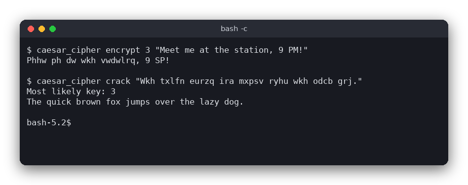

# Caesar Cipher (C)

A terminal program that encrypts and decrypts text with the Caesar cipher and can crack an encrypted message by trying all 26 keys. The key can be negative or larger than 26. The logic is a small C file without any input or output, so it can be tested on its own.



## Features

- Encrypt and decrypt with any integer key, including negative numbers and numbers above 26 (`52` works like `0`).
- Upper and lower case letters keep their case. Digits, spaces, punctuation and Polish letters stay unchanged.
- `crack` tries all 26 keys and picks the most likely English text by letter frequency.
- Commands take arguments directly, so there are no prompts and the output can be piped into other tools.

## How to use

```
caesar_cipher encrypt KEY TEXT
caesar_cipher decrypt KEY TEXT
caesar_cipher crack TEXT
```

Example session:

```
$ ./build/caesar_cipher encrypt 3 "Meet me at the station, 9 PM!"
Phhw ph dw wkh vwdwlrq, 9 SP!
$ ./build/caesar_cipher decrypt 3 "Phhw ph dw wkh vwdwlrq, 9 SP!"
Meet me at the station, 9 PM!
$ ./build/caesar_cipher crack "Wkh txlfn eurzq ira mxpsv ryhu wkh odcb grj."
Most likely key: 3
The quick brown fox jumps over the lazy dog.
```

The text can be at most 1023 bytes long. Polish letters take two bytes each in UTF-8; the program leaves those bytes unchanged, so they are kept as they are.

## How it works

- **Data.** Text is a C string: an array of `char` that ends with `'\0'`. The cipher functions change the text in place, so `main.c` first copies the argument into its own buffer (command-line arguments should not be modified).
- **Shifting one letter.** `letter_index` returns 0 to 25 for an ASCII letter and -1 for anything else. `caesar_shift_char` computes `base + (index + key) % 26`, where `base` is `'a'` or `'A'`, so the case is kept. Other characters are returned unchanged.
- **Negative keys.** In C the `%` operator keeps the sign of its left operand: `-1 % 26` is `-1`, not `25`. `normalize_key` therefore computes `((key % 26) + 26) % 26`. Decryption is encryption with the shift `-normalize_key(key)`, so the key `INT_MIN` never has to be negated.
- **Cracking.** For every key from 0 to 25, `score` adds the English frequency of each letter the text would have after decryption with that key. The frequencies are the usual percentages for English letters (`e` is 12.7 %, `t` 9.1 %, `z` 0.07 %). The key with the largest sum wins, and the text is decrypted with it. Text without letters gets the key 0.
- **Command line.** `main` checks the command name and the number of arguments, reads the key with `strtol` (so `3x` and `abc` are rejected), calls the logic and prints the result.

## Project layout

```
CMakeLists.txt                 build rules for the program and the tests
src/caesar_cipher.h            declarations of the logic
src/caesar_cipher.c            the logic: shifting, encrypting, decrypting, cracking
src/main.c                     the command-line interface
tests/test_caesar_cipher.c     tests of the logic, using assert()
```

## Requirements

- A C compiler (gcc or clang) and CMake 3.10 or newer
- No other libraries

## Run

```sh
cmake -S . -B build
cmake --build build
./build/caesar_cipher encrypt 3 "Hello, World!"
```

## Test

```sh
cmake -S . -B build && cmake --build build && cd build && ctest --output-on-failure
```

The tests check letter shifts, case, unchanged characters, negative and large keys, decryption, round trips, cracking a known sentence and cracking text without letters.

## Comparison with the other versions

- [C](../../c/caesar_cipher)
- [Python](../../python/caesar_cipher)
- [JavaScript](../../vanilla_js/caesar_cipher)

| | C | Python | JavaScript |
|---|---|---|---|
| Interface | terminal, command-line arguments | tkinter window | browser page |
| Lines of logic | 70 | 30 | 52 |
| Lines of interface | 62 | 60 | 34 |
| Tests | 7 | 7 | 7 |

The C version works on bytes: it must keep its own buffer, change the text in place, and check for ASCII letters by value, because `isalpha()` is undefined for the negative `char` values of UTF-8 bytes. Python works on Unicode strings, so it builds a new string and needs an explicit `isascii()` check. In JavaScript the `%` operator has the same negative-number problem as in C, and the page recalculates the result on every keystroke, while the other two versions act only when a button is pressed.

## Ideas for extensions

- Read the text from a file or from standard input, so that long messages can be processed.
- Add a Vigenere cipher, which uses a keyword instead of a single shift.
- Score candidates with a list of common English words, which works better on short texts.
- Show all 26 candidates in a list, so the user can choose the right one.
