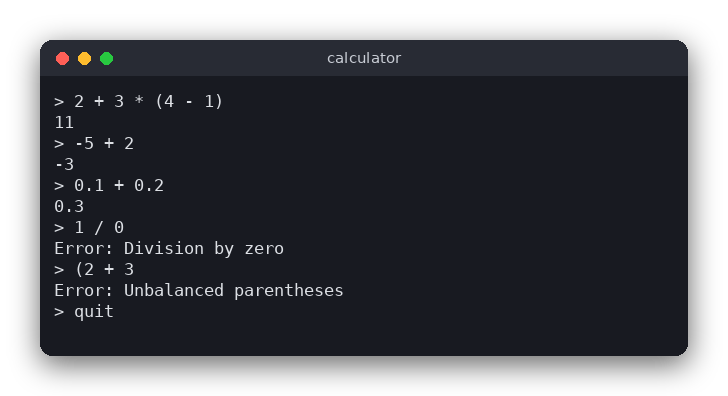

# Calculator (C)

A terminal calculator that reads one arithmetic expression per line and prints its value. It supports
`+ - * /`, parentheses, unary minus, decimal numbers and the usual operator precedence, and it reports
mistakes such as division by zero or unbalanced parentheses.



## Features

- Operators `+`, `-`, `*`, `/` with the usual precedence (`*` and `/` before `+` and `-`).
- Parentheses, nested as deep as you like.
- Unary minus: `-5 + 2`, `2 * -3`, `-(1 + 2)`.
- Decimal numbers: `3.5`, `.5`, `3.`.
- Clear error messages: division by zero, unbalanced parentheses, unexpected character, unexpected end
  of expression, empty expression.
- No `eval`: the expression is read by a small parser that accepts only the grammar below.

## How to use

Start the program and type an expression. Press Enter to see the value. Type `quit` to exit.

```text
> 2 + 3 * (4 - 1)
11
> -5 + 2
-3
> 0.1 + 0.2
0.3
> 1 / 0
Error: Division by zero
> (2 + 3
Error: Unbalanced parentheses
> 2 $ 3
Error: Unexpected character '$' at position 3
> quit
```

## How it works

### The grammar

The parser follows a grammar with three rules. Each rule is a C function, and each rule calls the next
one for its smaller parts:

```text
expression := term (('+' | '-') term)*
term       := factor (('*' | '/') factor)*
factor     := '-' factor | number | '(' expression ')'
```

Read `term (('+' | '-') term)*` as "one term, then any number of `+ term` or `- term` pairs". The rule
for `term` is one level lower, so `*` binds more tightly than `+`: `2 + 3 * 4` is parsed as
`2 + (3 * 4)`, because `3 * 4` is a single `term` inside the `expression`.

### Three stages

1. **Tokenizer** (`tokenize` in `src/calculator.c`). It walks the text and produces a list of tokens:
   numbers, the operators `+ - * /`, the parentheses, and a final `END` token. Spaces are skipped.
   Any other character stops the program with "Unexpected character".
2. **Parser and evaluator** (`parse_expression`, `parse_term`, `parse_factor`). These three functions
   read the tokens from left to right. They also compute the value while they go, so there is no
   separate tree to build. Each function returns 0 on success and -1 on error.
3. **Entry point** (`calc_evaluate`). It runs the tokenizer, checks that the parser used the whole
   input, and returns the value.

### Step by step: `2 + 3 * (4 - 1)`

The tokenizer produces: `2` `+` `3` `*` `(` `4` `-` `1` `)` `END`.

1. `parse_expression` calls `parse_term`, which calls `parse_factor`. The factor is the number `2`, so
   `parse_factor` returns 2. `parse_term` looks at the next token, `+`, which is not `*` or `/`, so it
   returns 2.
2. Back in `parse_expression`, the next token is `+`. It is consumed and `parse_term` is called again.
3. `parse_term` calls `parse_factor` for `3`, which returns 3. The next token is `*`, so it is consumed
   and `parse_factor` is called once more.
4. This time the token is `(`. `parse_factor` consumes it and calls `parse_expression` **recursively**,
   for the text inside the parentheses. That inner call parses `4 - 1` the same way as steps 1 and 2
   and returns 3. It stops when it sees `)`.
5. `parse_factor` consumes `)` and returns 3. Back in the `term` that started with 3, the value is
   `3 * 3 = 9`. The next token is `END`, so `parse_term` returns 9.
6. Back in the outer `parse_expression`, the value is `2 + 9 = 11`. The next token is `END`, so the
   whole input was used and 11 is the result.

The recursion is what makes the parentheses work: a `(` simply starts a new `expression` that must be
closed by `)` before the outer `factor` can continue. The lower the rule, the earlier its operators are
applied, which gives the precedence.

### Unary minus

`factor := '-' factor` lets a minus appear before any factor. `-5 + 2` is parsed as
`(-5) + 2`, and `2 * -3` as `2 * (-3)`. The minus is applied with a recursive call, so `--4` is 4.

### Errors

Every function checks the next token before it consumes it. If the token does not fit the grammar, the
function writes a message into the caller's buffer and returns -1, and the error travels back up. For
example `(2 + 3` ends with `END` where `)` was expected, so the message is "Unbalanced parentheses". A
division checks for a zero divisor before dividing. A result that is infinite (for example a 400-digit
number) gives "Result is out of range".

### The REPL loop

`src/main.c` reads a line with `fgets`, removes the newline, handles `quit` and empty lines, and then calls
`calc_evaluate`. A return value of 0 means the result is printed with `%.10g`; anything else prints the
error message.

## Project layout

```text
calculator/
├── CMakeLists.txt          build rules: logic library, program, tests
├── README.md               this file
├── screenshot.png          picture of a terminal session
├── .clang-format           code style for clang-format
├── .clang-tidy             checks for clang-tidy
├── .editorconfig           editor settings (indentation, line endings)
├── src/
│   ├── calculator.h        declaration of calc_evaluate (the logic's public function)
│   ├── calculator.c        tokenizer, recursive-descent parser and evaluator
│   └── main.c              terminal interface: the read-evaluate-print loop
└── tests/
    └── test_calculator.c   tests of the logic, using assert()
```

## Requirements

- CMake 3.10 or newer
- A C compiler with C99 support (GCC or Clang)

## Run

```sh
cd src/c/calculator
cmake -S . -B build
cmake --build build
./build/calculator
```

## Test

```sh
cmake -S . -B build && cmake --build build && cd build && ctest --output-on-failure
```

The test program checks precedence, parentheses, unary minus, decimals, whitespace and each error
message. On success it prints one line and returns 0.

## Comparison with the other versions

- [Python (tkinter)](../../python/calculator)
- [JavaScript (browser)](../../vanilla_js/calculator)

| | C | Python | JavaScript |
|---|---|---|---|
| Interface | terminal (stdin/stdout) | tkinter window | browser page |
| Lines of logic | 221 | 105 | 111 |
| Lines of interface | 31 | 77 | 52 |
| Tests | 32 | 31 | 23 |

All three versions use the same three recursive functions and the same error messages. C has no
exceptions, so each function returns -1 and writes the message into a buffer the caller passes in, while
Python and JavaScript throw an error that travels up the call stack. C also manages its memory by hand:
the token array is a variable-length array on the stack, sized from the length of the text, so nothing
has to be freed. Python and JavaScript convert number text with their own library functions, but they
must not call `eval`, which would run any code typed into the calculator. C has no `eval` at all.

## Ideas for extensions

- Add the power operator `^`: a new rule between `factor` and `term` that binds even more tightly.
- Support a modulo operator `%` at the same level as `*` and `/`.
- Add named constants such as `pi` and functions such as `sqrt(x)`, by reading letters as a name token.
- Keep a history of results and let the user refer to the last value with `ans`.
- Accept an expression as a command-line argument, for example `./build/calculator "2 + 2"`.
