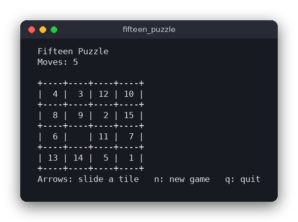

# Fifteen Puzzle (C)

The fifteen puzzle: fifteen numbered tiles and one gap on a 4×4 board. Slide the tiles into the gap until they are in order from 1 to 15. The game runs in the terminal with ncurses, counts your moves and announces the win.



## Features

- 4×4 board, shuffled so that the puzzle can always be solved
- Move a tile with the arrow keys: the tile next to the gap slides into it
- Move counter and a win message when the tiles are in order
- New game with `n`, quit with `q`

## How to play

| Key | Action |
|---|---|
| Arrow keys | Move the gap in that direction, so the tile on the other side slides into it |
| `n` | New game (a new shuffle, moves reset to 0) |
| `q` | Quit |

Example: the gap is in the bottom-right corner. Pressing **Up** slides the tile above it (12) down into the gap, and the gap moves up one row.

```
+----+----+----+----+        +----+----+----+----+
|  1 |  2 |  3 |  4 |        |  1 |  2 |  3 |  4 |
+----+----+----+----+        +----+----+----+----+
|  5 |  6 |  7 |  8 |        |  5 |  6 |  7 |  8 |
+----+----+----+----+  Up    +----+----+----+----+
|  9 | 10 | 11 | 12 |  --->  |  9 | 10 | 11 |    |
+----+----+----+----+        +----+----+----+----+
| 13 | 14 | 15 |    |        | 13 | 14 | 15 | 12 |
+----+----+----+----+        +----+----+----+----+
```

## How it works

### The board

The board is a struct with an array of 16 integers, `tiles[16]`, read row by row. The number `0` is the gap. The solved board is `1, 2, …, 15, 0`.

```c
typedef struct {
    int tiles[CELLS];
} Board;
```

### Moves

- `board_slide(board, cell)` moves the tile in `cell` into the gap, but only when the two cells are next to each other (their row and column differ by exactly one step). It returns 1 when the move happened and 0 when it was not allowed.
- `board_move_gap(board, dir)` moves the gap in a direction. It finds the neighbor of the gap in that direction and slides it in. At the edge of the board there is no neighbor, so nothing happens.

The keyboard uses `board_move_gap`, and the moves counter increases only when it returns 1.

### Shuffle

`board_shuffle` does not place the tiles at random. It starts from the solved board and makes 500 random legal moves. Every legal move keeps the puzzle solvable, so the shuffled board is always solvable. Random numbers come from `Rng`, a small generator with a seed. The same seed gives the same shuffle, which the tests use. The game seeds it with the current time. (If the 500 moves happen to lead back to the solved board, the shuffle starts again.)

### Solvability rule

Not every arrangement of the tiles can be solved. For a board with an even width (4 columns), a board is solvable when

> **inversions + row of the gap (counted from the top, starting at 0) is odd**

An *inversion* is a pair of tiles where the larger number comes before the smaller one, reading row by row. The gap is ignored. On the solved board there are no inversions and the gap is in row 3, so 0 + 3 = 3 is odd, and the board is solvable. Swapping tiles 14 and 15 gives one inversion, and the gap is still in row 3, so 1 + 3 = 4 is even: that position can never be solved. `board_is_solvable` checks this rule. The shuffle does not need it, but the tests use it to confirm the shuffle and the swap example.

### Solved check

`board_is_solved` compares the board with a freshly built solved board, tile by tile.

### The game loop

`main.c` starts ncurses (`cbreak`, `noecho`, `keypad`), shuffles, and then loops: read a key, change the board through the logic functions, draw the board again. Once the board is solved, arrow keys are ignored and the win message is shown until you press `n`.

## Project layout

```
CMakeLists.txt               builds the logic library, the game and the tests
src/fifteen_puzzle.h         the declarations of the rules (board, Rng, Direction)
src/fifteen_puzzle.c         the rules: moves, shuffle, solved and solvable checks
src/main.c                   the ncurses interface: drawing, keys, the game loop
tests/test_fifteen_puzzle.c  tests of the rules, using assert()
.clang-format, .clang-tidy,  formatting and lint settings
.editorconfig
```

## Requirements

- A C compiler (gcc or clang)
- CMake 3.10 or newer
- The ncurses development package: `libncurses-dev` on Debian and Ubuntu, `ncurses-devel` on Fedora, `brew install ncurses` on macOS

## Run

```sh
cmake -S . -B build
cmake --build build
./build/fifteen_puzzle
```

## Test

```sh
cmake -S . -B build && cmake --build build
cd build && ctest --output-on-failure
```

The tests do not need a terminal. They check the moves at the edges, the rule for sliding tiles, the solved check, the unsolvable swap, and that every shuffle is solvable and reproducible from its seed.

## Comparison with the other versions

- [Python version](../../python/fifteen_puzzle) (tkinter window)
- [JavaScript version](../../vanilla_js/fifteen_puzzle) (browser page)

| | C | Python | JavaScript |
|---|---|---|---|
| Interface | ncurses terminal | tkinter window | browser page |
| Lines of logic | 112 | 45 | 64 |
| Lines of interface | 68 | 60 | 38 |
| Tests | 8 | 9 | 9 |

The rules are the same in all three versions, and so are the names of the functions. C keeps the board in a fixed-size struct on the stack, so it never allocates memory, and a move is reported by returning 0 or 1. Python works on a plain list that the functions change in place, and it takes a `random.Random` object so the shuffle can be seeded. JavaScript uses an array and passes `Math.random` as a default parameter. C is the only version that has to switch the terminal into keypad mode to read arrow keys; the other two get clicks and key events from their toolkit.

## Ideas for extensions

- Show a timer next to the move counter
- Add a 3×3 or 5×5 board (the solvability rule for odd widths is different, so check the new rule)
- Add an undo key that remembers the moves
- Save the best (fewest) moves and show them at the start
- Add a hint that shows the next move of a solution found by breadth-first search
