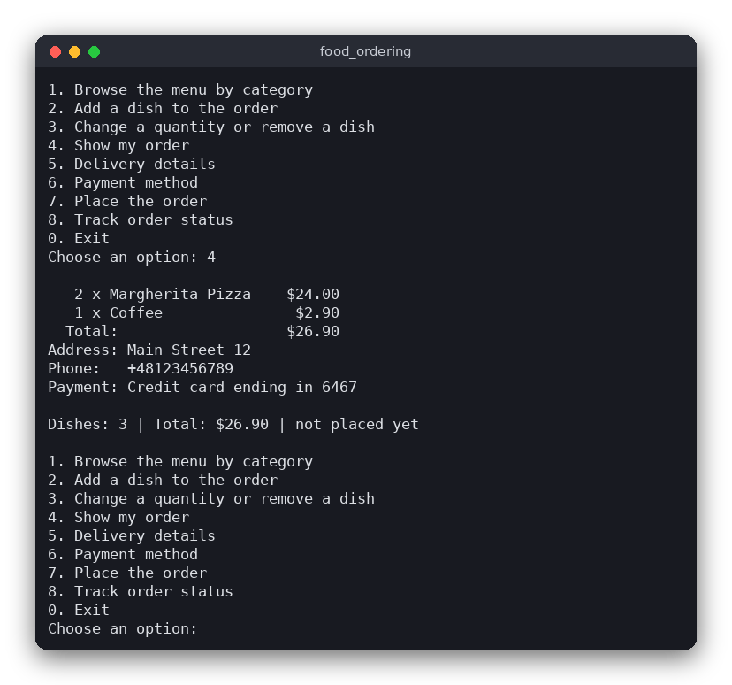

# Food Ordering (C)

A small food ordering program for the terminal. You browse a menu of ten dishes, build an order, enter a delivery address and phone number, choose a way to pay (PayPal, a credit card or cash on delivery) and place the order. The program then simulates the delivery: the order goes from *Received* to *Preparing*, *On the way* and *Delivered*.

The same program is also written in [Python](../../python/food_ordering) and [JavaScript](../../vanilla_js/food_ordering). The three versions have the same menu and the same rules.



## Features

- Ten dishes in four categories (starters, main courses, desserts, drinks), each with a description and a price
- Add dishes to the order, change quantities (up to 20 per dish) and remove them
- Totals are computed in whole cents, so no rounding errors appear
- Validated delivery address and phone number
- Payment by PayPal, by credit card (the number is checked with the Luhn algorithm) or in cash
- Order status that moves through *Received*, *Preparing*, *On the way* and *Delivered*, based on the time since the order was placed

## How to use

Start the program and type the number of an option, then press Enter. The main menu is shown again after each action.

```text
Dishes: 0 | Total: $0.00 | not placed yet

1. Browse the menu by category
2. Add a dish to the order
3. Change a quantity or remove a dish
4. Show my order
5. Delivery details
6. Payment method
7. Place the order
8. Track order status
0. Exit
Choose an option:
```

An example session:

1. Choose `2` (add a dish), then `3` (Margherita Pizza) and `2` (two of them).
2. Choose `5` (delivery details). Type an address such as `Main Street 12`, then a phone number such as `+48 123 456 789`.
3. Choose `6` (payment method), then `2` (credit card). Type `4539 1488 0343 6467`. The program answers `Card accepted, ending in 6467`.
4. Choose `7` to place the order. Choose `8` a few times to watch the status change.

An empty line at the address or phone prompt keeps the current value, and an empty line at the card prompt cancels the card payment.

## How it works

**Data.** The menu is a constant array of `Dish` structs (`menu` in `src/food_ordering.c`). Prices are `int` numbers of cents, so `$9.90` is stored as `990`. An `Order` struct holds an array of `OrderLine` (dish id and quantity), the address and phone as fixed-size character arrays, the payment method, the last four digits of a card and the time the order was placed. An order never uses heap memory, so nothing has to be freed.

**Order rules.** `order_set_quantity` sets the quantity of a dish and removes the dish when the quantity is 0. `order_add_dish` adds to the current quantity. `order_total_cents` multiplies each price by its quantity and adds the results. Once an order is placed, every change function returns `false`.

**Validation.**
- The address is trimmed. It must have 5 to 100 characters, at least one digit (the house number) and at least one letter (the street name). `order_set_address` checks this.
- The phone number ignores spaces, `-`, `(` and `)`. It may start with `+` and must contain 9 to 15 digits. `order_set_phone` cleans and checks it.

**Luhn check.** The Luhn algorithm finds typing mistakes in card numbers. Starting from the last digit and moving left, every second digit is doubled. If a doubled digit is greater than 9, subtract 9. Add all the digits. A valid number gives a total that ends in 0. For example, the valid number `4111 1111 1111 1111` gives a total of 30. Changing its last digit to `2` gives a total of 31, so the number is rejected. `luhn_is_valid` in `src/food_ordering.c` does this. The program keeps only the last four digits of an accepted card.

**Placing the order.** `order_place` checks in turn that the order is not empty and not placed yet, that there is an address and a phone number, and that a payment method is chosen. It returns the reason as a text message, or `NULL` when the order is placed. It stores the time of placing, which is the number of seconds since 1970 returned by `time()`.

**Status.** `order_status_at(elapsed)` is a pure function: it takes the number of seconds since placing and returns the status. Every status lasts `STATUS_STEP_SECONDS` (3 seconds), so an order is delivered after 9 seconds. Tests call this function with fixed numbers instead of waiting.

**User interface.** `src/main.c` has no rules in it. `read_line` reads a line with `fgets` and exits cleanly at the end of input. `read_number` repeats the question until the answer is a number in the allowed range. `main` shows the summary and the menu, reads an option and calls the matching function. Option 8 prints the four steps with the current one marked `[>]`. The program does not wait between steps: each time you choose option 8, it computes the status from the current time.

## Project layout

```text
food_ordering/
├── CMakeLists.txt             build rules: the logic library, the program and the tests
├── README.md                  this file
├── screenshot.png             picture of the program
├── src/
│   ├── food_ordering.h        declarations of the rules (types, functions, constants)
│   ├── food_ordering.c        the rules: menu, order, validation, Luhn check, status
│   └── main.c                 the terminal menu (reading input and printing)
└── tests/
    └── test_food_ordering.c   tests of the rules with assert()
```

The `.clang-format`, `.clang-tidy` and `.editorconfig` files set the code style.

## Requirements

- CMake 3.10 or newer
- A C compiler (gcc or clang)
- Linux, macOS or WSL (any system with `time()` and a terminal works)

## Run

```sh
cmake -S . -B build
cmake --build build
./build/food_ordering
```

## Test

```sh
cmake -S . -B build && cmake --build build && cd build && ctest --output-on-failure
```

The tests check the menu, quantities and limits, totals in cents, address and phone validation, the Luhn check, card payment, the rules for placing an order and the status over time. They do not need a terminal or input.

## Comparison with the other versions

- [Python version](../../python/food_ordering)
- [JavaScript version](../../vanilla_js/food_ordering)

| | C | Python | JavaScript |
|---|---|---|---|
| Interface | terminal, numbered menu | terminal, numbered menu | browser page |
| Lines of logic | 257 | 152 | 140 |
| Lines of interface | 237 | 168 | 158 (plus 59 lines of HTML and 229 of CSS) |
| Tests | 10 | 12 | 11 |

In C, every string has a fixed size and every copy checks the length first, so the program needs no heap memory. The price of this is more code: `copy_trimmed` and the phone and card checks handle the buffers by hand. Python keeps the same rules in about 150 lines, because lists, dictionaries and `str` do the memory work, and the `Enum` class keeps the statuses and payment methods readable. In the browser version, the rules are plain functions in `food_ordering.js`, and `main.js` only redraws the page and listens to clicks. Its status uses `Date.now()` and `setInterval`, which is the same time-based idea as `order_status_at` in C.

## Ideas for extensions

- Save the order to a file, so that it survives after the program closes
- Add a discount code that lowers the total
- Check the expiry date of the card as well as the number
- Let the user choose a time for the delivery
- Show the menu in Polish as well as in English
