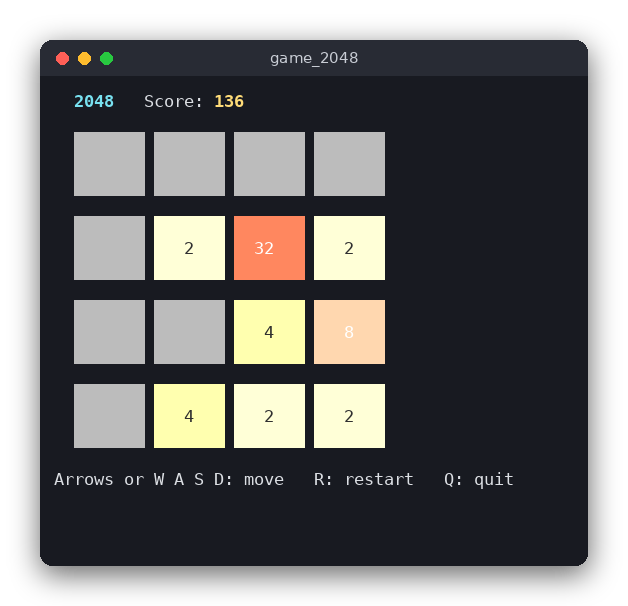

# 2048 (C)

2048 is a sliding-tile puzzle on a 4×4 board. Each move slides every tile in one direction; equal tiles that meet merge into their sum. The game is played in the terminal with colored tiles, and the goal is to make a tile with the value 2048.



## Features

- Slide the tiles with the arrow keys or W, A, S, D
- Equal tiles merge once per move and add their value to the score
- After each move that changes the board, a new 2 (90%) or 4 (10%) appears on a random empty cell
- Win message at 2048, with the option to keep playing
- Game over when no move is possible
- Restart at any time with R

## How to play

Start the program and move the tiles with the arrow keys or W A S D.

| Key | Action |
|---|---|
| ↑ ↓ ← → or W A S D | Slide all tiles |
| R | Start a new game |
| C | Keep playing after reaching 2048 |
| Q | Quit |

Example: the board has `2 2 0 0` in the first row. Pressing `A` (left) turns it into `4 0 0 0`, adds 4 to the score and places a new 2 or 4 on a random empty cell.

## How it works

The code is split in two. `game_2048.c` contains the rules and has no input or output. `main.c` draws the board and reads the keys.

### Board and game state

`Game` is a struct with a 4×4 array of `int` (`0` means an empty cell), the score, and a flag that is set when the player chooses to keep playing after 2048.

### Sliding one line

`slide_row` handles one line of four cells, always sliding towards index 0:

1. Copy the non-zero values into `tiles`, in order. This closes the gaps.
2. Walk through `tiles` from the start. If two neighbours are equal, output their sum and skip both. Otherwise output the single tile.
3. Fill the rest of the line with zeros and return the points gained.

Skipping both tiles after a merge is what makes a merge happen only once per move. For `4 4 8 0` the two 4s merge into 8, and that new 8 is not merged with the existing 8 next to it, so the result is `8 8 0 0`, not `16 0 0 0`.

### The four directions from one slide

`slide_row` only knows how to slide towards the start of a line. The other directions do not need separate code. `line_cell` returns the cell of a row or column in the order of the direction: for `DIR_RIGHT` the cell at index 0 is the rightmost one, for `DIR_UP` it is the top one, and so on.

`board_slide` then does the same thing for each of the four lines in that direction:

1. Read the cells in the direction order into `values`.
2. Call `slide_row(values)`.
3. Write `values` back to the same cells.

The board itself is never rotated or transposed, because the cell order decides which way the tiles go.

### A move

`game_move` does nothing if the game is won (and not continued) or lost. Otherwise it slides the board and compares it with a copy taken before the move. If nothing changed, it returns 0 and no tile appears. If the board changed, `game_spawn_tile` picks one of the empty cells with `random_below(count)` and then draws the value with `random_below(10)`: 0 gives a 4, anything else gives a 2.

`RandomBelow` is a function pointer that returns a number in `[0, n)`. The program passes `rand() % n`, and the tests pass a scripted list of values, so every spawn in the tests is known in advance.

### Win and lose

`game_status` returns `STATUS_WON` when a tile of 2048 or more exists and the player has not chosen to continue. It returns `STATUS_LOST` when `game_can_move` finds no empty cell and no two equal neighbours. Otherwise it returns `STATUS_PLAYING`.

### The user interface loop

`main` draws the board, reads one key, and updates the game. `read_key` switches the terminal to non-canonical mode, so keys arrive without Enter. Arrow keys send the three bytes `ESC [ A` to `ESC [ D`; `read_key` turns them into `w`, `a`, `s`, `d`. The board is drawn with ANSI escape codes: each tile has a background color from a 256-color palette, chosen from the tile value (its position on the 2, 4, 8, ... scale).

## Project layout

```
CMakeLists.txt             builds the logic as a library, the game and the tests
.clang-format, .clang-tidy, .editorconfig   code style settings
src/game_2048.h            the declarations of the rules
src/game_2048.c            the rules: slide, merge, spawn, win and lose checks
src/main.c                 the terminal interface: drawing, colors, keys
tests/test_game_2048.c     tests of the rules, with a scripted random source
```

## Requirements

- A C compiler (gcc or clang) and CMake 3.10 or newer
- A POSIX system (Linux, macOS, WSL), because the program uses `termios`
- A terminal with ANSI 256-color support and at least 40×22 characters

## Run

```sh
cmake -S . -B build
cmake --build build
./build/game_2048
```

## Test

```sh
cmake -S . -B build
cmake --build build
cd build
ctest --output-on-failure
```

The tests check the classic merge cases, every direction, the spawn rules, and the win and lose states. They use `assert()`, and the CMake file keeps assertions enabled in Release builds.

## Comparison with the other versions

- [Python](../../python/game_2048) (tkinter window)
- [JavaScript](../../vanilla_js/game_2048) (browser page)

| | C | Python | JavaScript |
|---|---|---|---|
| Interface | ANSI terminal | tkinter window | browser page |
| Lines of logic | 132 | 87 | 107 |
| Lines of interface | 116 | 79 | 56 |
| Tests | 10 | 13 | 10 |

C needs the most explicit code: the board is a fixed array, the random source is a function pointer, and the direction logic works on indices. Python expresses the same logic with lists and `zip`, so the slide code is shorter, and its tests can replace the random source with any function. JavaScript does the board copy and comparison with `JSON.stringify`, and its page runs straight from disk because it uses classic scripts. In all three versions the rules do not know about the screen, so the tests run without a terminal, a window or a browser.

## Ideas for extensions

- Save the best score to a file between runs
- Add undo: keep a stack of previous boards
- Animate the sliding tiles
- Support a board size other than 4×4 (the code uses `G2048_SIZE`)
- Add a simple AI that suggests the best move for each board
