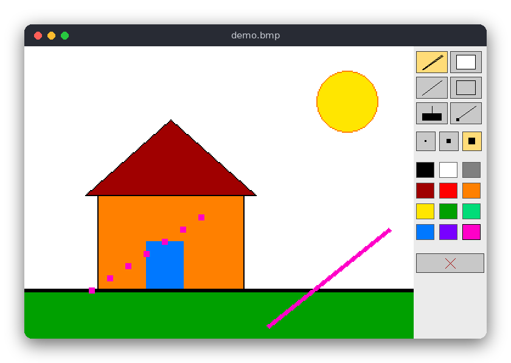

# Graphics Editor (C)

A small paint program with an SDL2 window. You draw on a 320×240 canvas (shown at twice its size) with a brush, an eraser, a straight line, a rectangle, a flood fill and a color picker, you can undo your steps, and you can save and open BMP files.

The same program is also written in [Python](../../python/graphics_editor) and [JavaScript](../../vanilla_js/graphics_editor). All three have the same tools and the same rules.



## Features

- Brush with three sizes (1, 3 and 5 pixels), eraser (a brush that paints white)
- Straight line and rectangle outline, shown while you drag the mouse
- Flood fill of an enclosed region
- Color picker and a palette of 12 colors
- Undo (the last 20 steps) and clear canvas
- Save and open a BMP file (`Ctrl+S`, `Ctrl+O`)
- Keyboard shortcuts for all tools

## How to use

Drag the left mouse button on the canvas to draw with the selected tool. Use the panel on the right to choose a tool, a brush size, a color, or to clear the canvas.

| Key | Action |
|---|---|
| `B` / `E` | brush / eraser |
| `L` / `R` | line / rectangle |
| `F` / `P` | fill / color picker (click a pixel to take its color) |
| `1` / `2` / `3` | brush size 1, 3 or 5 pixels |
| `N` | clear the canvas |
| `Ctrl+Z` | undo |
| `Ctrl+S` | save the picture to the file |
| `Ctrl+O` | open the picture from the file again |

The file is `drawing.bmp` in the current folder. You can give another name on the command line: `./build/graphics_editor picture.bmp`. The file is also opened at start-up when it is given on the command line. Only the top-left 320×240 pixels of a bigger picture are used.

## How it works

### The canvas

A `Canvas` is a width, a height and an array of `Color` values, one `{r, g, b}` struct per pixel, stored row by row: the pixel `(x, y)` is `pixels[y * width + x]`. `canvas_create` allocates the array with `malloc` and `canvas_destroy` frees it, so every canvas you create must be destroyed.

Drawing functions call `canvas_set`, which ignores positions outside the canvas. This means a line or brush stroke can run past the edge and only the visible part is painted.

### The brush and the eraser

A brush of width 1, 3 or 5 is a square of pixels centred on the mouse position (`stamp`). While you drag, the program draws a line from the previous mouse position to the current one with the line algorithm below, stamping the brush at every step. That keeps the stroke without gaps even when the mouse moves quickly.

### The line: Bresenham's algorithm

A line between two pixels must be made of pixels on a grid. Bresenham's algorithm finds them without any floating-point numbers:

1. Let `dx = |x1 - x0|` and `dy = -|y1 - y0|` (note the minus sign; it keeps the error term small), and let `err = dx + dy`.
2. Paint the current pixel `(x0, y0)`. Stop when it equals `(x1, y1)`.
3. Compute `e2 = 2 * err`. If `e2 >= dy`, step in x (`err += dy`). If `e2 <= dx`, step in y (`err += dx`). Both steps can happen in one iteration.
4. Go back to step 2.

`err` is the difference between the ideal line and the pixels chosen so far, so the algorithm always takes the step that keeps the chosen pixels closest to the ideal line. Only additions and comparisons are needed. The function is `draw_line` in `src/graphics_editor.c`.

### The rectangle

`draw_rect` draws four lines between the opposite corners you dragged between. The rectangle is an outline; the inside stays as it was.

### The flood fill: an explicit stack

Flood fill replaces the color of a region with a new color. It starts at the clicked pixel and visits its four neighbours (up, down, left, right) whenever they have the same old color. A simple recursive version calls itself for each neighbour, and a big canvas could overflow the call stack. `flood_fill` keeps the pixels still to visit in an array used as a stack:

1. If the clicked color already equals the new color, stop (this avoids endless work).
2. Paint the clicked pixel and push its position onto the stack.
3. While the stack is not empty: pop a position, look at its four neighbours, and for each neighbour with the old color paint it and push it.

A pixel is painted at the moment it is pushed, so it can never be pushed twice, and the stack never needs more than `width * height` entries. A pixel with a different color (a wall) is never entered, so the fill stops at the borders of the region.

### Undo

`History` keeps up to `HISTORY_DEPTH` (20) copies of the canvas. Before every change (a stroke, a shape, a fill, a clear, an open) the program calls `history_push`, which copies the canvas. `history_undo` throws away the current canvas and makes the newest copy the current one. When the history is full, the oldest copy is freed.

### Saving and opening: BMP

SDL2 can write and read BMP files itself (`SDL_SaveBMP` and `SDL_LoadBMP`), so the program needs no other library. PNG, the format most people use, needs a compression library such as libpng, which SDL2 does not include; SDL_image would add it. The C version therefore uses BMP. The Python and JavaScript versions save PNG.

The program converts the canvas to pixels for SDL in two places: the texture that is shown on the screen, and the surface that is saved. Both use the same `to_pixels` function.

### The window loop

`main` creates the window and a software renderer, and makes a streaming texture of the canvas size. `SDL_WaitEvent` blocks until an event arrives, so the program uses no CPU while it waits. For each event the program updates the editor, copies the canvas (or, while you drag a line or rectangle, the preview) into the texture, and draws the texture at twice its size with the tool panel next to it. The panel buttons are plain rectangles; the icons are a few lines and rectangles drawn on top.

## Project layout

```
CMakeLists.txt                builds the logic library, the program and the tests
src/graphics_editor.h         declarations of the canvas, drawing functions and history
src/graphics_editor.c         the logic: pixels, brush, Bresenham line, rectangle, flood fill, undo
src/main.c                    the SDL2 window: mouse, keys, the tool panel, BMP files
tests/test_graphics_editor.c  tests of the logic (no window needed)
```

## Requirements

- CMake 3.10 or newer and a C compiler (gcc or clang)
- SDL2 development files: `sudo apt-get install libsdl2-dev` (Ubuntu/Debian), `brew install sdl2` (macOS)

## Run

```sh
cmake -S . -B build
cmake --build build
./build/graphics_editor
```

## Test

```sh
cmake -S . -B build && cmake --build build
cd build && ctest --output-on-failure
```

The tests check that a line has the right endpoints and pixel count (also when drawn backwards), that a steep line has one pixel per row, that a brush is clipped at the border, that a rectangle outline has the expected border pixels, that flood fill stops at the walls and does nothing with the same color, that a fill of the whole 320×240 canvas works, and that undo restores the previous image and drops the oldest snapshot when full.

## Comparison with the other versions

- [Python](../../python/graphics_editor)
- [JavaScript](../../vanilla_js/graphics_editor)

| | C | Python | JavaScript |
|---|---|---|---|
| Interface | SDL2 window | tkinter window | browser page |
| Lines of logic | 175 | 86 | 130 |
| Lines of interface | 389 | 187 | 249 |
| Tests | 13 | 13 | 14 |
| File format | BMP (SDL2 only) | PNG (Tk PhotoImage) | PNG (download, file input) |

The C version does its own memory management: every canvas and every undo snapshot is allocated with `malloc` and must be freed, and the window code also draws the buttons and their icons from rectangles and lines. Python keeps the canvas as a list of tuples and gets PNG files and mouse events from tkinter for free, so the same logic is shorter. The JavaScript version stores the pixels in a `Uint8Array` and uses the browser for the file dialog and the download, so it needs no file-format code; it also works without any server because it uses classic scripts. Of the three, C has the most code to write by hand but shows clearly how a flood fill, a line and an undo history really work in memory.

## Ideas for extensions

- Add a circle tool with the midpoint circle algorithm (a Bresenham relative)
- Save PNG files with SDL_image, and ask for the file name with a text box
- Add a zoom level (1×, 2×, 4×) and scroll the canvas
- Add a selection rectangle that can be copied and moved
- Add a color-replace fill: fill only pixels of the clicked color that are near it
