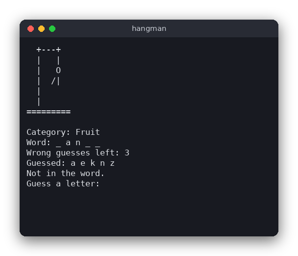

# Hangman (C)

Hangman (Polish: *szubienica*) in the terminal. The computer picks a secret word from a list and shows it as underscores. You guess letters: correct guesses reveal every matching position, and each wrong guess adds one part to the hanged figure. Six wrong guesses and the game is lost.



## Features

- A random word from 20 built-in English words, in four categories (Animal, Fruit, Country, Coding)
- The category is shown as a hint
- Correct guesses reveal all occurrences of the letter
- Six wrong guesses allowed, one per part of the figure
- Repeated guesses and invalid input are ignored with a message
- The list of guessed letters is always visible
- Win and lose messages reveal the word, then you can play again

## How to play

Type one letter and press Enter. Only the first character of the line is used.

```text
Category: Animal
Word: k a n _ a _ _ _
Wrong guesses left: 4
Guessed: a e k n z
Not in the word.
Guess a letter: m
```

Answer `y` to play again or anything else to quit. You can also quit at any time with Ctrl+D (end of input).

## How it works

The project has three parts: rules, drawing and input.

- **Word list** (`word_list` in `hangman.c`): an array of `Entry` structs, each with a category and a word.
- **Choosing a word**: `choose_entry()` takes a number and returns `list[number % count]`. `main.c` gives it `rand()`, so the logic itself never calls the random generator and can be tested with fixed numbers.
- **Game state** (`Game` in `hangman.h`): the word, its category, a `bool guessed[26]` array (one flag per letter) and the number of `misses`.
- **Applying a guess** (`game_guess()`): a non-letter gives `GUESS_INVALID`. The letter is lowercased. If it was already in `guessed`, the result is `GUESS_REPEAT`. Otherwise it is marked as guessed; if `strchr()` finds it in the word the result is `GUESS_HIT`, else `misses` grows and the result is `GUESS_MISS`.
- **Masked word** (`game_masked()`): writes each letter that was guessed, and `_` for the others, separated by spaces.
- **Game status** (`game_status()`): lost when `misses` reaches `MAX_MISSES` (6); won when every letter of the word is guessed; otherwise still playing.

The game loop is in `main.c`. `play()` repeats: draw the screen (`show()` clears it with ANSI codes and prints the figure, the word and the guesses), read one key (`read_key()`), and apply it. `draw_figure()` prints the gallows and adds a part for each miss: head, body, two arms, two legs.

## Project layout

```text
hangman/
├── CMakeLists.txt        build rules: library, game, tests
├── README.md             this file
├── screenshot.png        a game in progress
├── .clang-format         code style for clang-format
├── .clang-tidy           checks for clang-tidy
├── .editorconfig         indentation and line endings for editors
├── src/
│   ├── hangman.h         declarations of the rules
│   ├── hangman.c         the rules: word list, guesses, game state (no printf)
│   └── main.c            the terminal interface: drawing, input, the game loop
└── tests/
    └── test_hangman.c    tests of the rules with assert()
```

## Requirements

- A C compiler (gcc or clang)
- CMake 3.10 or newer
- A terminal that understands ANSI escape codes (any Linux, macOS or Windows Terminal)

## Run

```sh
cmake -S . -B build
cmake --build build
./build/hangman
```

## Test

```sh
cmake -S . -B build && cmake --build build && cd build && ctest --output-on-failure
```

The tests cover choosing a word, masking, hits that reveal every occurrence, misses, repeated and invalid guesses, uppercase letters, winning and losing.

## Comparison with the other versions

- [Python](../../python/hangman) (tkinter window)
- [JavaScript](../../vanilla_js/hangman) (browser page)

| | C | Python | JavaScript |
|---|---|---|---|
| Interface | terminal (stdio, ANSI codes) | tkinter window | browser page |
| Lines of logic | 63 | 58 | 46 |
| Lines of interface | 108 | 92 | 53 |
| Tests | 9 | 14 | 10 |

The rules are the same in all three versions, and so are the word list and the six attempts. C has no string type, so the guessed letters are a 26-element `bool` array indexed by `letter - 'a'`, and the masked word is written into a caller-provided buffer. Python uses a `set` and a string join, and JavaScript a `Set` and `map`. C also has to write its own random choice through a number passed in by the caller, which makes the tests fully repeatable.

## Ideas for extensions

- Add a "hint" command that reveals one random letter at the cost of an attempt.
- Read words from a file, one `category word` pair per line.
- Let the player choose the number of attempts with a command-line argument.
- Show the score over several games (wins and losses).
