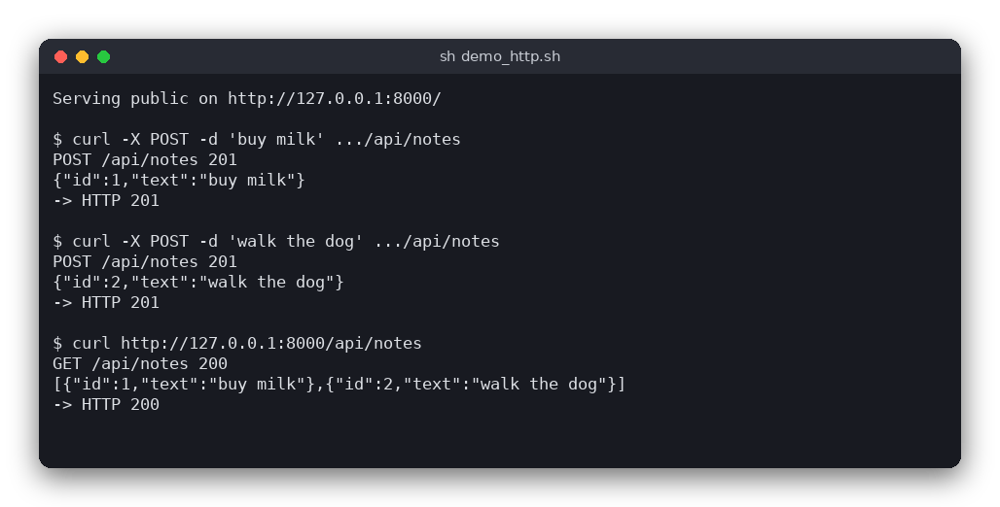

# HTTP Server with a Notes API (C)

A small HTTP/1.1 server written in C, using only POSIX sockets. It serves the files in `public/` (with the right `Content-Type`) and a notes API whose notes are kept in memory. Open `http://127.0.0.1:8000/` in a browser to add notes on a small page.

The same server is also written in [Python](../../python/http_server) and [JavaScript (Node.js)](../../vanilla_js/http_server). All three answer the same requests with the same status codes.



## Features

- Serves static files from `public/` with the correct `Content-Type` (HTML, CSS, JSON, images, ...)
- `404 Not Found` for missing files and `403 Forbidden` for paths that try to leave `public/` (for example `/../secret.txt`)
- A notes API: `GET /api/notes`, `POST /api/notes`, `PUT /api/notes/<id>`, `DELETE /api/notes/<id>`
- The note is the plain-text request body, and the answers are JSON
- Status codes `200`, `201`, `204`, `400`, `403`, `404`, `405` and `507` (store full, at most 100 notes)
- One log line per request, for example `POST /api/notes 201`
- Handles one connection at a time, which keeps the code short

## How to use

Start the server from the project directory. The port and the folder are optional:

```sh
./build/http_server          # port 8000, serves ./public
./build/http_server 9000     # another port
```

Example session (the server log is printed by the server, the rest is what `curl` shows):

```sh
curl -X POST -H 'Content-Type: text/plain' -d 'buy milk' http://127.0.0.1:8000/api/notes
# HTTP 201  {"id":1,"text":"buy milk"}

curl http://127.0.0.1:8000/api/notes
# HTTP 200  [{"id":1,"text":"buy milk"}]

curl -X PUT -H 'Content-Type: text/plain' -d 'buy oat milk' http://127.0.0.1:8000/api/notes/1
# HTTP 200  {"id":1,"text":"buy oat milk"}

curl -X DELETE http://127.0.0.1:8000/api/notes/1
# HTTP 204  (no body)
```

| Request | Success | Errors |
|---|---|---|
| `GET /api/notes` | `200` with a JSON array | |
| `POST /api/notes` with the note as text | `201` with the new note | `400` empty or over 200 bytes, `507` store full |
| `PUT /api/notes/<id>` with the note as text | `200` with the changed note | `400` empty or over 200 bytes, `404` no such note |
| `DELETE /api/notes/<id>` | `204` with no body | `404` no such note |
| any other method on the API | | `405` |
| `GET /<file>` | `200` with the file | `404` missing, `403` outside `public/` |

The body is trimmed of spaces and line breaks first. The note must then be 1 to 200 bytes long.

## How it works

### Reading a request

HTTP is plain text. A request looks like this:

```
POST /api/notes HTTP/1.1\r\n
Host: 127.0.0.1:8000\r\n
Content-Type: text/plain\r\n
Content-Length: 8\r\n
\r\n
buy milk
```

`parse_request()` in `src/http_server.c` finds the blank line (`\r\n\r\n`) that ends the headers. It reads the request line with `sscanf()` into the method, the path (the part before `?`) and the version. It then looks for the `Content-Length` header. The body is the next `Content-Length` bytes. The function returns one of three results:

- `REQUEST_COMPLETE`: the whole request is in the buffer.
- `REQUEST_INCOMPLETE`: some bytes are still missing, so `main.c` reads more from the socket.
- `REQUEST_MALFORMED`: the request is broken, so the server answers `400`.

The request points into the buffer that `main.c` filled, so the body is not copied.

### Routing

`handle_request()` looks at the path. `/api/notes` and `/api/notes/...` go to `handle_notes()`. Everything else is a file request for `handle_static()`.

For a file, `safe_path()` refuses any path with a `%` escape, a backslash or a `..` part. The file must therefore be inside `public/`. A path of `/` means `index.html`. This is a simplification: a real server would decode the escapes first and then check the path. `mime_type()` picks the `Content-Type` from the file extension, with `application/octet-stream` as the default.

### The notes store

`NoteStore` is a fixed array of 100 `Note` structs. Each note has an `id` and a `text` of up to 200 bytes, stored inside the struct, so nothing is allocated for a note. Ids start at 1 and are never reused. `store_delete()` removes a note and moves the rest of the array down with `memmove`. When the array is full, a `POST` answers `507`. The store is created in `main()` and passed by pointer, so there is no global state.

### Responses

`Response` holds a status code, a content type and a `Buffer` with the body. The answers are JSON. `append_note()` writes `{"id":..,"text":".."}` and escapes quotes, backslashes and control characters in the text. `response_format()` writes the status line and the headers (`Connection: close`, and `Content-Type` and `Content-Length` when there is a body), then the body. A `204` response has no body and no `Content-Type`.

`Buffer` is a growable byte string. It holds the body of a response, the file that is read for a static request, and the bytes that are sent.

### The user interface loop

`main.c` opens a socket on `127.0.0.1`, then loops forever: `accept()`, read the request, call the logic, send the response and close the connection. A read timeout (5 seconds) stops a slow client from blocking the server for long. `SIGPIPE` is ignored, so a client that disconnects early cannot stop the server.

## Project layout

```
CMakeLists.txt             builds the logic library, the server and the tests
public/                    the files the server serves
public/index.html          a page that lists and adds notes with fetch()
public/style.css           the page style
public/about.json          a small JSON file (demo content)
src/http_server.h          declarations of the logic
src/http_server.c          the logic: parsing, responses, MIME types, safe paths, notes, routing
src/main.c                 the user interface: sockets and the connection loop
tests/test_http_server.c   tests of the logic (no sockets)
```

## Requirements

- CMake 3.10 or newer
- A C compiler (gcc or clang)
- Linux, macOS or WSL (the server uses POSIX sockets)

## Run

```sh
cmake -S . -B build
cmake --build build
./build/http_server
```

Then open `http://127.0.0.1:8000/` in a browser.

## Test

```sh
cmake -S . -B build && cmake --build build && cd build && ctest --output-on-failure
```

The tests call the logic functions directly with raw request strings, so they need neither the network nor a running server.

## Comparison with the other versions

- [Python](../../python/http_server)
- [JavaScript (Node.js)](../../vanilla_js/http_server)

| | C | Python | JavaScript |
|---|---|---|---|
| Interface | POSIX sockets, one connection at a time | `socket` module, one connection at a time | Node `http` module |
| Lines of logic | 424 | 159 | 133 |
| Lines of interface | 119 | 62 | 35 |
| Tests | 13 | 22 | 11 |

The C version does everything by hand: it parses the request bytes, keeps the notes in a fixed array of C strings, and writes the JSON answers with `snprintf`. That is why its logic is about 2.7 times the Python one. Python parses the same request with ordinary string methods and gets JSON from the standard library. In JavaScript, Node's `http` module parses HTTP for you, so the logic only contains routing and the notes store.

The C version checks only the length of the note text, not that it is valid UTF-8. Python and JavaScript reject invalid UTF-8 with `400`.

## Ideas for extensions

- Store the notes in a file, so they survive a restart
- Handle several connections at once with `fork()` or threads
- Decode `%XX` escapes in paths instead of refusing them
- Add a `GET /api/notes/<id>` route
- Send `ETag` or `Last-Modified` headers for the static files
