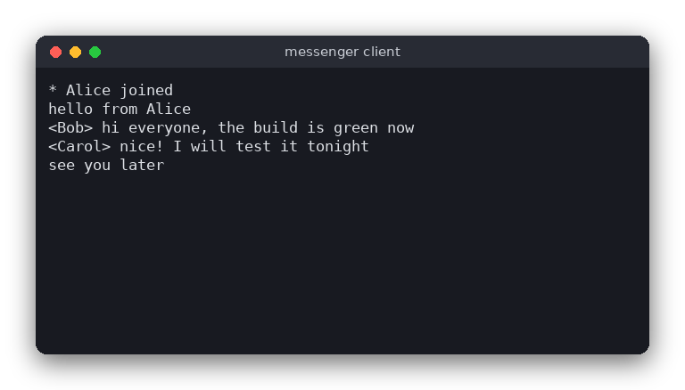

# Messenger (C)

A simple text chat for a local network (LAN). One program runs as the **server**; any number of **clients** connect to it, pick a nickname and chat. Everything a client types is sent to the server, which passes it on to everybody else.

The same chat is also written in [Python](../../python/messenger) and [JavaScript](../../vanilla_js/messenger). All three versions speak the same line-based protocol, so a C server works with a Python or JavaScript client and the other way round.



## Features

- One program with two modes: `server` and `client`
- The server accepts several clients at once (up to 16) with a single `poll()` loop, no threads
- Every chat line is relayed to all other connected clients
- Nicknames with `/nick <name>`, a list of online users with `/list`, leaving with `/quit`
- Join, leave and rename notices (`* Bob joined`)
- Duplicate and invalid nicknames are refused
- Only the POSIX standard library and sockets: no third-party packages

## How to use

Start the server on one computer (the default port is 8888):

```sh
./build/messenger server
```

Start a client on the same or another computer. The nickname is the last argument; the port is optional:

```sh
./build/messenger client 192.168.1.20 Alice
./build/messenger client 192.168.1.20 9000 Bob
```

Type a line and press Enter to send it. Commands start with `/`:

| Command | What it does |
|---|---|
| `/nick <name>` | Set or change your nickname (letters, digits, `_` and `-`, up to 16 characters) |
| `/list` | Show who is online |
| `/quit` | Leave the chat (Ctrl+D does the same) |

Example session as seen by Bob, who typed `/list` once:

```
* Alice joined
* Bob joined
<Alice> hello everyone
* Online: Alice, Bob
<Bob> hi Alice
* Bob left
```

## How it works

**The protocol.** Every message is one line of text ending with a newline. A line that starts with `/` is a command; any other line is a chat message. The server sends back plain text lines, and the client prints them as they arrive. The first line a client sends is `/nick <name>`, so joining and renaming are the same command. The rules of the protocol are in `src/messenger.c`; the sockets are in `src/main.c`.

**Data.** The server keeps a `Roster`: an array with one nickname per client slot (an empty string means the slot is free or has no nickname yet). A client's slot number is also its index in the server's `peers` array, which holds the socket and the unfinished input of that client.

**Server loop.** `run_server()` calls `poll()` on the listening socket and on every client socket, then:

1. `accept_peer()` puts a new connection in a free slot, or tells it that the server is full.
2. `read_peer()` reads bytes into the client's buffer. `next_line()` cuts complete lines out of the buffer, and `handle_line()` deals with each one.
3. `handle_line()` uses `parse_line()` to find out what the line is. Chat goes to `broadcast()`, `/nick` goes to `change_nick()` (which checks `valid_nick()` and `roster_has_nick()`), `/list` answers with `format_list()`, and `/quit` calls `drop_peer()`.
4. `drop_peer()` announces the departure and closes the socket. It is also called when a client disconnects without saying goodbye.

**Client loop.** `run_client()` sends `/nick <name>`, then calls `poll()` on the socket and on standard input. Lines from the server are printed; lines typed by the user are sent to the server as they are. When the input ends, the client sends `/quit`.

**Line limit.** A line is at most 512 bytes (`MAX_LINE`). A longer line is cut, and a chat line is shortened by `format_chat()` so that it always fits, which keeps the framing simple.

**Note.** A chat line is sent to every client except the one who wrote it, because that terminal already shows what the user typed. Join, leave and rename notices go to everybody.

## Project layout

```
messenger/
├── src/
│   ├── messenger.h     declarations of the protocol and the rules (the logic)
│   ├── messenger.c     parsing, nicknames, the roster, line splitting, formatting
│   └── main.c          sockets, poll() loops, the server and client modes
├── tests/
│   └── test_messenger.c  tests of the logic (no network needed)
├── CMakeLists.txt      build rules for the program and the tests
├── .clang-format       code style for clang-format
├── .clang-tidy         checks for clang-tidy
├── .editorconfig       editor settings (indentation, line endings)
└── README.md
```

## Requirements

- CMake 3.10 or newer and a C compiler (gcc or clang)
- A POSIX system: Linux, macOS or WSL

## Run

```sh
cmake -S . -B build
cmake --build build
./build/messenger server
```

In another terminal:

```sh
./build/messenger client 127.0.0.1 Alice
```

## Test

The tests check the protocol rules: parsing commands, nickname rules, the roster, line splitting and the message formats. They run with CTest:

```sh
cd build
ctest --output-on-failure
```

## Comparison with the other versions

- [Python version](../../python/messenger)
- [JavaScript version](../../vanilla_js/messenger)

| | C | Python | JavaScript |
|---|---|---|---|
| Interface | terminal, POSIX sockets and `poll()` | terminal, `selectors` and a thread | terminal, `net` and `readline` |
| Lines of logic | 167 | 43 | 68 |
| Lines of interface | 308 | 143 | 166 |
| Tests | 9 | 11 | 11 |

C is the most work here: the program has to manage the sockets itself, keep an array of client slots, and split the incoming bytes into lines with its own buffer. The `Roster` is a fixed array and memory is a fixed size, so nothing is allocated while the server runs. Python and JavaScript hand the buffers, the sockets and the event loop to the standard library, so the same program needs about 190 lines in Python and 230 in JavaScript, against about 475 in C. The JavaScript version is event-driven: `net` calls a function when data arrives, instead of a loop asking `poll()`.

## Ideas for extensions

- Private messages: `/msg <name> <text>`
- Keep a short history and send the last 20 messages to a client who has just joined
- Rooms or channels, with `/join <room>`
- Replace the plain-text protocol with JSON lines, so clients can show more information
- Detect dead connections with a heartbeat (a ping every few seconds)
