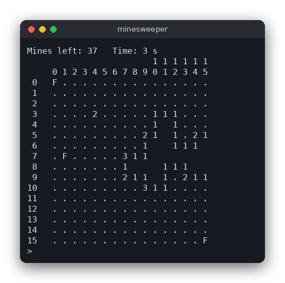

# Minesweeper (C)

The classic Minesweeper game for the terminal. Uncover the cells without touching a mine: each opened cell shows how many of its eight neighbors hide a mine, and you use those numbers to find every safe cell. Written in C with only the standard library; the rules are kept apart from the screen code and tested.



## Features

- Three levels: Beginner 9x9 (10 mines), Intermediate 16x16 (40 mines), Expert 16x30 (99 mines)
- The first cell you open is never a mine, and neither are its neighbors
- Opening an empty cell opens the whole empty area around it (flood fill)
- Flags for marked cells, and a counter of mines left (mines minus flags)
- Timer, win when every safe cell is open, loss when you open a mine (all mines are then shown)

## How to play

Start the program and choose a level by typing its number. Then type one command per line:

| Command | Meaning |
|---|---|
| `r ROW COL` | reveal (open) a cell |
| `f ROW COL` | put a flag on a hidden cell, or remove it |
| `q` | quit |

Rows are counted down the left side and columns along the top, both starting at 0.

Example session:

```text
> r 8 8        open the cell in row 8, column 8
> f 0 0        flag a cell you think is a mine
> r 3 4        open another cell
> q            quit
```

On the board, `.` is a hidden cell, `F` a flag, a digit a revealed cell with that many mines around it, a blank a revealed cell with none, and `*` a mine.

## How it works

**Data.** The whole game is one struct, `Game`, in `src/minesweeper.h`. It has fixed-size 2D arrays (at most 16 rows and 30 columns) for four things: `mine` (1 where a mine is), `neighbors` (how many mines touch each cell), `revealed` and `flagged`. The struct also stores the board size, the counters, the random state and the game state (`PLAYING`, `WON` or `LOST`). Nothing is global, so every function gets the game as a pointer.

**Random layout with a seed.** `game_start` only sets up empty arrays. The random numbers come from xorshift32 (`next_random` in `minesweeper.c`), a small generator whose output depends only on the seed. `main.c` passes the current time as the seed. Tests pass fixed seeds, so the same seed always gives the same board.

**Mines after the first click.** The mines are placed by the first `game_reveal`, not at the start. `place_mines` draws random cells and skips the clicked cell and its eight neighbors, so the first click always opens a cell with no mine and, if it is empty, starts a large opening. Then it counts the neighbors of every cell with `count_mines_around`.

**Flood fill.** `reveal_cell` opens a cell. If the cell has no neighboring mines (its number is 0), it calls itself for all eight neighbors. Each of them is opened; the ones with numbers stop there, and the empty ones keep spreading. A cell that is already open or flagged is skipped, which also stops the recursion. This is the flood fill: it starts from one cell and spreads through the connected empty cells, like water. Because the spreading stops at numbers, the empty area is always surrounded by numbered cells. A flood fill can never reach a mine, since a mine always makes its neighbors non-empty.

**Win and loss.** Opening a mine sets the state to `LOST` and opens all mines. After each opening, `game_reveal` compares the number of opened cells with the number of safe cells (`rows * cols - mines`). When they are equal the state becomes `WON`.

**Flags and the counter.** `game_toggle_flag` flips the flag of a hidden cell and updates `flag_count`. `game_mines_left` returns `mine_total - flag_count`, which can become negative if you place more flags than mines.

**The user interface loop (`src/main.c`).** `main` asks for a level, then repeats: print the status line and the board, read one line with `fgets`, parse it with `sscanf`, and call the matching logic function. The loop ends when the state is no longer `PLAYING`, when you type `q`, or when the input ends. `print_board` prints the column numbers as two lines (tens, then units) so that the 30 columns of the Expert board fit in 80 characters.

## Project layout

```text
src/c/minesweeper/
├── CMakeLists.txt        build rules for the program and the tests
├── README.md             this file
├── screenshot.png        the game in progress
├── src/
│   ├── minesweeper.h     the Game struct and the logic functions
│   ├── minesweeper.c     the rules: mines, numbers, flood fill, flags, win and loss
│   └── main.c            the terminal interface: level menu, commands, drawing
└── tests/
    └── test_minesweeper.c   tests of the rules (no input or output needed)
```

## Requirements

- A C compiler (gcc or clang)
- CMake 3.10 or newer
- Any terminal. No extra libraries are needed.

## Run

```sh
cmake -S . -B build
cmake --build build
./build/minesweeper
```

## Test

```sh
cmake -S . -B build && cmake --build build
cd build && ctest --output-on-failure
```

The 13 tests cover: no mines before the first click, the first click and its neighbors being safe, neighbor counts, flood fill (opening an area and stopping at numbers), losing on a mine, winning when all safe cells are open, flags and the counter, and moves outside the board.

## Comparison with the other versions

- [Python (tkinter)](../../python/minesweeper)
- [JavaScript (browser)](../../vanilla_js/minesweeper)

| | C | Python | JavaScript |
|---|---|---|---|
| Interface | terminal (text commands) | tkinter window | browser page |
| Lines of logic | 113 | 75 | 100 |
| Lines of interface | 113 | 87 | 88 |
| Tests | 13 | 13 | 13 |

The rules are the same in all three versions, so the differences come from the language. C keeps the board in fixed-size arrays inside one struct, and the random generator state lives inside that struct, so there are no global variables. Python uses lists and the standard `random.Random`, which makes seeding easy. JavaScript has no seedable `Math.random`, so the logic brings a small seeded generator with it. The interface differs most: C reads a line and redraws the board, while the tkinter and browser versions react to clicks and need a timer.

## Ideas for extensions

- Play again after a game ends, without restarting the program
- Chording: clicking a number whose flags are complete opens its other neighbors
- Keep the best time for each level in a file
- Color the flags and show a question mark for "maybe a mine"
- Add a custom level that the player types in
