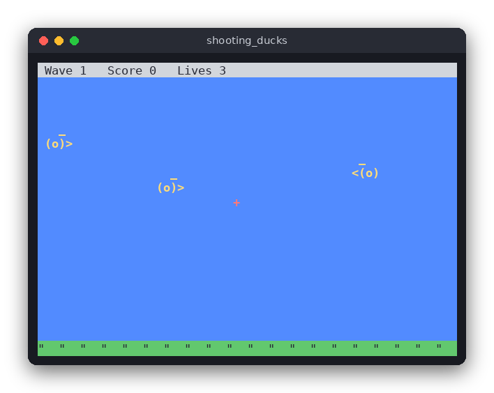

# Shooting Ducks (C)

Ducks fly across a terminal sky, left to right or right to left, bobbing up and down. You move a crosshair with the arrow keys and shoot with Space. Each wave brings more and faster ducks. A duck that gets away costs a life, and the game ends when all three lives are gone.

The same game is also written in [Python](../../python/shooting_ducks) and [JavaScript](../../vanilla_js/shooting_ducks).



## Features

- Ducks fly in both directions and bob up and down.
- A crosshair you move with the arrow keys; Space shoots.
- Waves: each wave has more ducks (3 + 2 × wave) that are faster and appear more often.
- Three lives: a duck that leaves the screen costs one life.
- 10 points per hit, shown with the wave number and lives in the status bar.
- A short pause after each cleared wave, and a game over screen with restart.

## How to play

| Key | Action |
|---|---|
| Arrow keys | Move the crosshair |
| Space | Shoot at the crosshair |
| R | Play again (after game over) |
| Q | Quit |

Shoot the ducks before they leave the screen. When a wave is cleared, the next one starts after two seconds.

## How it works

The game is split into two files:

- `src/shooting_ducks.c` holds the rules and knows nothing about the terminal. The state is a `Game` struct with the ducks in a fixed array, the score, the lives and the wave.
- `src/main.c` draws with ncurses and reads the keyboard.

**Random numbers.** `Rng` is a linear congruential generator. `rng_next` returns a number in [0, 1). The seed is passed in, so the same seed always gives the same game.

**Spawning.** A wave starts with `ducks_in_wave(wave)` ducks to release. Every `spawn_interval` seconds (2.0 s at the start, down to 0.5 s) `spawn_duck` adds one duck just outside the screen. It picks a direction, a speed, a height and a bobbing phase.

**Movement.** `game_update(game, dt)` moves each duck by `speed * dt`, so the game runs at the same speed on any machine. The height follows a sine wave around `base_y`.

**Escapes.** A duck that has fully left the screen on the far side is removed and costs a life. When the lives reach zero, `game_over` is set and the update and shooting functions stop.

**Hits.** `game_shoot(game, x, y)` looks for a duck whose box (10 × 6 field units) contains the point. It removes the first one it finds and adds 10 points. The UI converts the crosshair cell to field coordinates first.

**Waves.** When every duck of the wave has been spawned and removed, `break_timer` starts a two-second pause. Then the next wave begins.

The field is 100 × 40 units. The terminal maps it onto the screen, so the same rules work at any terminal size.

## Project layout

```
shooting_ducks/
├── CMakeLists.txt          build rules for the game and the tests
├── README.md               this file
├── screenshot.png          the game in progress
├── src/
│   ├── shooting_ducks.h    declarations of the rules
│   ├── shooting_ducks.c    the rules: spawning, movement, hits, waves
│   └── main.c              the ncurses screen and the keyboard loop
└── tests/
    └── test_shooting_ducks.c   tests of the rules, no terminal needed
```

## Requirements

- A C99 compiler (gcc or clang)
- CMake 3.10 or newer
- ncurses development files (`libncurses-dev` on Debian/Ubuntu, `ncurses-devel` on Fedora)

## Run

```sh
mkdir -p build && cd build
cmake ..
cmake --build .
./shooting_ducks
```

## Test

```sh
cd build
ctest --output-on-failure
```

The tests check the rules: the random source, spawning, movement over time, hits and misses, escapes, game over and waves.

## Comparison with the other versions

- [C](../../c/shooting_ducks) (terminal, ncurses)
- [Python](../../python/shooting_ducks) (pygame window)
- [JavaScript](../../vanilla_js/shooting_ducks) (browser canvas)

| | C | Python | JavaScript |
|---|---|---|---|
| Interface | ncurses terminal | pygame window | browser page |
| Lines of logic | 98 | 103 | 114 |
| Lines of interface | 135 | 103 | 156 |
| Tests | 10 | 11 | 10 |

The three versions use the same rules and the same random number generator, so a given seed produces the same ducks in each language. The C version keeps the ducks in a fixed array and removes a shot duck by shifting the rest down; Python and JavaScript just use a list, and removing an element is one call. C also has to draw the sky, grass and ducks cell by cell and convert between terminal cells and field coordinates, while the pygame and canvas versions draw shapes at pixel positions. JavaScript has no integer type, so the generator uses `Math.imul` to get the same 32-bit arithmetic that C gets for free from `uint32_t`.

## Ideas for extensions

- Add a bonus for shooting ducks quickly after they appear.
- Make some ducks worth more points, and draw them in a different colour.
- Add a splash animation where a duck was shot.
- Save the high score to a file.
- Support the mouse with the ncurses mouse API.
