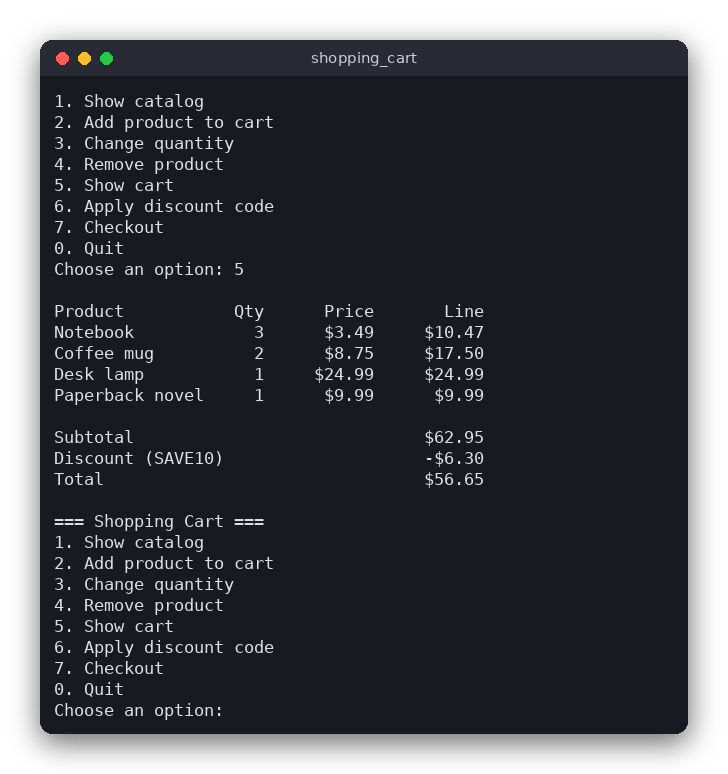

# Shopping Cart (C)

A terminal shopping cart for a small online shop. You browse an 8-product catalog, put items in the cart, apply a discount code, and check out with a name and a delivery address. The Polish name of the project is *Koszyk z zakupami*.



## Features

- A built-in catalog of 8 products with a name, a category and a price
- Add a product, change its quantity (0 removes it), or remove it
- The cart shows every line with its line total, the subtotal, the discount and the total
- Two discount codes: `SAVE10` takes 10% off any order, `FLAT5` takes 5.00 off orders of 30.00 or more
- Codes are not case-sensitive; an unknown code, or a code whose minimum is not reached, is rejected
- Checkout checks the name and the address, prints an order summary and empties the cart
- Money is stored as whole cents, so the totals are exact

## How to use

The program shows a numbered menu. Type the number and press Enter:

```
=== Shopping Cart ===
1. Show catalog
2. Add product to cart
3. Change quantity
4. Remove product
5. Show cart
6. Apply discount code
7. Checkout
0. Quit
```

A product is chosen by its catalog number (1-8). When you add a product, an empty quantity means 1. Press Ctrl+D to quit at any prompt.

Example session (three notebooks with the `SAVE10` code):

```
Choose an option: 2
Product number (1-8): 1
Quantity [1]: 3
Choose an option: 6
Discount code (try SAVE10 or FLAT5): SAVE10
Choose an option: 5

Product           Qty      Price       Line
Notebook            3      $3.49     $10.47

Subtotal                             $10.47
Discount (SAVE10)                    -$1.05
Total                                 $9.42
```

The screenshot shows a larger cart with four products and the same code.

## How it works

**Data.** `CATALOG` is an array of `Product` structs (name, category, price). `DISCOUNT_CODES` is an array of `DiscountCode` structs: a percentage, or a fixed amount with a minimum order value. A `Cart` holds `quantities[8]`, one number per catalog product, and a pointer to the applied code (`NULL` when there is none). The cart never holds more than 99 of one product.

**Money in cents.** Every price and total is an `int` counting cents: `349` means $3.49. The reason is that binary floating point cannot store most decimal fractions exactly. For example, `0.1` is really `0.1000000000000000055511...`, so adding ten prices of `0.10` with `double` can give `0.9999999999999999` instead of `1.00`. With integers the arithmetic is exact, and the text `$3.49` is only produced when the program prints the money (`format_money` in `main.c`).

**Rules** (`shopping_cart.c`):

1. `cart_subtotal` adds `price * quantity` for each product.
2. A percentage discount is `(subtotal * percent + 50) / 100`. The `+ 50` rounds half up to the nearest cent, so 10% of $3.49 is 35 cents.
3. A fixed discount is the amount, but never more than the subtotal. It is applied only when the subtotal reaches the code's minimum. If the cart later drops below the minimum, the discount becomes 0.
4. `cart_total` is the subtotal minus the discount.
5. Names must have 2-40 characters and at least one letter. Addresses must have 5-80 characters and at least one digit (the house number).

The logic functions return a `CartResult` code and never print anything. `main.c` turns the code into a message with `result_message`.

**The user interface loop** (`main.c`). `main` prints the menu, reads one line with `read_line` (which removes the surrounding spaces), converts it to a number with `parse_int` and calls the matching function from a `switch`. Checkout asks for the name and the address again until each is valid, prints the summary and calls `cart_clear`. When the input ends (Ctrl+D), `read_line` returns 0 and the program stops.

## Project layout

```
CMakeLists.txt             build rules for the program and the tests
README.md                  this file
screenshot.png             the terminal screenshot above
src/shopping_cart.h        declarations of the catalog, the cart and the rules
src/shopping_cart.c        the rules: catalog data, cart operations, discounts, totals, validation
src/main.c                 the terminal menu: reading input, printing tables and messages
tests/test_shopping_cart.c tests of the rules, using assert()
```

## Requirements

- A C99 compiler (gcc or clang)
- CMake 3.10 or newer (optional: the program also compiles with one command, see below)
- No external libraries

## Run

```sh
cmake -S . -B build
cmake --build build
./build/shopping_cart
```

Without CMake:

```sh
cc -std=c99 -Wall -Wextra src/main.c src/shopping_cart.c -o shopping_cart
./shopping_cart
```

## Test

```sh
cmake -S . -B build
cmake --build build
cd build
ctest --output-on-failure
```

The tests check the catalog, adding and removing items, the quantity limit, both kinds of discount (including rounding and the minimum order), unknown codes, clearing the cart, and the name and address rules. They do not need a terminal.

## Comparison with the other versions

- [Python](../../python/shopping_cart)
- [JavaScript](../../vanilla_js/shopping_cart)

| | C | Python | JavaScript |
|---|---|---|---|
| Interface | terminal menu | terminal menu | browser page |
| Lines of logic | 163 | 81 | 90 |
| Lines of interface | 265 | 130 | 205 |
| Tests | 12 | 17 | 12 |

C has no built-in collections, so the cart is a fixed array indexed by product, and the functions report errors with a returned enum value. Python uses dataclasses and raises `CartError` exceptions, and its integers never overflow, so the same cents logic needs no size checks. JavaScript numbers are 64-bit floating-point values; they represent whole numbers up to 2^53 exactly, so cents work there too, but the division has to use `Math.floor`. The browser version redraws the page from one state object, so it needs no manual updating of individual elements.

## Ideas for extensions

- Save the cart to a file, so it survives restarting the program
- Add a stock count per product and refuse orders that exceed it
- Support several discount codes at once, with a rule for which one wins
- Add shipping costs that depend on the order value
- Print a numbered receipt with a date and an order id
