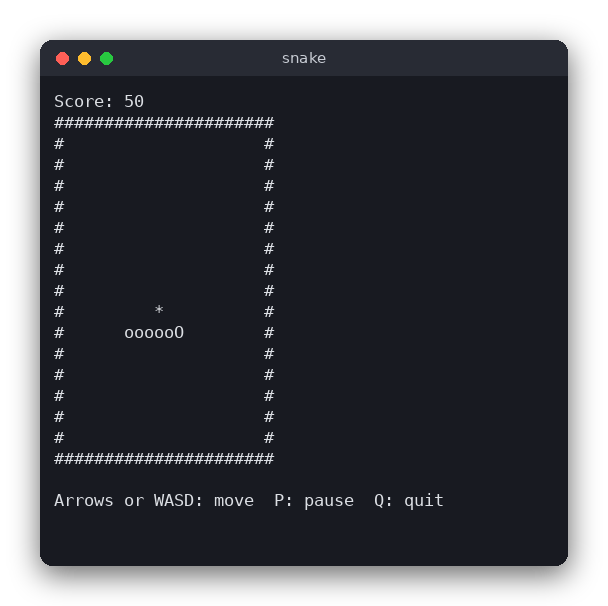

# Snake (C)

Snake in the terminal: you steer a snake around a board, eat the food to grow and score points, and the game ends when the snake hits a wall or its own body. The game is written in C with ncurses for the screen and keyboard, and its rules are in a separate file that has no input or output at all.



## Features

- A 20 x 15 board with a wall around it
- Arrow keys or W, A, S, D steer the snake
- The snake cannot reverse into itself
- Eating food makes the snake longer and adds 10 points
- Hitting the wall or the snake's own body ends the game
- The game gets faster as the snake grows
- P pauses, R or Space restarts after game over, Q quits

## How to play

| Key | Action |
|---|---|
| Arrow keys or W A S D | Turn the snake (it keeps moving on its own) |
| P | Pause or continue |
| R or Space | Start a new game (after game over) |
| Q | Quit |

The head is `O`, the body is `o`, and the food is `*`. Your score is shown at the top.

## How it works

### Data

The board is 20 x 15 cells. A cell is a `Cell` (`x` and `y`). The snake is an array `body` of cells, where `body[0]` is the head and the last element is the tail. `length` says how many of them are used. The direction is a `Direction` (`UP`, `DOWN`, `LEFT`, `RIGHT`).

### One step of the game

`game_step` does the following:

1. Take the direction the player asked for (`next_direction`) and work out the new head cell.
2. If the head is outside the board or on a cell of the snake's body, the game is over.
3. Otherwise move the body: `memmove` shifts every segment one place towards the tail. If the head has reached the food, nothing is removed, so the snake grows by one; the score goes up by 10 and new food is placed.

### Turns

`game_turn` stores the requested direction, but only if it is not the opposite of the last step. Turning from right to left is ignored. Two key presses between two steps are checked against the last step too, so the snake can never turn back into its own neck.

### Food

`place_food` counts the free cells and asks the random source for one number between 0 and that count. It then walks over the board and puts the food on the chosen free cell. A function pointer (`RandomFn`) is passed in, so the tests can use a fixed choice.

### The loop in main.c

`main.c` only draws and reads keys. It keeps the time of the next step in milliseconds (`clock_gettime`) and calls `getch()` with a timeout that ends at that time. When the key read returns `ERR` the time for a step has come and `game_step` runs; a key press is handled without moving the snake. This way key presses do not speed the snake up. `keypad(stdscr, TRUE)` makes ncurses translate the arrow keys into `KEY_UP` and the other constants.

## Project layout

```
CMakeLists.txt          build script (library, game, tests)
src/snake.h             declarations and types of the rules
src/snake.c             the rules: steps, turns, food, speed (no screen, no keys)
src/main.c              the terminal interface with ncurses
tests/test_snake.c      tests of the rules, with assert()
```

## Requirements

- CMake 3.10 or newer and a C compiler (gcc or clang)
- The ncurses development files: `libncurses-dev` on Debian and Ubuntu, `ncurses` with Homebrew on macOS
- A terminal of at least 22 x 20 characters

## Run

```sh
cmake -S . -B build
cmake --build build
./build/snake
```

## Test

```sh
cmake -S . -B build
cmake --build build
cd build && ctest --output-on-failure
```

The tests check the rules only: the start, moves, turns, walls, collisions with the body, eating, the random choice of food and the speed. They need no terminal.

## Comparison with the other versions

- [Python version](../../python/snake)
- [JavaScript version](../../vanilla_js/snake)

| | C | Python | JavaScript |
|---|---|---|---|
| Interface | ncurses terminal | pygame window | browser page |
| Lines of logic | 128 | 55 | 79 |
| Lines of interface | 121 | 75 | 74 |
| Tests | 9 | 13 | 13 |

The rules are the same in all three versions, and so are the tests in spirit. In C the snake is a fixed array with room for the whole board, so there is no memory to allocate or free, and the random source is a function pointer. Python uses a list of tuples and a free-cell list comprehension, and its random source is a default argument. In JavaScript the body is an array of objects, and the browser timer is a `setTimeout` chain. C has to manage the timing and the key codes itself, while the other two get them from the platform.

## Ideas for extensions

- Show the high score in a file between games
- Add a faster and a slower mode chosen at the start
- Add obstacles that are placed at random on the board
- Let the walls wrap around, so the snake comes out on the other side
