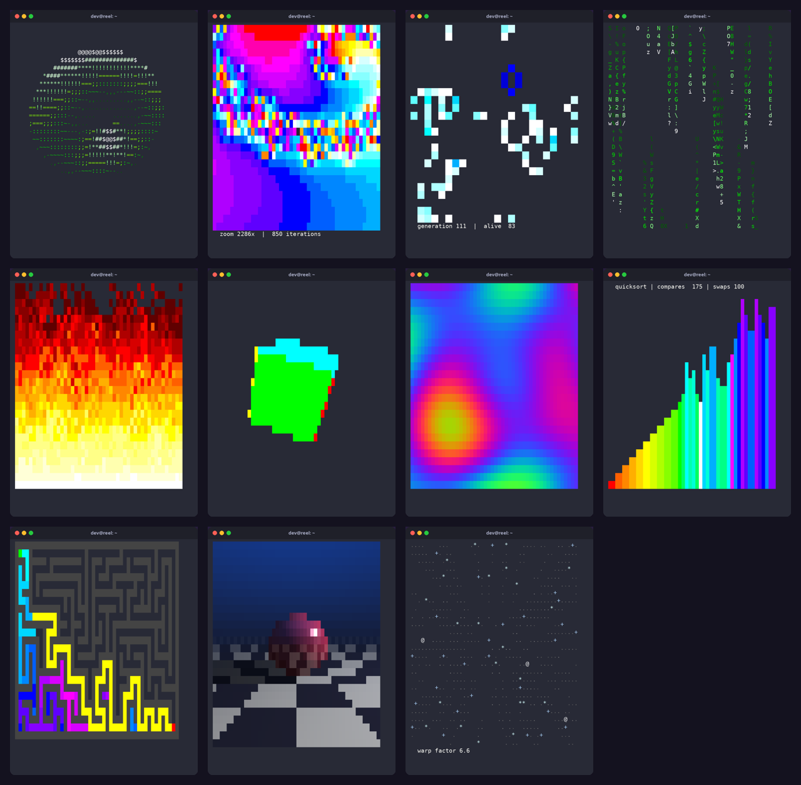

# Terminal Effects (C)

Eleven small, self-contained C programs that turn the terminal into a canvas: 3D graphics, fractals, simulations and algorithm visualizations, using only the standard library and ANSI escape codes.



## Effects

| Program | What it shows | Ideas inside |
|---|---|---|
| `donut` | A spinning 3D torus drawn with ASCII shading | Rotation matrices, perspective projection, z-buffer, surface normals |
| `mandelbrot_zoom` | A 60,000× zoom into the Mandelbrot set's "seahorse valley" | Complex numbers, escape-time algorithm, color cycling |
| `game_of_life` | Conway's Game of Life on a wrapping grid, cells colored by age | Cellular automata, double buffering, toroidal neighbors |
| `matrix_rain` | The Matrix "digital rain" | Per-column state, trails with color gradients |
| `doom_fire` | The PSX Doom fire effect | Heat propagation with random cooling and wind |
| `spinning_cube` | A solid cube with six colored faces | 3D rotation around three axes, z-buffer rasterization |
| `plasma` | Demoscene plasma in 24-bit color | Summed sine waves, truecolor escape codes |
| `quicksort_visualizer` | Quicksort, one frame per swap | Lomuto partitioning, recursion |
| `maze_solver` | A random maze carved live, then solved | Depth-first search with an explicit stack, BFS shortest path |
| `ray_tracer` | A reflective sphere on a checkered floor with an orbiting light | Ray-sphere and ray-plane intersection, diffuse/specular light, shadows, reflections |
| `warp_starfield` | A 3D starfield accelerating to warp speed | Perspective projection, depth sorting, motion streaks |

Each program is a single file in `src/`, short enough to read in one sitting.

## Requirements
- A C compiler (gcc or clang) and CMake >= 3.10
- A terminal with UTF-8, 256 colors and truecolor support (most modern terminals), at least 50×28 characters

## Build & Run

### Locally
```sh
cmake -S . -B build
cmake --build build
./build/donut
./build/plasma
```

Or compile a single effect directly:
```sh
gcc src/ray_tracer.c -o ray_tracer -lm && ./ray_tracer
```

### With Docker
```sh
docker build -t terminal_effects .
docker run --rm -it terminal_effects
docker run --rm -it terminal_effects /app/build/maze_solver
```

## Test
Each test runs one animation to the end and checks that it exits cleanly (about 80 seconds for all of them):
```sh
cd build
ctest --output-on-failure
```
