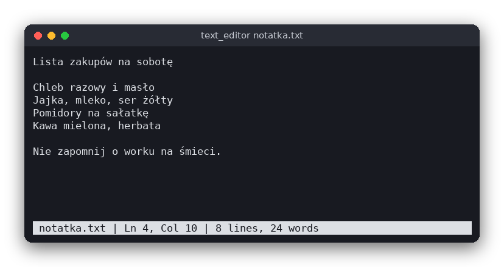

# Text Editor (C)

A small plain-text editor for the terminal, written in C with ncurses. You open a file, edit it, search it and save it. The text is stored as a list of lines, and the editor is the part to read: how a buffer of lines supports inserting, splitting and joining lines.

The same editor is also written in [Python](../../python/text_editor) (tkinter) and [JavaScript](../../vanilla_js/text_editor) (browser). The editor works with plain text only, without bold, italic or colors, so the three versions have the same features and can be compared line by line.



## Features

- Open a file from the command line (`text_editor notes.txt`); a file that does not exist yet is created when you save
- Edit with the arrow keys, Home, End, PgUp, PgDn, Enter, Backspace, Delete and Tab (4 spaces)
- Non-English letters (UTF-8) work, and Backspace removes a whole character, not one byte
- Save with Ctrl+S; a new file asks for its name
- Find text with Ctrl+F, find the next match with F3; the search wraps around to the start of the file
- Go to a line with Ctrl+G
- A status bar with the file name, a `[modified]` marker, line and column, and the number of lines and words
- Warns before you quit (Ctrl+Q) or start a new file (Ctrl+N) with unsaved changes

## How to use

| Key | Action |
|---|---|
| Arrows, Home, End | Move the cursor |
| PgUp, PgDn | Move one screen up or down |
| Letters, Enter, Tab | Type text, split the line, insert 4 spaces |
| Backspace, Delete | Delete the character before / after the cursor (at a line end, joins the lines) |
| Ctrl+S | Save (asks for a name if the file has none) |
| Ctrl+F | Find text; Enter starts the search, Esc cancels |
| F3 | Find the next match |
| Ctrl+G | Go to a line number |
| Ctrl+N | New empty file |
| Ctrl+Q | Quit |

In a question line such as "Unsaved changes. Quit anyway? (y/n)", press `y` or `n`. Typing in a prompt is done with Backspace, Enter confirms and Esc cancels.

## How it works

### The buffer

`src/text_editor.h` defines `Buffer`:

```c
typedef struct {
    char **lines;    /* every line is a NUL-terminated string without '\n' */
    size_t count;    /* number of lines, always at least 1 */
    size_t capacity; /* allocated slots in lines */
    size_t row;      /* cursor line */
    size_t col;      /* cursor position in bytes inside the line (UTF-8) */
    int modified;
} Buffer;
```

Each line is its own heap-allocated string, and `lines` is an array of pointers to them. The cursor is a line number (`row`) and a byte offset in that line (`col`). The byte offset always points to the start of a UTF-8 character, which is why the helpers `utf8_next` and `utf8_prev` skip the continuation bytes (those that start with the bits `10`).

Every change is a small operation on this structure, and each one is in `src/text_editor.c`:

- **Typing** (`buffer_insert`) makes the line longer with `realloc`, moves the bytes after the cursor with `memmove` and copies the new text in. Text with `'\n'` in it splits the line.
- **Enter** (`split_line`) copies the part of the line after the cursor into a new line and inserts it into the array of lines. Pressing Enter in the middle of a line therefore moves the rest of the line down.
- **Backspace** and **Delete** remove one character. At the start (or end) of a line they join the two lines (`join_with_next`): the second line is appended to the first and the array is closed up.
- **Movement** (`buffer_left`, `buffer_right`, `buffer_move_rows`) wraps from the end of one line to the start of the next. Moving up or down keeps the byte column, but never past the end of the line.
- **Loading** (`buffer_load`) splits the file text on `'\n'`. A final newline ends the last line and does not add an empty line, so saving writes back the same text with a newline at the end.

### Search and counts

`buffer_find` looks for the text on the cursor's line after the cursor, then on the following lines, and wraps around to the first line. It returns after the first match and moves the cursor there. `buffer_word_count` counts the spaces-separated words of all lines.

### The user interface

`src/main.c` contains everything that touches the terminal. The main loop is:

1. `draw` scrolls the view so the cursor is visible, draws the lines and the status bar, then places the terminal cursor.
2. `read_input` waits for one key with `get_wch`, which reads whole UTF-8 characters. It returns whether the key is a special key (an arrow, F3, ...) or a character.
3. `handle_input` changes the buffer or the editor state (file name, search text, message). It returns 1 when the editor should quit.

`prompt` is used for the file name, the search text and the line number. It reads a line in the status bar, and it is the only place that handles typing for these questions.

Long lines scroll sideways, and the view is measured in characters, not bytes, so a Polish letter takes one column. Tabs are drawn as a blank and wide characters (such as Chinese) are not handled.

## Project layout

```
CMakeLists.txt         builds the logic as a library, the editor and the tests
src/text_editor.h      the Buffer type and the functions of the logic
src/text_editor.c      the logic: lines, cursor, editing, search, UTF-8 (no input or output)
src/main.c             the user interface: ncurses, keys, status bar, saving
tests/test_text_editor.c  tests of the logic
```

## Requirements

- A C compiler (gcc or clang) and CMake 3.10 or newer
- The ncurses development package with the wide-character library (`libncursesw`, on Debian and Ubuntu `libncurses-dev`)
- A terminal that uses UTF-8

## Run

```sh
cmake -S . -B build
cmake --build build
./build/text_editor notes.txt
```

## Test

```sh
cd build
ctest --output-on-failure
```

The tests check the buffer operations (inserting, splitting and joining lines, Backspace on UTF-8 characters, moving the cursor, searching with wrap-around, counting words) without a terminal.

## Comparison with the other versions

- [Python](../../python/text_editor): tkinter window, [README](../../python/text_editor/README.md)
- [JavaScript](../../vanilla_js/text_editor): browser page, [README](../../vanilla_js/text_editor/README.md)

| | C | Python | JavaScript |
|---|---|---|---|
| Interface | ncurses terminal | tkinter window | browser page |
| Lines of logic | 298 | 22 | 35 |
| Lines of interface | 355 | 156 | 157 |
| Tests | 9 | 6 | 7 |

In C the editor keeps the text itself, so the buffer of lines, the cursor and the byte-level UTF-8 handling are written by hand, and that is most of the code. In Python and JavaScript the built-in Text widget and textarea already store the text, cursor and selection, so the logic only has the search, the positions and the counts. The C version must also manage memory: every line is allocated and freed explicitly, and an error while growing the buffer is checked after each change.

## Ideas for extensions

- Replace the array of lines with a gap buffer, so typing in a long line does not copy the whole line each time
- Add Undo and Redo with a stack of changes
- Select text with Shift+arrows and copy or cut it
- Open another file from inside the editor (Ctrl+O) with the same warning as for Ctrl+N
- Show the line numbers in a column on the left
