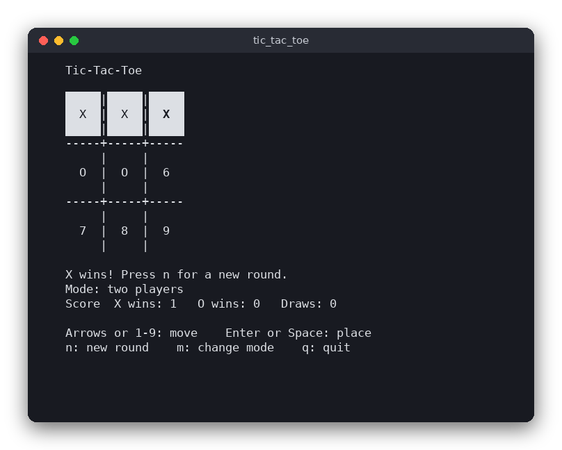

# Tic-Tac-Toe (C)

Tic-tac-toe ("Kółko i krzyżyk") in the terminal, drawn with ncurses. Two people can share the keyboard, or you can play X against a computer that uses minimax and never loses.



## Features

- Two players on one computer, or a player against the computer.
- Wins are detected, the winning line is highlighted, and draws are reported.
- A score of X wins, O wins and draws is kept across rounds.
- Move with the arrow keys or jump straight to a cell with 1-9.
- Start a new round at any time.

## How to play

| Key | Action |
|---|---|
| Arrows | move the cursor over the board |
| `1` to `9` | place a mark on that cell (see the numbers on the empty cells) |
| Enter or Space | place a mark under the cursor |
| `n` | new round (the score is kept) |
| `m` | switch between two players and playing against the computer, starts a new round |
| `q` | quit |

Example session in two-player mode, from the screenshot: X presses `1`, O presses `4`, X presses `2`, O presses `5`, X presses `3`. X has three cells in the top row, so X wins and the row is highlighted.

## How it works

### Data structures

The rules live in `src/tic_tac_toe.c`. A board is a struct with an array of nine `Mark` values (`EMPTY`, `X`, `O`), indexed row by row from 0 to 8. The eight winning lines are listed once in a static table `LINES`. `board_winning_line()` checks them and returns a pointer to the matching row of that table, or `NULL` when nobody has won. Because the board is a plain struct, the search can copy it with `Board next = *board;` and never allocates memory.

### Turns and the round

`src/main.c` keeps a `Game` struct: the board, whose turn it is, the cursor position, the mode and the three counters. `place()` puts the mark, then either switches the turn or, when the round has ended, adds one to the right counter. In vs-computer mode `human_move()` calls `board_best_move()` right after the human's move, so the computer answers at once.

### The main loop

`main()` starts ncurses, then repeats: draw the screen, read one key with `getch()`, handle it. Nothing is drawn while waiting for the key, and the screen is redrawn completely after each key, which is simple and never leaves stale characters behind.

### Win and draw

- A win is a complete line of the same mark, found by `board_winning_line()`.
- A draw is a full board with no winning line, `board_is_draw()`.

### Minimax, step by step

The computer looks ahead through every possible continuation of the game and chooses the move that leads to the best result for it. Each finished game is scored from the computer's point of view:

- a win scores `10 - depth`,
- a loss scores `depth - 10`,
- a draw scores `0`,

where `depth` is the number of moves played from the position being scored. Subtracting the depth makes a quick win score higher than a slow one, and a slow loss score higher than a fast one, so the computer finishes a won game quickly and delays a lost one.

The search alternates between two players. On the computer's turn it takes the **maximum** score of its moves; on the opponent's turn it takes the **minimum**, because the opponent picks the reply that is worst for the computer. Recursion ends when a game is over.

Example. X has cells 0 and 1 and threatens to win on cell 2. O (the computer) has cells 4 and 8. It is O's turn:

```
X X 2        (empty cells are shown by their number)
3 O 5
6 7 O
```

1. The legal moves for O are 2, 3, 5, 6 and 7.
2. Move 3 (or 5, 6, 7) does not stop X. X plays 2 and wins at once. The win is found at depth 2, so the score is `2 - 10 = -8`.
3. Move 2 blocks the threat, and it also creates two threats for O: 6 (cells 2-4-6) and 5 (cells 2-5-8). X can stop only one of them, so O wins on its next move. That win is found at depth 3, so the score is `10 - 3 = 7`.
4. O compares the scores 7, -8, -8, -8, -8 and picks the maximum: cell 2.

The computer therefore never loses a game it can avoid losing. Two computers playing each other always end in a draw, which the tests check.

The function `board_best_move()` tries every legal move, runs `minimax()` on the position that results, and returns the cell with the highest score. If several moves score the same, the lowest cell number is taken.

## Project layout

```
CMakeLists.txt             builds the logic library, the game and the tests
src/tic_tac_toe.h, .c     the rules: board, legal moves, winner, draw, minimax (no input or output)
src/main.c                 the ncurses user interface
tests/test_tic_tac_toe.c   tests of the rules using assert()
```

## Requirements

- A C compiler (gcc or clang), CMake 3.10 or newer
- The ncurses development files: `libncurses-dev` on Debian or Ubuntu, `ncurses-devel` on Fedora

## Run

```sh
cmake -S . -B build
cmake --build build
./build/tic_tac_toe
```

## Test

```sh
cmake -S . -B build && cmake --build build && cd build && ctest --output-on-failure
```

The tests use only the logic module. They check the win and draw rules, illegal moves, the computer taking an immediate win, the computer blocking an immediate loss, and two computers always drawing.

## Comparison with the other versions

- [C (terminal, ncurses)](../../c/tic_tac_toe)
- [Python (tkinter window)](../../python/tic_tac_toe)
- [JavaScript (browser page)](../../vanilla_js/tic_tac_toe)

| | C | Python | JavaScript |
|---|---|---|---|
| Interface | ncurses terminal | tkinter window | browser page |
| Lines of logic | 142 | 53 | 82 |
| Lines of interface | 163 | 73 | 68 |
| Tests | 10 | 17 | 9 |

The rules and the minimax search are the same algorithm in all three versions, so the tests check the same positions. C stores the board in a fixed struct of nine values and copies it by value inside the search, so no memory is allocated; the winning line is a pointer into a static table. Python and JavaScript write each new position as a new list or array, which reads more like the rules but allocates a little more. The terminal version polls keys in a loop, while the other two react to button callbacks.

## Ideas for extensions

- Add a difficulty level that sometimes chooses a random legal move.
- Let the computer start every other round, so the score is fairer.
- Save the score to a file and load it at the next start.
- Show the moves of the last round, or let the player undo one move.
