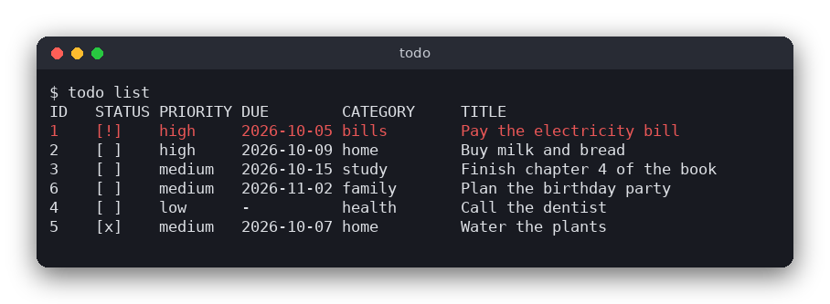

# Todo List (C)

A terminal todo list. Each task has a title, a priority (low, medium or high), an optional due date and an optional category. Tasks are saved in a plain text file, `tasks.txt`, so there is no database to install.



## Features

- Add, edit, delete, mark done and mark not done
- Priorities, due dates (checked against the calendar) and categories
- The list is sorted by done status, then due date, then priority
- Filter by category, or show all, active or done tasks
- Overdue tasks (not done, due before today) are red and marked `[!]`
- The tasks are stored in `tasks.txt` in the current directory

## How to use

Every command is one run of the program. Run it without arguments to see the list.

| Command | What it does |
|---|---|
| `todo` or `todo list` | show the tasks; add `--category NAME` and `--status all\|active\|done` to filter |
| `todo add TITLE [--due YYYY-MM-DD] [--priority low\|medium\|high] [--category NAME]` | add a task (the default priority is medium) |
| `todo edit ID [--title T] [--due DATE\|none] [--priority P] [--category NAME\|none]` | change a task; `none` removes the due date or the category |
| `todo done ID` / `todo undone ID` | mark a task as done or not done |
| `todo rm ID` | delete a task |
| `todo --help` | show the usage |

Example session:

```sh
$ todo add "Buy milk" --due 2026-10-20 --priority high --category home
Added task 1.
$ todo add "Call the dentist" --priority low
Added task 2.
$ todo done 1
Task 1 is now done.
$ todo list --status active
ID   STATUS PRIORITY DUE        CATEGORY     TITLE
2    [ ]    low      -          -            Call the dentist
```

The `ID` of a task never changes. A new task gets the largest id plus one.

## How it works

### The data

A task is a `Task` struct (`src/todo.h`): an id, a title, a `Priority` enum, a due date and a category as fixed-size strings (an empty string means "no due date" or "no category"), and a `done` flag. A `TaskList` holds up to 200 tasks in an array. Titles can be up to 255 bytes and categories up to 63 bytes.

### The file format

`tasks.txt` has one task per line. The six fields are separated by tab characters:

```
1	0	high	2026-10-20	home	Buy milk
2	1	low		work	Send the report
```

The fields are: id, done (`1` or `0`), priority, due date, category, title. The due date and category are empty when they are not set.

The format uses tabs and new lines as separators, so a title or category cannot contain a tab or a new line. The program refuses such values instead of escaping them. This keeps the format trivial: a line is split at the tabs and nothing else. Plain text was chosen instead of SQLite because it needs no library, the file can be read and edited by hand, and a small list does not need a database. If the file contains a line that is not valid, the program stops and reports the line number, so no task is lost silently.

### Rules and checks (`src/todo.c`)

- `is_valid_date` checks the `YYYY-MM-DD` form, the month range, and the number of days in the month (leap years included).
- `task_is_valid` checks the title (not empty), the category, the priority and the due date. The commands use it before they change anything.
- `task_is_overdue` is true when the task is not done, has a due date, and the date is earlier than today. The program passes today's date in, which keeps this function testable.
- `list_view` selects the tasks that match the filters and sorts them with `qsort`. The comparison function puts active tasks first, then tasks with a due date (earliest first, tasks without a date last), then high priority first, and finally the id.

### The terminal interface (`src/main.c`)

There is no loop. `main` reads the command line, loads `tasks.txt` into a `TaskList`, runs one command (a `cmd_...` function), and writes the file back when the command changes something. Each `cmd_` function prints a message or an error and returns the exit code: 0 for success, 1 for a data error (such as a missing id or an invalid date), 2 for a wrong command line. Overdue rows are printed with ANSI escape codes for red.

## Project layout

```
CMakeLists.txt         builds the logic as a library, the todo program and the tests
src/todo.h, todo.c     the logic: validation, dates, sorting, filtering, the text format
src/main.c             the terminal interface: commands, reading and writing tasks.txt
tests/test_todo.c      tests of the logic (no files, no terminal needed)
```

## Requirements

- A C compiler (gcc or clang) and CMake 3.10 or newer
- No other libraries

## Run

```sh
cmake -S . -B build
cmake --build build
./build/todo add "Buy milk" --due 2026-10-20 --priority high
./build/todo list
```

## Test

```sh
cmake -S . -B build && cmake --build build
cd build && ctest --output-on-failure
```

## Comparison with the other versions

- [Python version](../../python/todo)
- [JavaScript version](../../vanilla_js/todo)

| | C | Python | JavaScript |
|---|---|---|---|
| Interface | terminal commands | terminal commands | browser page |
| Lines of logic | 239 | 76 | 79 |
| Lines of interface | 273 | 136 | 180 |
| Tests | 7 | 10 | 7 |

C has no dictionaries, lists or string type, so every value lives in a fixed-size array and the program checks each length before copying. The file parser is a short loop that splits at the tab characters, and the sort comparison is a separate function that `qsort` calls through a pointer. In Python the `Task` is an immutable dataclass, so an edit creates a new task with `dataclasses.replace` and the list is rebuilt rather than changed. The JavaScript version keeps the tasks as plain objects and saves them as JSON in `localStorage`, so it does not need a text format at all.

## Ideas for extensions

- Add `todo search TEXT` to find tasks by part of the title.
- Sort the list by a chosen field with `--sort`.
- Repeat tasks: a weekly task that moves its due date forward when it is marked done.
- Add a `--json` output option for other programs to read.
