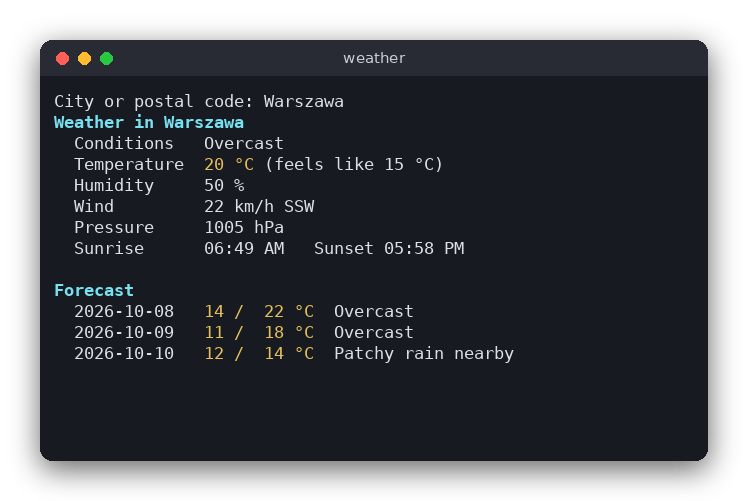

# Weather (C)

A command-line weather report. You type a city name or postal code, and the program downloads the current weather and a 3-day forecast from [wttr.in](https://wttr.in), a free service that needs no API key. The program is written in C with a small logic module that is tested without touching the network.

The same program is also written in [Python](../../python/weather) and [JavaScript](../../vanilla_js/weather). All three print the same report.



## Features

- Current temperature, feels-like temperature, conditions, humidity, wind speed and direction, pressure, sunrise and sunset
- A 3-day forecast with the minimum and maximum temperature and the conditions for each day
- Works with city names (`Warszawa`, `New York`, `Kraków`) and postal codes (`00-001`)
- Clear error messages for an unknown city, no network connection, or an empty reply
- Colors for the title, the temperatures and the section headings

## How to use

Give the city as an argument:

```sh
./build/weather Warszawa
```

Several words are joined into one name, so `./build/weather New York` also works. Without an argument the program asks for the city:

```text
$ ./build/weather
City or postal code: Warszawa
Weather in Warszawa
  Conditions   Overcast
  Temperature  20 °C (feels like 15 °C)
  Humidity     50 %
  Wind         22 km/h SSW
  Pressure     1005 hPa
  Sunrise      06:49 AM   Sunset 05:58 PM

Forecast
  2026-10-08  14 /  22 °C  Overcast
  2026-10-09  11 /  18 °C  Overcast
  2026-10-10  12 /  14 °C  Patchy rain nearby
```

Errors go to standard error and the program exits with status 1:

```text
$ ./build/weather zzzzqqq
City not found: zzzzqqq
```

## How it works

**Getting the data.** The program runs `curl` with `popen()` and reads its output into a buffer that grows with `realloc()`. We use `curl` instead of the libcurl library because it needs no extra library to link against and the command is easy to read. `curl -sf` makes HTTP errors (such as the 500 that wttr.in returns for an unknown city) give exit code 22, so the program can tell "unknown city" apart from "no network" (for example exit code 6 or 7).

**One request for everything.** wttr.in can return a single line of text with a format string (`?format=%t|%f|...`), but that format has no forecast. The JSON reply (`?format=j1`) has everything, so the program makes one request and reads the JSON. A full JSON parser would take a lot of code in C, so `weather.c` uses a small key finder instead. `find_key()` looks for `"key"` with `strstr()`, and `read_text()` copies the quoted value after it. The values we need are unique in their part of the reply, so this simple search is enough. Pieces of the reply are searched in order: the `current_condition` block first, then the `weather` array, where each day lists its date, its minimum and maximum temperature, and 8 three-hour `hourly` slots. The fifth slot (index 4) is 12:00, and its description is used for the day.

**Encoding the city.** `weather_url()` keeps letters, digits and `-._~` as they are and writes every other byte as `%XX`. The UTF-8 bytes of `ł` become `%C5%82`, and a space becomes `%20`. Because the URL then contains only safe characters, it can be placed in single quotes in the `curl` command without any risk of running other shell commands.

**Formatting.** `weather_report()` writes the report into a buffer with `snprintf()`-style calls. It contains ANSI color codes, so the same text looks colored in a terminal.

**Project layout of the logic.** The logic (`weather.c`) never prints and never reads input. Only `main.c` talks to the user and runs `curl`. This split lets the tests check the parsing and the URL building with a saved reply.

## Project layout

```
weather/
├── CMakeLists.txt        build rules for the program and the tests
├── README.md             this file
├── screenshot.png        the program running for Warszawa
├── src/
│   ├── weather.h         the Weather struct and the three logic functions
│   ├── weather.c         URL building, JSON key lookup, report formatting
│   └── main.c            reads the city, runs curl, prints the report or an error
└── tests/
    ├── test_weather.c    tests of the logic, using warszawa.json
    └── warszawa.json     a saved wttr.in reply (format=j1) for Warszawa
```

## Requirements

- A C compiler (gcc or clang) and CMake 3.10 or newer
- `curl` in your `PATH`
- Linux, macOS or WSL (the program uses the POSIX functions `popen()` and `WEXITSTATUS`)
- An internet connection to run the program (the tests do not need one)

## Run

```sh
cmake -S . -B build
cmake --build build
./build/weather Warszawa
```

## Test

```sh
cmake -S . -B build && cmake --build build && cd build && ctest --output-on-failure
```

The tests check the URL encoding, the parsing of the saved reply (current conditions and the forecast), the rejection of bad replies, and the report text.

## Comparison with the other versions

- [Python version](../../python/weather)
- [JavaScript version](../../vanilla_js/weather)

| | C | Python | JavaScript |
|---|---|---|---|
| Interface | Terminal, `curl` through `popen()` | Terminal, `urllib` | Terminal, `fetch` |
| Lines of logic | 177 | 77 | 62 |
| Lines of interface | 100 | 33 | 50 |
| Tests | 9 | 9 | 7 |

The C version is the longest mostly because of the JSON handling. Python and JavaScript read the reply with a built-in JSON parser in one line, while C has to find each value by searching the text, and it has to manage the memory for the download buffer and the report buffer by hand. Error handling is also more work in C, since a failed `curl` run only gives an exit code. The C version is the only one where the data structures (the `Weather` struct and the fixed-size `char` arrays) must be sized in advance. In Python and JavaScript, a `dataclass` or a plain object holds the data without size limits.

## Ideas for extensions

- Add a `--units imperial` option to show Fahrenheit and mph
- Show how many hours of daylight there are, computed from the sunrise and sunset times
- Cache the last reply in a file and show it when the network is down
- Show the hourly forecast for the rest of the day
- Read the default city from an environment variable
