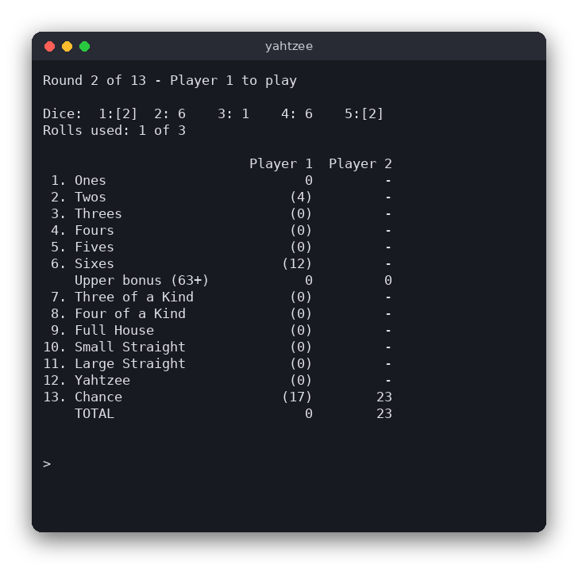

# Yahtzee (C)

Yahtzee is a dice game for 1 to 4 players who take turns on one computer. In each turn you roll five dice up to three times, hold the dice you like between rolls, and then write the result into one free category of your score card. This version runs in the terminal and uses only the standard C library.

The same game is also written in [Python](../../python/yahtzee) (tkinter window) and [JavaScript](../../vanilla_js/yahtzee) (browser page).



## Features

- 1 to 4 players, taking turns, 13 rounds
- Up to three rolls per turn, holding any dice between rolls
- The 13 standard categories: Ones to Sixes, Three of a Kind, Four of a Kind, Full House (25), Small Straight (30), Large Straight (40), Yahtzee (50) and Chance
- The score card shows, in brackets, what the current dice would score in every free category
- Upper bonus: 35 points when the upper section reaches 63
- The winner is shown at the end
- Not included: the optional Yahtzee bonus and joker rules

## How to play

Start the program and type the number of players. Then type one command per line:

| Command | Meaning |
|---|---|
| `r` | Roll the dice that are not held |
| `h 1 3` | Hold or release dice 1 and 3 (numbers are shown above the dice) |
| `s 7` | Score the current dice in category 7 and end your turn |
| `q` | Quit |

Example turn:

```
> r            roll all five dice
> h 2 5        hold dice 2 and 5
> r            roll the other three dice again
> s 12         write the score into Yahtzee
```

A turn can end after any roll, so you do not have to use all three rolls. The bracketed numbers on the score card are the possible scores for the current player. Filled cells are fixed.

## How it works

The game is split into two files:

- `src/yahtzee.c` and `src/yahtzee.h` contain the rules. They never print or read input, so the tests can run them.
- `src/main.c` contains the terminal interface.

**Data.** A `Game` holds up to four `Card`s (each has 13 scores, `UNUSED` means the category is still free), the five dice, which dice are held, the number of rolls in this turn, the current player and the round.

**Scoring.** `score_for()` counts how many dice show each face in `counts[]`. The upper categories add up the dice showing their face. Three and Four of a Kind add all dice when there is enough of one face. Full House needs exactly three of one face and two of another. The straights check whether a run of faces is present. Yahtzee needs five equal dice. Chance adds all dice.

**Turn flow.** `game_roll()` rolls only the dice that are not held and counts the roll. `game_toggle_hold()` works only after the first roll. `game_choose()` writes the score for the current player, resets the dice and moves to the next player. When the last player has finished a round, the round number goes up. After round 13, `game_is_over()` returns true.

**Random numbers.** The logic never calls `rand()` itself. It receives a `FaceRoller` function, and `main.c` passes one that uses `rand()`. The tests pass a fixed sequence of faces, so every test result is predictable.

**Interface loop.** `main()` draws the screen, reads one line, and calls `run_command()`. The screen is redrawn after every command, and the escape sequence `ESC[H ESC[2J` clears the terminal first.

## Project layout

```
CMakeLists.txt          build rules for the library, the program and the tests
src/yahtzee.h           declarations of the rules, categories and constants
src/yahtzee.c           the rules: scoring, turns, rounds, upper bonus, winner
src/main.c              the terminal interface and the command loop
tests/test_yahtzee.c    tests of the rules with scripted dice (exit code 0 = pass)
.clang-format           code style settings for clang-format
.clang-tidy             extra checks for clang-tidy
.editorconfig           indentation and line endings for editors
```

## Requirements

- A C compiler (gcc or clang) that supports C99
- CMake 3.10 or newer
- Linux, macOS or WSL

## Run

```
cmake -S . -B build
cmake --build build
./build/yahtzee
```

## Test

```
cmake -S . -B build && cmake --build build && cd build && ctest --output-on-failure
```

The tests check the score of each category with a table of dice, the upper bonus threshold, the totals, holding and rolling limits, the turn order, the rule that a category is used once, a full game of 13 rounds, and the winner.

## Comparison with the other versions

- [C](../../c/yahtzee) (this version)
- [Python](../../python/yahtzee)
- [JavaScript](../../vanilla_js/yahtzee)

| | C | Python | JavaScript |
|---|---|---|---|
| Interface | terminal (stdin/stdout) | tkinter window | browser page |
| Lines of logic | 212 (159 + 53 header) | 107 | 139 |
| Lines of interface | 171 | 121 | 110 (+ 45 HTML) |
| Tests | 10 | 24 | 10 |

The C version has to write the score card layout with `printf` widths and keep the game state in plain structs passed by pointer. It has no dynamic memory at all, because the number of players and categories are fixed at compile time. The Python version uses classes and lists of `None` for free categories, so the logic reads almost like the rules. The JavaScript version is similar, but its `null` values and `Object.freeze` category table make the same design read naturally in the browser. Only the C version needs an explicit header file for the declarations.

## Ideas for extensions

- Add the optional Yahtzee bonus (100 points per extra Yahtzee) and the joker rules.
- Ask for the player names at the start.
- Save the score card to a file and load it later.
- Show the average score of every category in a summary table at the end.
