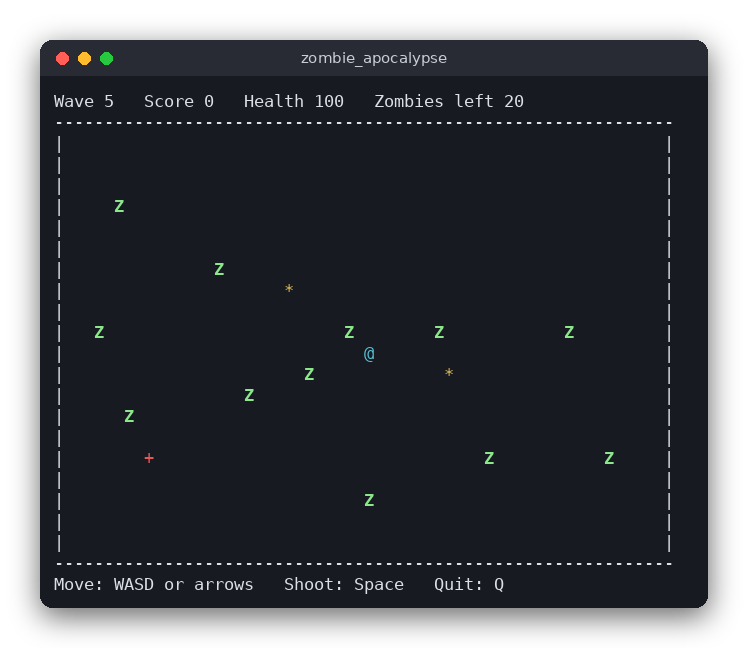

# Zombie Apocalypse (C)

A small top-down survival game in the terminal. You stand in the middle of a field, zombies walk in from the edges, and you shoot them before they touch you. Every wave brings more and faster zombies, and health packs appear now and then.

The same game is also written in [Python](../../python/zombie_apocalypse) (pygame) and [JavaScript](../../vanilla_js/zombie_apocalypse) (browser canvas). All three follow the same rules.



## Features

- Move with **WASD** or the arrow keys; you cannot leave the field
- Shoot with **Space**: the bullet flies in the direction you moved last
- Zombies appear on the edges of the field and walk towards you
- Each wave has more zombies (5, then 8, 11, ...) and they are faster
- Touching a zombie costs 10 health and destroys the zombie
- Health packs (`+`) appear every 12 seconds (at most two on the field) and restore 25 health
- Each zombie you shoot gives 10 points
- The status line shows the wave, score, health and zombies left
- Game over when health reaches 0; press **R** to play again

## How to play

Start the game, then:

| Key | Action |
|---|---|
| `W` `A` `S` `D` or arrows | Move |
| `Space` | Shoot (in the direction you moved last) |
| `R` | Play again (after game over) |
| `Q` or `Esc` | Quit |

Symbols on the field: `@` you (cyan), `Z` zombie (bold green), `*` bullet (yellow), `+` health pack (red).

The terminal must be at least 64 columns wide and 24 rows high.

## How it works

The project has two parts. `src/zombie_apocalypse.c` holds the rules and knows nothing about the screen. `src/main.c` reads the keyboard, calls the rules once per frame and draws the result with ncurses.

**Data.** The whole game is one `Game` struct (`src/zombie_apocalypse.h`). Zombies, bullets and health packs are stored in fixed-size arrays (`zombies[MAX_ZOMBIES]`, `bullets[MAX_BULLETS]`, `pickups[MAX_PICKUPS]`) with a count next to each array, so no memory is allocated while playing. Positions are `double` values in cells: the field is 60 x 20 cells and a zombie can stand between two cells.

**One step.** Each frame the interface fills an `Input` struct (movement direction, aim direction, fire flag) and calls `game_update(&game, &input, dt)`, where `dt` is the time since the last frame in seconds. `game_update` does these things in order:

1. `move_player`: move by `PLAYER_SPEED * dt` in the chosen direction, normalized so diagonals are not faster, and keep the player inside the field. The last movement direction is remembered as `facing`.
2. `try_fire`: if fire is requested and the cooldown has ended, add a bullet at the player's position. The aim direction is the direction you move in: the interface sends a zero aim, so the bullet flies in the `facing` direction.
3. `move_bullets`: move bullets; remove the ones that left the field.
4. `spawn_zombies`: during a wave, one zombie appears on a random edge every `spawn_interval` seconds until the wave's zombies are all on the field.
5. `move_zombies`: each zombie moves towards the player at the wave's speed.
6. `resolve_bullet_hits`: a bullet closer than 0.6 to a zombie removes both and adds 10 points.
7. `resolve_zombie_touches`: a zombie closer than 1.0 to the player removes it and costs 10 health. At 0 health the game is over and later steps do nothing.
8. `resolve_pickups`, `spawn_pickups`: a health pack heals 25 (up to 100) when the player touches it; a new one appears every 12 seconds.
9. `update_waves`: when the field is empty, a 3-second break starts; then the next wave begins with more zombies and a higher speed (`game_wave_size`, `game_zombie_speed`).

**Randomness.** Spawn points come from `game_random`, a 32-bit linear congruential generator seeded with `game_init`. The same seed always gives the same spawns, which makes the rules easy to test. The interface seeds it with the current time.

**The interface loop.** `main.c` calls `getch` in a loop until there are no more keys, so a held key can give several presses in one frame. A movement key keeps the player walking for 0.15 seconds after the last key repeat, because terminals send key repeats with gaps. Frame time comes from `clock_gettime`, so the game runs at the same speed on any terminal. Then the frame is drawn with `mvaddch` and `mvprintw`, and the loop sleeps for 15 ms.

## Project layout

```
CMakeLists.txt                 build rules: the game, the logic library and the tests
README.md                      this file
screenshot.png                 a wave in progress
.clang-format, .clang-tidy     formatting and lint settings
.editorconfig                  indentation and line-ending settings
src/zombie_apocalypse.h        the constants, the Game struct and the logic functions
src/zombie_apocalypse.c        the rules: movement, shooting, zombies, waves, pickups
src/main.c                     the terminal interface (ncurses)
tests/test_zombie_apocalypse.c 15 tests of the rules
```

## Requirements

- A C compiler (gcc or clang) with C99 support
- CMake 3.10 or newer
- The ncurses development package (`libncurses-dev` on Debian and Ubuntu, `ncurses-devel` on Fedora)
- Linux, macOS or WSL, with a terminal of at least 64 x 24 characters

## Run

```sh
cmake -S . -B build
cmake --build build
./build/zombie_apocalypse
```

## Test

The tests check the rules without a terminal or any user input:

```sh
cmake -S . -B build && cmake --build build && cd build && ctest --output-on-failure
```

## Comparison with the other versions

- [C](../../c/zombie_apocalypse) (this version)
- [Python](../../python/zombie_apocalypse)
- [JavaScript](../../vanilla_js/zombie_apocalypse)

| | C | Python | JavaScript |
|---|---|---|---|
| Interface | ncurses terminal | pygame window | browser page |
| Lines of logic | 232 | 202 | 224 |
| Lines of interface | 155 | 138 | 218 |
| Tests | 15 | 15 | 15 |

The rules are the same in all three versions, and so is the random generator, so a given seed produces the same zombie spawns in each. C keeps everything in one struct with fixed arrays and removes dead objects by moving the last element into their place. Python and JavaScript create new lists instead, which is shorter but allocates memory on every frame. The terminal version has to work around key repeats, while pygame reads the keyboard state each frame and the browser listens to key events.

## Ideas for extensions

- Show a short explosion or blood splat where a zombie dies
- Add a second kind of zombie that is slower but takes two hits
- Save the best score to a file between runs
- Let the player hold Space to fire continuously, with the same cooldown
- Add a pause key that stops `game_update` from being called
