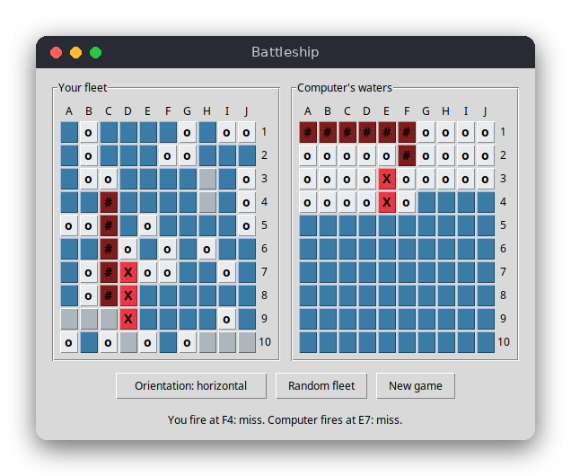

# Battleship (Python)

Battleship in a tkinter window. You place a classic fleet of five ships on a 10×10 board, then take turns with the computer, which fires at your board. The first side to sink the whole fleet wins.



## Features

- Two 10×10 boards with the classic fleet: ships of length 5, 4, 3, 3 and 2
- Place ships yourself: click a cell with the chosen orientation, or use **Random fleet** to place the whole fleet at once
- Ships may touch but never overlap or leave the board
- Hits, misses and sunk ships are reported after every shot
- The computer hunts your ships with a hunt-and-target strategy
- A win or lose message at the end, and **New game** at any time

## How to play

1. Click a cell on your board (left). The next ship is placed with its first cell there. The ship is horizontal or vertical, as shown on the **Orientation** button. Click **Orientation** to change it.
2. Or click **Random fleet** to place all five ships at random and start the battle.
3. Click a cell on the computer's board (right) to fire. Your shot and the computer's answer are written under the boards.
4. Marks: `X` is a hit, `#` (dark red) is a sunk ship, `o` is a miss. The computer's ships stay hidden until the game is over.

Example message:

```
You fire at F4: miss. Computer fires at A10: hit.
```

## How it works

**Logic and interface are separate.** `src/battleship.py` has the rules and no tkinter code, so the tests can run without a window. `src/main.py` draws the boards and handles the clicks.

**Board.** A `Board` has five `Ship` objects (length, hits, placed) and two 10×10 lists of lists: `ship_at[y][x]` is the index of the ship on a cell (or `None` for water), and `shot[y][x]` says whether the cell was fired at.

**Placement.** `Board.place()` checks that each cell of the ship is on the board and empty (`can_place()`). Touching is allowed, because only occupied cells are checked. A ship can be placed only once.

**Random placement.** `Board.place_randomly(rng)` clears the board and tries to put each ship at a random cell with a random orientation. If a ship cannot be placed after 1000 tries, the whole fleet starts again. The source of randomness is an argument, so the game passes a `random.Random()` and the tests pass one with a fixed seed. With the same seed the layout is always the same.

**Firing.** `Board.fire(x, y)` returns a constant:

- `INVALID`: outside the board (nothing changes)
- `REPEAT`: the cell was already fired at (nothing changes)
- `MISS`: water
- `HIT`: a ship was hit, but it is not sunk yet
- `SUNK`: the hit sank the ship (its hits equal its length)

`Board.all_sunk()` is true when every ship is sunk. That is the win and lose check.

**The computer (hunt and target).** `Computer` keeps a list of cells to try (`targets`).

1. **Hunt:** while the list is empty, the computer fires at a random cell it has not fired at yet.
2. **Target:** after a `HIT`, the four neighbours (up, down, left, right) of that cell that are on the board and not yet fired at are added to the list. The next shot is taken from the end of the list, so the computer follows the ship it found.
3. **Sunk:** after `SUNK`, the list is cleared and the computer hunts again.

`Computer.choose()` does steps 1 and 2, and `Computer.report()` does steps 2 and 3 (so it adds the neighbours and clears the list).

**The window.** `BattleshipApp` keeps the game state (both boards, the computer, the phase: `placing`, `battle` or `over`, and the message). Every click changes the state and then `refresh()` colours all 200 buttons from the board data. Clicking the computer's board fires your shot, then the computer fires back in the same click.

## Project layout

```
battleship/
├── README.md             this file
├── screenshot.png        a game in progress
├── requirements.txt      pytest (for the tests)
├── pyproject.toml        tells pytest where the modules are
├── .flake8               line length for flake8
├── src/
│   ├── battleship.py     the rules: boards, placement, shots, computer
│   └── main.py           the tkinter window
└── tests/
    └── test_battleship.py tests of the rules
```

## Requirements

- Python 3.8 or newer, with tkinter (included with most Python installers; on Debian/Ubuntu install `python3-tk`)
- For the tests only: `pytest` (see `requirements.txt`)

## Run

```sh
python3 src/main.py
```

## Test

```sh
pip install -r requirements.txt
pytest
```

The tests check placement, touching and overlapping ships, the four shot results, repeated and invalid shots, the random fleet, the computer's targeting and a whole computer game that finishes without repeated shots. They do not open a window.

## Comparison with the other versions

- [C](../../c/battleship): the same rules and computer strategy, in an ncurses terminal
- [JavaScript](../../vanilla_js/battleship): the same rules, in a web page

| | C | Python | JavaScript |
|---|---|---|---|
| Interface | ncurses terminal | tkinter window | browser page |
| Lines of logic | 180 | 89 | 119 |
| Lines of interface | 210 | 134 | 150 |
| Tests | 9 | 10 | 9 |

Python is the shortest version because the standard library does most of the work: `random.Random` is the random source, and `Board`, `Ship` and `Computer` are plain classes with their data in attributes. A bad index raises an error at once, while in C it is undefined behaviour and may go unnoticed. The window is only a grid of buttons whose colours are set from the board data on every turn, which is the same approach as in the other two versions.

## Ideas for extensions

- Show the sunk ships in a different colour from a hit
- Let the computer use a checkerboard pattern while hunting, since every ship is at least two cells long
- Add a preview of the next ship under the mouse, as in the browser version
- Add a two-player mode where both boards are placed by people
