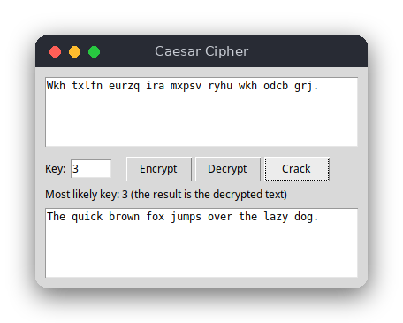

# Caesar Cipher (Python)

A desktop window that encrypts and decrypts text with the Caesar cipher and can crack an encrypted message by trying all 26 keys. The key can be negative or larger than 26. The logic lives in one file without any window code, so it is tested without a display.



## Features

- Encrypt and decrypt with any whole-number key, including negative numbers and numbers above 26 (`52` works like `0`).
- Upper and lower case letters keep their case. Digits, spaces, punctuation and Polish letters stay unchanged.
- `Crack` tries all 26 keys, puts the most likely key into the key field and shows the decrypted text.
- A wrong key (for example `abc`) shows an error box instead of crashing.

## How to use

1. Type or paste the text into the top box.
2. Enter the key, for example `3`.
3. Press **Encrypt** or **Decrypt**. The result appears in the bottom box.
4. If you do not know the key, press **Crack**. The program finds the most likely key, shows it in the key field and displays the decrypted text.

## How it works

- **Data.** Text is a Python `str`. The logic functions take a string and return a new one; nothing is changed in place.
- **Shifting one letter.** `shift_char` checks that the character is an ASCII letter (`isascii()` and `isalpha()`), then computes `(ord(char) - base + key) % 26 + base`, where `base` is the code of `'A'` or `'a'`. Other characters are returned unchanged, so Polish letters pass through.
- **Negative keys.** Python's `%` always gives a result with the same sign as the divisor: `-1 % 26` is `25`. That is why the same formula works for negative keys and keys above 26, without any extra step.
- **Decrypting.** `decrypt` is `encrypt` with the key `-key`.
- **Cracking.** `crack` calls `max` over the keys 0 to 25. For each key, `_letter_score` adds the English frequency of each letter the text would have after decryption with that key. The frequencies are the usual percentages for English letters (`e` is 12.7 %, `t` 9.1 %, `z` 0.07 %). The key with the largest sum wins; on a tie the smaller key wins.
- **Window.** `CipherWindow` in `main.py` creates the widgets. Each button calls one method. The methods read the text and the key, call the logic and put the result into the read-only box.

## Project layout

```
README.md                   this file
requirements.txt            pytest, for the tests
pyproject.toml              pytest settings (finds the code in src/)
.flake8                     style checker settings
src/caesar_cipher.py        the logic: shifting, encrypting, decrypting, cracking
src/main.py                 the tkinter window
tests/test_caesar_cipher.py tests of the logic
```

## Requirements

- Python 3.8 or newer, with tkinter (on Debian and Ubuntu: `sudo apt install python3-tk`)
- For the tests: `pytest` (see `requirements.txt`)

## Run

```sh
python3 src/main.py
```

## Test

```sh
pip install -r requirements.txt
pytest
```

The tests check letter shifts, case, unchanged characters, negative and large keys, decryption, round trips, cracking a known sentence and cracking text without letters.

## Comparison with the other versions

- [C](../../c/caesar_cipher)
- [Python](../../python/caesar_cipher)
- [JavaScript](../../vanilla_js/caesar_cipher)

| | C | Python | JavaScript |
|---|---|---|---|
| Interface | terminal, command-line arguments | tkinter window | browser page |
| Lines of logic | 70 | 30 | 52 |
| Lines of interface | 62 | 60 | 34 |
| Tests | 7 | 7 | 7 |

The C version works on bytes: it must keep its own buffer, change the text in place, and check for ASCII letters by value, because `isalpha()` is undefined for the negative `char` values of UTF-8 bytes. Python works on Unicode strings, so it builds a new string and needs an explicit `isascii()` check. In JavaScript the `%` operator has the same negative-number problem as in C, and the page recalculates the result on every keystroke, while the other two versions act only when a button is pressed.

## Ideas for extensions

- Read the text from a file or from standard input, so that long messages can be processed.
- Add a Vigenere cipher, which uses a keyword instead of a single shift.
- Score candidates with a list of common English words, which works better on short texts.
- Show all 26 candidates in a list, so the user can choose the right one.
