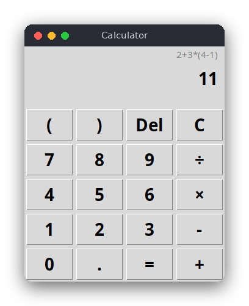

# Calculator (Python)

A tkinter calculator window with a grid of buttons and a display. It evaluates expressions such as
`2+3*(4-1)` with the usual precedence, and it can be used with the mouse or the keyboard. Errors such as
division by zero or unbalanced parentheses are shown under the display.



## Features

- Buttons for digits, `+ - × ÷`, parentheses, a decimal point, `=`, `Del` (delete last character) and `C`
  (clear).
- The same keys work on the keyboard: `0`-`9`, `.`, `+`, `-`, `*`, `/`, `(`, `)`, `Enter`, `Backspace`,
  `Escape`.
- Unary minus, decimal numbers and operator precedence.
- The display shows the last calculation above the current value.
- Error messages in red below the display. The expression stays on the screen so you can fix it.

## How to use

1. Type or click an expression, for example `2+3*(4-1)`.
2. Press `=` (or `Enter`). The expression moves to the small line at the top and the result is shown big.
3. Type a number to start a new calculation. Type an operator (`+`, `*`, ...) to continue with the result.
4. `Del` or `Backspace` removes the last character. `C` or `Escape` clears everything.

If the expression is wrong, the message appears in red, for example `Division by zero` for `1/0`.

## How it works

### Two files, two jobs

- `src/calculator.py` is the logic. It has no tkinter code and no input or output, so the tests can call
  it directly.
- `src/main.py` is the window. It creates the buttons, maps clicks and key presses to a key string, and
  calls `evaluate` when `=` is pressed.

### The grammar

The logic is a recursive-descent parser for this grammar:

```text
expression := term (('+' | '-') term)*
term       := factor (('*' | '/') factor)*
factor     := '-' factor | number | '(' expression ')'
```

Each rule is a method of the `Parser` class in `src/calculator.py`. `expression` handles `+` and `-`,
`term` handles `*` and `/`, and `factor` handles numbers, unary minus and parentheses. A rule calls the
rule below it for each of its parts, so a lower rule binds more tightly.

### Step by step: `2 + 3 * (4 - 1)`

`tokenize` first turns the text into tokens: `2`, `+`, `3`, `*`, `(`, `4`, `-`, `1`, `)`, and an `end`
marker.

1. `expression()` calls `term()`, which calls `factor()`. The token is the number `2`, so `factor`
   returns 2. `term` sees `+`, which is not `*` or `/`, and returns 2.
2. `expression()` sees `+`, moves past it and calls `term()` again.
3. `term()` calls `factor()`, which returns 3. It sees `*`, moves past it and calls `factor()`.
4. The token is `(`. `factor()` moves past it and calls `self.expression()` **recursively** for the
   text inside the parentheses. That call handles `4 - 1` exactly like steps 1 and 2 and returns 3. It
   stops at `)`.
5. `factor()` checks for the closing `)`, moves past it and returns 3. The `term` that started with 3
   computes `3 * 3 = 9`. The next token is `end`, so `term()` returns 9.
6. The outer `expression()` computes `2 + 9 = 11`. The next token is `end`, so `evaluate` accepts
   the result.

### Errors

Each place that expects a certain token raises `CalculatorError` with a message if it finds something
else:

- `(2 + 3` reaches `end` where `)` was expected: "Unbalanced parentheses".
- `2 3` leaves a number after a complete expression: "Unexpected '3' at position 3".
- `2 +` needs a term but finds `end`: "Unexpected end of expression".
- `1 / 0`: the division checks the divisor first: "Division by zero".
- Characters that are not numbers or operators, such as `$` or `e`, are rejected by the tokenizer.

### Why not `eval`?

Python's `eval("2+3*(4-1)")` would give the same answer, but `eval` runs any Python code it is given.
Typing `__import__('os').system('...')` into a calculator would then run a shell command, and
`eval("9**9**9")` would freeze the program for a very long time. The parser above accepts only numbers,
the four operators, unary minus and parentheses, so anything else is rejected with an error message.
The JavaScript version follows the same rule for the same reason.

## Project layout

```text
calculator/
├── README.md               this file
├── screenshot.png          picture of the window with an expression and its result
├── requirements.txt        pytest, used for the tests
├── pyproject.toml          pytest settings: tests import modules from src/
├── .flake8                 flake8 settings (maximum line length 120)
├── .editorconfig           editor settings (indentation, line endings)
├── src/
│   ├── calculator.py       tokenizer, recursive-descent parser and evaluator (logic only)
│   └── main.py             tkinter window: buttons, display and keyboard
└── tests/
    └── test_calculator.py  tests of the logic
```

## Requirements

- Python 3.8 or newer, with tkinter (included with most Python installers; on Debian/Ubuntu install
  `python3-tk`)
- pytest, only for running the tests

## Run

```sh
cd src/python/calculator
python3 src/main.py
```

## Test

```sh
pip install -r requirements.txt
pytest
```

The tests do not open a window. They check precedence, parentheses, unary minus, decimals and each
error message.

## Comparison with the other versions

- [C (terminal)](../../c/calculator)
- [JavaScript (browser)](../../vanilla_js/calculator)

| | C | Python | JavaScript |
|---|---|---|---|
| Interface | terminal (stdin/stdout) | tkinter window | browser page |
| Lines of logic | 221 | 105 | 111 |
| Lines of interface | 31 | 77 | 52 |
| Tests | 32 | 31 | 23 |

All three versions use the same three recursive functions and the same error messages. C has no
exceptions, so each function returns -1 and writes the message into a buffer the caller passes in, while
Python and JavaScript throw an error that travels up the call stack. C also manages its memory by hand:
the token array is a variable-length array on the stack, sized from the length of the text, so nothing
has to be freed. Python and JavaScript convert number text with their own library functions, but they
must not call `eval`, which would run any code typed into the calculator. C has no `eval` at all.

## Ideas for extensions

- Add the power operator `**` and a percent button.
- Show a scrollable history of earlier calculations.
- Add a memory row with `M+`, `M-` and `MR`.
- Use `math.sqrt` through a named function token, such as `sqrt(16)`.
- Add a theme switch between light and dark colors.
