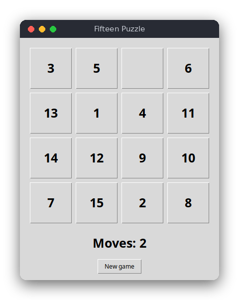

# Fifteen Puzzle (Python)

The fifteen puzzle: fifteen numbered tiles and one gap on a 4×4 board. Slide the tiles into the gap until they are in order from 1 to 15. The game is a tkinter window, it counts your moves and announces the win.



## Features

- 4×4 board, shuffled so that the puzzle can always be solved
- Click a tile next to the gap, or press an arrow key, to slide tiles
- Move counter and a win message when the tiles are in order
- New game button

## How to play

- **Click** a tile that is next to the gap. It slides into the gap.
- **Arrow keys** move the gap in that direction: the tile on that side slides into it. For example, when the gap is in the bottom-right corner, pressing **Up** slides the tile above the gap down into it.
- **New game** shuffles the tiles and resets the move counter.

When the tiles are in order, the counter shows `Solved in N moves!`, and clicks and arrow keys stop working until you start a new game.

## How it works

### The board

The board is a plain list of 16 integers, read row by row. The number `0` is the gap. The solved board is `[1, 2, …, 15, 0]`, made by `solved_board()`. The functions in `src/fifteen_puzzle.py` change the list in place and return `True` when a move happened.

### Moves

- `slide(board, cell)` moves the tile in `cell` into the gap, but only when the two cells are next to each other. A tile diagonal to the gap cannot move.
- `move_gap(board, direction)` finds the neighbor of the gap in the direction (`"up"`, `"down"`, `"left"`, `"right"`) and slides it in with `slide`. At the edge of the board there is no neighbor, so nothing happens.

The window counts a move only when one of these functions returns `True`.

### Shuffle

`shuffle(board, rng)` does not place the tiles at random. It starts from the solved board and makes 500 random legal moves with `move_gap`. Every legal move keeps the puzzle solvable, so the result is always solvable. The random source is passed in as `rng`, a `random.Random` object. Giving it a seed (`random.Random(42)`) makes the shuffle repeatable, which the tests use. The window uses `random.Random()`, seeded from the system. (If the walk happens to end on the solved board, the shuffle starts again.)

### Solvability rule

Not every arrangement of the tiles can be solved. For a board with an even width (4 columns), a board is solvable when

> **inversions + row of the gap (counted from the top, starting at 0) is odd**

An *inversion* is a pair of tiles where the larger number comes before the smaller one, reading row by row. The gap is ignored. The solved board has no inversions and the gap is in row 3, so 0 + 3 = 3 is odd: it is solvable. Swapping tiles 14 and 15 gives one inversion, and the gap is still in row 3, so 1 + 3 = 4 is even: that position can never be solved. `is_solvable()` checks this rule. The shuffle does not need it, but the tests use it to check the shuffle and the swap example.

### Solved check

`is_solved(board)` compares the list with `solved_board()`.

### The window

`src/main.py` builds 16 buttons in a 4×4 grid. The button command calls `click(cell)`, and key bindings on the root window call `arrow(direction)`. Both call the logic, then `refresh()` updates the button labels, the counter and the message. tkinter runs the event loop, so the program never needs its own loop.

## Project layout

```
README.md
requirements.txt          pytest (for the tests)
pyproject.toml            tells pytest where the logic is
.flake8                   style settings (line length 120)
.editorconfig
src/fifteen_puzzle.py     the rules: moves, shuffle, solved and solvable checks
src/main.py               the tkinter window: buttons, keys, the counter
tests/test_fifteen_puzzle.py   tests of the rules
```

## Requirements

- Python 3.8 or newer, with tkinter (on Debian and Ubuntu: `sudo apt install python3-tk`)
- To run the tests: `pytest`

## Run

```sh
python3 src/main.py
```

## Test

```sh
pip install -r requirements.txt
pytest
```

The tests do not open a window. They check the moves at the edges, the rule for sliding tiles, the solved check, the unsolvable swap, and that every shuffle is solvable and reproducible from its seed.

## Comparison with the other versions

- [C version](../../c/fifteen_puzzle) (ncurses terminal)
- [JavaScript version](../../vanilla_js/fifteen_puzzle) (browser page)

| | C | Python | JavaScript |
|---|---|---|---|
| Interface | ncurses terminal | tkinter window | browser page |
| Lines of logic | 112 | 45 | 64 |
| Lines of interface | 68 | 60 | 38 |
| Tests | 8 | 9 | 9 |

The rules are the same in all three versions, and so are the names of the functions. Python works on a plain list that the functions change in place, and the random source is an object that the caller passes in, so a seed gives a repeatable shuffle without any global state. C keeps the board in a fixed-size struct and must read arrow keys itself, which needs ncurses in keypad mode. In JavaScript the tile buttons are rebuilt from the board after every move, which is the simplest way to keep the page in step with the logic. The Python logic is the shortest because lists, `index()` and `random.choice` do most of the work.

## Ideas for extensions

- Show a timer next to the move counter
- Add a 3×3 or 5×5 board (the solvability rule for odd widths is different, so check the new rule)
- Add an undo button that remembers the moves
- Save the best (fewest) moves and show them at the start
- Add a hint that shows the next move of a solution found by breadth-first search
