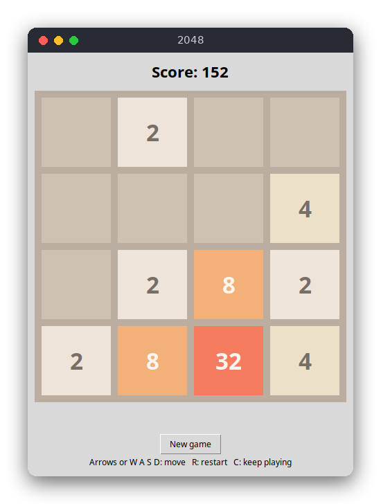

# 2048 (Python)

2048 is a sliding-tile puzzle on a 4×4 board. Each move slides every tile in one direction; equal tiles that meet merge into their sum. The game runs in a tkinter window, and the goal is to make a tile with the value 2048.



## Features

- Slide the tiles with the arrow keys or W, A, S, D
- Equal tiles merge once per move and add their value to the score
- After each move that changes the board, a new 2 (90%) or 4 (10%) appears on a random empty cell
- Win message at 2048, with the option to keep playing
- Game over when no move is possible
- Restart with R or the New game button

## How to play

Click the window so it has keyboard focus, then move the tiles with the arrow keys or W A S D.

| Key | Action |
|---|---|
| ↑ ↓ ← → or W A S D | Slide all tiles |
| R or the New game button | Start a new game |
| C | Keep playing after reaching 2048 |

Example: the board has `2 2 0 0` in the first row. Pressing `A` (left) turns it into `4 0 0 0`, adds 4 to the score and places a new 2 or 4 on a random empty cell.

## How it works

The code is split in two. `src/game_2048.py` contains the rules and has no input or output. `src/main.py` draws the board and handles the keys.

### Board and game state

`Game` keeps the board as a list of four rows, each a list of four integers (`0` means an empty cell), the score, and a flag that is set when the player chooses to keep playing after 2048. Its `random_below` argument is a function that returns a number in `[0, n)`; by default it is `random.randrange`.

### Sliding one line

`slide_row(line)` handles one list of four numbers, always sliding towards index 0:

1. Keep the non-zero values in `tiles`, in order. This closes the gaps.
2. Walk through `tiles` from the start. If two neighbours are equal, add their sum to `merged` and move past both. Otherwise add the single tile.
3. Pad `merged` with zeros and return it together with the points gained.

Moving past both tiles after a merge is what makes a merge happen only once per move. For `[4, 4, 8, 0]` the two 4s merge into 8, and that 8 does not merge with the 8 after it, so the result is `[8, 8, 0, 0]`.

### The four directions from one slide

`slide_row` only slides towards the start of a line. `_line_cells(direction, index)` gives the cells of one row or column in the order of the direction: for `"right"` the first cell is the rightmost one, for `"up"` it is the top one, and so on.

`slide_board` does the same for each of the four lines in the chosen direction:

1. Read the cells in direction order.
2. Call `slide_row` on those values.
3. Write the result back to the same cells.

The board itself is never rotated or transposed. The order of the cells decides which way the tiles move, so one slide function serves all four directions.

### A move

`Game.move(direction)` does nothing if the game is won (and not continued) or lost. Otherwise it copies the board, slides it, and compares the copy with the result. If nothing changed, it returns `False` and no tile appears. If the board changed, `spawn_tile` picks one of the empty cells with `random_below(len(empty))` and then draws the value with `random_below(10)`: 0 gives a 4, anything else gives a 2.

### Win and lose

`Game.status()` returns `"won"` when a tile of 2048 or more exists and the player has not chosen to continue. It returns `"lost"` when `can_move()` finds no empty cell and no two equal neighbours. Otherwise it returns `"playing"`.

### The user interface

`App` in `src/main.py` binds every key press to `on_key`, which maps the key to a direction and calls `Game.move`, then calls `draw`. `draw` clears the canvas and draws one rectangle per cell, with the value text on the tiles. The fonts are copies of the default font with a different size, so they work on any system.

## Project layout

```
README.md
screenshot.png
requirements.txt       pytest
pyproject.toml         tells pytest where the source is
.flake8                style check settings
.editorconfig          editor settings
src/game_2048.py       the rules: slide, merge, spawn, win and lose checks
src/main.py            the tkinter window: drawing and keys
tests/test_game_2048.py  tests of the rules, with a scripted random source
```

## Requirements

- Python 3.8 or newer, with tkinter (included in most Python installations; on Debian/Ubuntu install `python3-tk`)
- For the tests: pytest

## Run

```sh
python3 src/main.py
```

## Test

```sh
pip install -r requirements.txt
pytest
```

The tests check the classic merge cases, every direction, the spawn rules, and the win and lose states. They do not need a window.

## Comparison with the other versions

- [C](../../c/game_2048) (ANSI terminal)
- [JavaScript](../../vanilla_js/game_2048) (browser page)

| | C | Python | JavaScript |
|---|---|---|---|
| Interface | ANSI terminal | tkinter window | browser page |
| Lines of logic | 132 | 87 | 107 |
| Lines of interface | 116 | 79 | 56 |
| Tests | 10 | 13 | 10 |

C needs the most explicit code: the board is a fixed array, the random source is a function pointer, and the direction logic works on indices. Python expresses the same logic with lists and `zip`, so the slide code is shorter, and its tests can replace the random source with any function. JavaScript does the board copy and comparison with `JSON.stringify`, and its page runs straight from disk because it uses classic scripts. In all three versions the rules do not know about the screen, so the tests run without a terminal, a window or a browser.

## Ideas for extensions

- Save the best score to a file between runs
- Add undo: keep a stack of previous boards
- Animate the sliding tiles
- Support a board size other than 4×4 (the code uses `SIZE`)
- Add a simple AI that suggests the best move for each board
