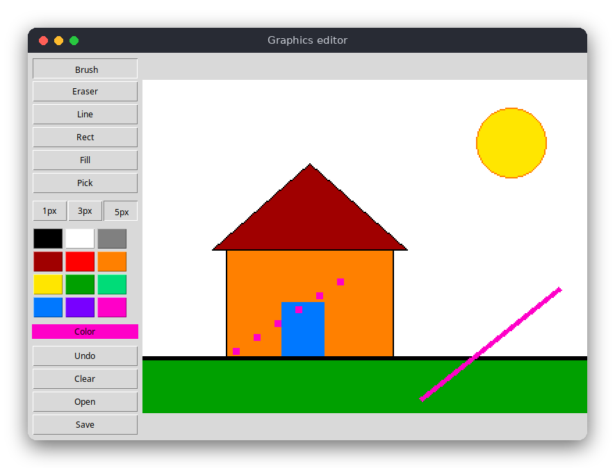

# Graphics Editor (Python)

A small paint program in a tkinter window. You draw on a 320×240 canvas (shown at twice its size) with a brush, an eraser, a straight line, a rectangle, a flood fill and a color picker, you can undo your steps, and you can save and open PNG files.

The same program is also written in [C](../../c/graphics_editor) and [JavaScript](../../vanilla_js/graphics_editor). All three have the same tools and the same rules.



## Features

- Brush with three sizes (1, 3 and 5 pixels), eraser (a brush that paints white)
- Straight line and rectangle outline, shown while you drag the mouse
- Flood fill of an enclosed region
- Color picker and a palette of 12 colors
- Undo (the last 20 steps) and clear canvas
- Save and open a PNG file (`Ctrl+S`, `Ctrl+O`)
- Keyboard shortcuts for all tools

## How to use

Drag the left mouse button on the canvas to draw with the selected tool. Use the buttons on the left to choose a tool, a brush size, a color, or to undo, clear, open or save.

| Key | Action |
|---|---|
| `B` / `E` | brush / eraser |
| `L` / `R` | line / rectangle |
| `F` / `P` | fill / color picker (click a pixel to take its color) |
| `1` / `2` / `3` | brush size 1, 3 or 5 pixels |
| `N` | clear the canvas |
| `Ctrl+Z` | undo |
| `Ctrl+S` | save the picture to the file |
| `Ctrl+O` | open the picture from the file again |

The file is `drawing.png` in the current folder. You can give another name on the command line: `python3 src/main.py picture.png`. A file given on the command line is opened at start-up. Only the top-left 320×240 pixels of a bigger picture are used.

## How it works

### The canvas

A `Canvas` has a width, a height and a flat list `pixels` with one `(r, g, b)` tuple per pixel, row by row: the pixel `(x, y)` is `pixels[y * width + x]`. `Canvas.set` ignores positions outside the canvas, so a line or a brush stroke can run past the edge.

### The brush and the eraser

A brush of width 1, 3 or 5 is a square of pixels centred on the mouse position (`stamp`). While you drag, the program draws a line from the previous mouse position to the current one, stamping the brush at every step, so a fast movement does not leave gaps. The eraser is the same brush painted in white.

### The line: Bresenham's algorithm

Bresenham's algorithm chooses the pixels of a line on a grid with additions and comparisons only:

1. Let `dx = |x1 - x0|` and `dy = -|y1 - y0|`, and let `err = dx + dy`.
2. Paint `(x0, y0)`. Stop when it equals `(x1, y1)`.
3. Let `e2 = 2 * err`. If `e2 >= dy`, step in x (`err += dy`). If `e2 <= dx`, step in y (`err += dx`).
4. Go back to step 2.

`err` measures how far the pixels chosen so far are from the ideal line. Each step moves in the direction that keeps them closest to it. The function is `draw_line` in `src/graphics_editor.py`.

### The rectangle

`draw_rect` draws four lines between the two corners. It is an outline: the inside keeps its colors.

### The flood fill: an explicit stack

Flood fill starts at the clicked pixel and paints every pixel that has the same old color and can be reached through up, down, left and right steps. A recursive version would call itself for every neighbour, and a big canvas can exceed Python's recursion limit. `flood_fill` keeps a list of pixels still to visit and uses it as a stack:

1. If the clicked color already equals the new color, stop.
2. Paint the clicked pixel and push it onto `stack`.
3. While `stack` is not empty: pop a pixel, and for each neighbour that has the old color, paint it and push it.

A pixel is painted when it is pushed, so it is never pushed twice. Pixels of other colors (walls) are never entered, so the fill stops at the borders of the region.

### Undo

`History` keeps a list of copies of the canvas, at most `HISTORY_DEPTH` (20). Before each change (a stroke, a shape, a fill, a clear, an open) the window calls `history.push(canvas)`, which copies the canvas. `history.undo()` returns the newest copy, or `None` when the list is empty, and the window shows it.

### Saving and opening: PNG

The image is converted to a `tkinter.PhotoImage` and written with `photo.write(path, format="png")`. Opening reads the file with `tkinter.PhotoImage(file=path)` and copies the pixels back with `photo.get(x, y)`. Tk 8.6 or newer can read and write PNG, so no extra package is needed.

### The window

`src/main.py` builds the toolbar with buttons and a tk.Canvas. Mouse events (`ButtonPress-1`, `B1-Motion`, `ButtonRelease-1`) call `press`, `drag` and `release`. Each of these changes the logic `Canvas` and then `redraw` shows it: the canvas is converted to a `PhotoImage`, zoomed to twice its size, and drawn. While you drag a line or a rectangle, `redraw` shows a copy of the canvas with the shape on it, so the real canvas only changes when you release the mouse. Keyboard shortcuts are bindings on the root window.

## Project layout

```
requirements.txt          pytest (the window uses only the standard library)
pyproject.toml            tells pytest where the source is
.flake8                   maximum line length 120
src/graphics_editor.py    the logic: canvas, brush, Bresenham line, rectangle, flood fill, undo
src/main.py               the tkinter window: toolbar, mouse, keys, PNG files
tests/test_graphics_editor.py  tests of the logic (no window needed)
```

## Requirements

- Python 3.8 or newer with tkinter (on Ubuntu/Debian: `sudo apt-get install python3-tk`)
- For the tests: `pytest` (`pip install -r requirements.txt`)

## Run

```sh
python3 src/main.py
```

## Test

```sh
pip install -r requirements.txt
pytest
```

The tests check that a line has the right endpoints and pixel count (also when drawn backwards), that a steep line has one pixel per row, that a brush is clipped at the border, that a rectangle outline has the expected border pixels, that flood fill stops at the walls and does nothing with the same color, that a fill of the whole 320×240 canvas works, and that undo restores the previous image and drops the oldest snapshot when full.

## Comparison with the other versions

- [C](../../c/graphics_editor)
- [JavaScript](../../vanilla_js/graphics_editor)

| | C | Python | JavaScript |
|---|---|---|---|
| Interface | SDL2 window | tkinter window | browser page |
| Lines of logic | 175 | 86 | 130 |
| Lines of interface | 389 | 187 | 249 |
| Tests | 13 | 13 | 14 |
| File format | BMP (SDL2 only) | PNG (Tk PhotoImage) | PNG (download, file input) |

Python gives the shortest version: the canvas is a list of tuples, the undo history is a list, and tkinter supplies PNG files, buttons, mouse events and the zoom. The C version does all of this by hand; it needs `malloc` and `free` for every canvas and undo snapshot, and it draws its buttons from rectangles and lines. The JavaScript version stores the pixels in a typed array and uses the browser for the file dialog and the download, so it needs no file-format code at all. Python is the easiest of the three to read; C shows what a flood fill or an undo history costs in memory.

## Ideas for extensions

- Add a circle tool (the midpoint circle algorithm, a relative of Bresenham's)
- Add a zoom level (1×, 2×, 4×) and a scroll bar for bigger pictures
- Add a selection rectangle that can be copied and moved
- Show the palette color as selected with a border, and add a custom color dialog (`colorchooser`)
- Use a `Canvas` of any size: read the size from the opened file
