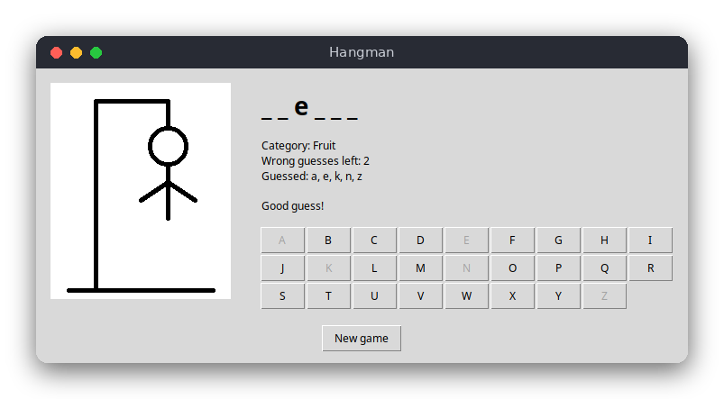

# Hangman (Python)

Hangman (Polish: *szubienica*) in a tkinter window. The computer picks a secret word from a list and shows it as underscores. You guess letters with the letter buttons or the keyboard: correct guesses reveal every matching position, and each wrong guess draws one more part of the hanged figure on a canvas. Six wrong guesses and the game is lost.



## Features

- A random word from 20 built-in English words, in four categories (Animal, Fruit, Country, Coding)
- The category is shown as a hint
- Correct guesses reveal all occurrences of the letter
- Six wrong guesses allowed, one per part of the figure
- Repeated guesses are ignored with a message; used letters are greyed out
- Win and lose messages reveal the word, then you can start a new game

## How to play

Click a letter button or press the letter on the keyboard. The window shows:

- the category of the word,
- the word with `_` for the letters you have not found yet,
- how many wrong guesses you have left,
- every letter you have guessed,
- a message about the last guess.

Press **New game** to start again.

## How it works

The project is split into the rules (`src/hangman.py`) and the window (`src/main.py`). The rules know nothing about tkinter, so the tests run without a display.

- **Word list** (`WORD_LIST`): a list of `Entry` tuples, each with a category and a word.
- **Choosing a word**: `random_entry(rng)` uses `rng.choice()`. The default is a new `random.Random()`, but a seeded generator can be passed in, which makes the choice repeatable in tests.
- **Game state** (`Game`): the category, the word, a `set` of guessed letters and the number of `misses`.
- **Applying a guess** (`Game.guess()`): returns a `GuessResult`. Anything that is not a single letter is `INVALID`. The letter is lowercased; if it is already in `guessed` the result is `REPEAT`. Otherwise it is added to `guessed`; a letter in the word is a `HIT`, any other letter adds a miss and gives `MISS`.
- **Masked word** (`Game.masked()`): joins the letters, showing the guessed ones and `_` for the others.
- **Game status** (`Game.status`): a property that is `LOST` after `MAX_MISSES` (6) misses, `WON` when every letter is guessed, and `PLAYING` otherwise.

In `main.py`, `draw_figure()` clears a `tk.Canvas` and draws the gallows and every part whose stage is reached. `FIGURE` lists the parts (head, body, arms, legs) with the miss number at which each appears. `HangmanApp` keeps the current `Game`, turns each guess into a message and refreshes the labels and buttons in `render()`. Keyboard presses are bound to the root window with `on_key()`.

## Project layout

```text
hangman/
├── README.md             this file
├── screenshot.png        a game in progress
├── requirements.txt      pytest (tkinter is part of the standard library)
├── pyproject.toml        tells pytest where to find the code
├── .flake8               style checker settings
├── .editorconfig         indentation and line endings for editors
├── src/
│   ├── hangman.py        the rules: word list, guesses, game state (no tkinter)
│   └── main.py           the tkinter window: drawing, buttons, keyboard
└── tests/
    └── test_hangman.py   tests of the rules
```

## Requirements

- Python 3.8 or newer, with tkinter (on Debian/Ubuntu: `sudo apt install python3-tk`)
- pytest, only for the tests

## Run

```sh
python3 src/main.py
```

## Test

```sh
pip install -r requirements.txt
pytest
```

The tests cover choosing a word with a seeded generator, masking, hits that reveal every occurrence, misses, repeated and invalid guesses, uppercase letters, winning and losing.

## Comparison with the other versions

- [C](../../c/hangman) (terminal)
- [JavaScript](../../vanilla_js/hangman) (browser page)

| | C | Python | JavaScript |
|---|---|---|---|
| Interface | terminal (stdio, ANSI codes) | tkinter window | browser page |
| Lines of logic | 63 | 58 | 46 |
| Lines of interface | 108 | 92 | 53 |
| Tests | 9 | 14 | 10 |

The same rules are implemented in all three versions, but Python gives the most natural data structures: a `set` for the guessed letters, an `Enum` for the results and a class for the game. The window is also the easiest part to write here: the drawing is a few canvas calls and the buttons are created in a loop. C has to manage the letters by hand (a `bool` array indexed by `letter - 'a'`) and build strings in buffers, and it does not have an event loop, so the terminal version simply reads the next line.

## Ideas for extensions

- Add a "hint" button that reveals one random letter at the cost of an attempt.
- Keep the score of wins and losses while the window is open.
- Add a dropdown to choose the category before the game starts.
- Use a different theme or colors for the figure when only one attempt is left.
