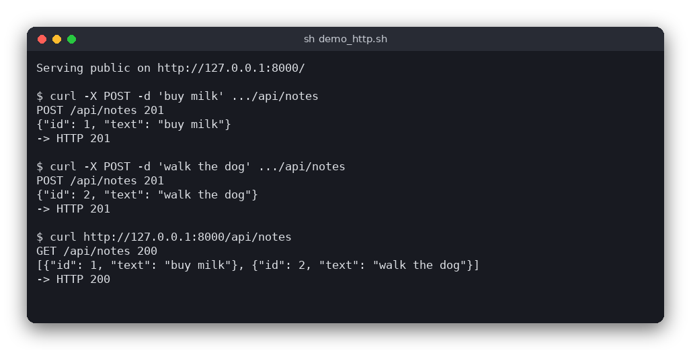

# HTTP Server with a Notes API (Python)

A small HTTP/1.1 server written in Python with only the `socket` module. It serves the files in `public/` (with the right `Content-Type`) and a notes API whose notes are kept in memory. Open `http://127.0.0.1:8000/` in a browser to add notes on a small page.

The same server is also written in [C](../../c/http_server) and [JavaScript (Node.js)](../../vanilla_js/http_server). All three answer the same requests with the same status codes.



## Features

- Serves static files from `public/` with the correct `Content-Type` (HTML, CSS, JSON, images, ...)
- `404 Not Found` for missing files and `403 Forbidden` for paths that try to leave `public/` (for example `/../secret.txt`)
- A notes API: `GET /api/notes`, `POST /api/notes`, `PUT /api/notes/<id>`, `DELETE /api/notes/<id>`
- The note is the plain-text request body, and the answers are JSON
- Status codes `200`, `201`, `204`, `400`, `403`, `404`, `405` and `507` (store full, at most 100 notes)
- One log line per request, for example `POST /api/notes 201`
- No third-party packages: the standard library only

## How to use

Start the server from the project directory. The port and the folder are optional:

```sh
python3 src/main.py          # port 8000, serves ./public
python3 src/main.py 9000     # another port
```

Example session (the server log is printed by the server, the rest is what `curl` shows):

```sh
curl -X POST -H 'Content-Type: text/plain' -d 'buy milk' http://127.0.0.1:8000/api/notes
# HTTP 201  {"id": 1, "text": "buy milk"}

curl http://127.0.0.1:8000/api/notes
# HTTP 200  [{"id": 1, "text": "buy milk"}]

curl -X PUT -H 'Content-Type: text/plain' -d 'buy oat milk' http://127.0.0.1:8000/api/notes/1
# HTTP 200  {"id": 1, "text": "buy oat milk"}

curl -X DELETE http://127.0.0.1:8000/api/notes/1
# HTTP 204  (no body)
```

| Request | Success | Errors |
|---|---|---|
| `GET /api/notes` | `200` with a JSON array | |
| `POST /api/notes` with the note as text | `201` with the new note | `400` empty or over 200 bytes, `507` store full |
| `PUT /api/notes/<id>` with the note as text | `200` with the changed note | `400` empty or over 200 bytes, `404` no such note |
| `DELETE /api/notes/<id>` | `204` with no body | `404` no such note |
| any other method on the API | | `405` |
| `GET /<file>` | `200` with the file | `404` missing, `403` outside `public/` |

The body is trimmed of spaces and line breaks first. The note must then be 1 to 200 bytes of UTF-8.

## How it works

### Reading a request

HTTP is plain text. A request looks like this:

```
POST /api/notes HTTP/1.1\r\n
Host: 127.0.0.1:8000\r\n
Content-Type: text/plain\r\n
Content-Length: 8\r\n
\r\n
buy milk
```

`parse_request()` in `src/http_server.py` looks for the blank line (`\r\n\r\n`) that ends the headers. It splits the request line into method, target and version, and reads the headers into a dictionary with lower-case names. The body is the next `Content-Length` bytes. The function returns:

- a `Request` when the whole request is there,
- `None` when bytes are still missing, so `main.py` reads more from the socket,
- or raises `ParseError` for a broken request, which gets the answer `400`.

### Routing

`handle()` looks at the path. `/api/notes` and `/api/notes/...` go to `handle_api()`. Everything else is a file request for `handle_static()`.

For a file, `handle_static()` refuses any path with a `%` escape, a backslash or a `..` part, so the file must be inside `public/`. A path of `/` means `index.html`. `mime_type()` picks the `Content-Type` from the file extension with `MIME_TYPES`, and falls back to `application/octet-stream`.

### The notes store

`NotesStore` keeps a dictionary from id to text, and refuses new notes after 100. Ids start at 1 and are never reused. The store is created in `main()` and passed to `handle()`, so the logic functions do not depend on any global state.

### Text in, JSON out

`note_text()` decodes the body as UTF-8, trims it and checks the length. `json_response()` turns Python objects into JSON bytes with `json.dumps()`, which also escapes quotes and backslashes.

### Responses

`Response` is a dataclass with a status, a body and a content type. `to_bytes()` builds the status line and headers (`Connection: close`, `Content-Type`, `Content-Length`) and adds the body. A `204` response has neither `Content-Type` nor `Content-Length`.

### The user interface loop

`main.py` creates a socket bound to `127.0.0.1` and loops: `accept()`, read until `parse_request()` says the request is complete, call `handle()`, send `to_bytes()` and close the connection. A timeout of 5 seconds stops a slow client from blocking the server for long. Ctrl+C stops the server.

## Project layout

```
pyproject.toml              pytest settings: the tests import from src/
requirements.txt            pytest (the only dependency, used for the tests)
.flake8                     flake8 settings (line length 120)
public/                     the files the server serves
public/index.html           a page that lists and adds notes with fetch()
public/style.css            the page style
public/about.json           a small JSON file (demo content)
src/http_server.py          the logic: parsing, responses, MIME types, safe paths, notes, routing
src/main.py                 the user interface: sockets and the connection loop
tests/test_http_server.py   tests of the logic (no sockets)
```

## Requirements

- Python 3.8 or newer
- For the tests: pytest (`pip install -r requirements.txt`)

## Run

```sh
python3 src/main.py
```

Then open `http://127.0.0.1:8000/` in a browser.

## Test

```sh
pip install -r requirements.txt
pytest
```

The tests call the logic functions directly with raw request bodies and a fresh notes store, so they need neither the network nor a running server.

## Comparison with the other versions

- [C](../../c/http_server)
- [JavaScript (Node.js)](../../vanilla_js/http_server)

| | C | Python | JavaScript |
|---|---|---|---|
| Interface | POSIX sockets, one connection at a time | `socket` module, one connection at a time | Node `http` module |
| Lines of logic | 424 | 159 | 133 |
| Lines of interface | 119 | 62 | 35 |
| Tests | 13 | 22 | 11 |

Python keeps the protocol visible without much code: the request is bytes, and the parser is a few string methods. The standard library then does the rest, with `json` for the answers and `dataclasses` for the responses. The C version has to do all of this by hand, with fixed arrays, `snprintf` and manual string handling, which is why its logic is about 2.7 times longer. In JavaScript the `http` module parses the request for you, so the logic is only routing and the notes store.

## Ideas for extensions

- Store the notes in a file or SQLite, so they survive a restart
- Use `threading` or `selectors` to serve several connections at once
- Decode `%XX` escapes in paths instead of refusing them
- Add a `GET /api/notes/<id>` route
- Send `ETag` or `Last-Modified` headers for the static files
