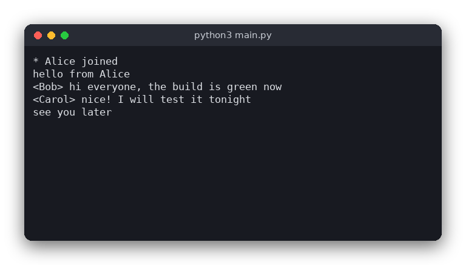

# Messenger (Python)

A simple text chat for a local network (LAN). One program runs as the **server**; any number of **clients** connect to it, pick a nickname and chat. Everything a client types is sent to the server, which passes it on to everybody.

The same chat is also written in [C](../../c/messenger) and [JavaScript](../../vanilla_js/messenger). All three versions speak the same line-based protocol, so a Python server works with a C or JavaScript client and the other way round.



## Features

- One program with two modes: `server` and `client`
- The server accepts several clients at once (up to 16) with `selectors`, no threads
- Every chat line is relayed to all other connected clients
- Nicknames with `/nick <name>`, a list of online users with `/list`, leaving with `/quit`
- Join, leave and rename notices (`* Bob joined`)
- Duplicate and invalid nicknames are refused
- Only the standard library (the tests need pytest)

## How to use

Start the server on one computer (the default port is 8888):

```sh
python3 src/main.py server
```

Start a client on the same or another computer. The nickname is the last argument; the port is optional:

```sh
python3 src/main.py client 192.168.1.20 Alice
python3 src/main.py client 192.168.1.20 9000 Bob
```

Type a line and press Enter to send it. Commands start with `/`:

| Command | What it does |
|---|---|
| `/nick <name>` | Set or change your nickname (letters, digits, `_` and `-`, up to 16 characters) |
| `/list` | Show who is online |
| `/quit` | Leave the chat (Ctrl+D does the same) |

Example session as seen by Bob, who typed `/list` once:

```
* Alice joined
* Bob joined
<Alice> hello everyone
* Online: Alice, Bob
<Bob> hi Alice
* Bob left
```

## How it works

**The protocol.** Every message is one line of text ending with a newline. A line that starts with `/` is a command; any other line is a chat message. The server sends back plain text lines, and the client prints them as they arrive. The first line a client sends is `/nick <name>`, so joining and renaming are the same command. The rules of the protocol are in `src/messenger.py`; the sockets are in `src/main.py`.

**Data.** The server keeps a dictionary `nicks` that maps each connected socket to its nickname (only users who have chosen one are in it). Each connection also has a `LineReader`, which turns the received bytes into text and keeps the unfinished end of the last message.

**Server loop.** `Server.serve()` waits in `selectors.DefaultSelector.select()` for the listening socket and the client sockets:

1. `accept()` registers a new connection, or tells it that the server is full.
2. `read()` receives the data and gives it to the `LineReader`. For each complete line, `handle_line()` runs.
3. `handle_line()` calls `parse_line()` to find out what the line is. Chat goes to `broadcast()`, `/nick` goes to `change_nick()` (which checks `valid_nick()` and whether the nickname is taken), `/list` answers with `format_list()`, and `/quit` makes `read()` call `drop()`.
4. `drop()` announces the departure, unregisters the socket and closes it. It is also called when a client disconnects without saying goodbye.

**Client.** `run_client()` sends `/nick <name>` and starts a thread that reads standard input and sends each line. The main thread receives from the server and prints every line. The thread is needed because a selector cannot watch standard input when it is a file. When the input ends, the thread sends `/quit`.

**Line limit.** A line is at most 512 characters. `split_lines()` cuts a longer line, and `format_chat()` shortens a chat line so that it always fits.

**Note.** A chat line is sent to every client except the one who wrote it, because that terminal already shows what the user typed. Join, leave and rename notices go to everybody.

## Project layout

```
messenger/
├── src/
│   ├── messenger.py    the protocol and the rules: parsing, nicknames, line splitting, formatting
│   └── main.py         sockets, the server loop, the client, command-line arguments
├── tests/
│   └── test_messenger.py  tests of the logic (no network needed)
├── pyproject.toml      tells pytest where to find messenger.py
├── requirements.txt    pytest
├── .flake8             flake8 settings (line length 120)
├── .editorconfig       editor settings (indentation, line endings)
└── README.md
```

## Requirements

- Python 3.8 or newer
- pytest (only for the tests)

## Run

```sh
python3 src/main.py server
```

In another terminal:

```sh
python3 src/main.py client 127.0.0.1 Alice
```

## Test

```sh
pip install -r requirements.txt
pytest
```

The tests check the protocol rules: parsing commands, nickname rules, port numbers, line splitting and the message formats. They do not open any sockets.

## Comparison with the other versions

- [C version](../../c/messenger)
- [JavaScript version](../../vanilla_js/messenger)

| | C | Python | JavaScript |
|---|---|---|---|
| Interface | terminal, POSIX sockets and `poll()` | terminal, `selectors` and a thread | terminal, `net` and `readline` |
| Lines of logic | 167 | 43 | 68 |
| Lines of interface | 308 | 143 | 166 |
| Tests | 9 | 11 | 11 |

Python needs the least code. The standard library gives a `LineReader` built on the decoder for UTF-8, so Polish letters split across two packets are not a problem, and `selectors` does the work that `poll()` does in C. The one place where Python is awkward is standard input: `selectors` cannot watch a file that is redirected into the program, so the client reads input in a thread instead. In C, `poll()` watches standard input directly.

## Ideas for extensions

- Private messages: `/msg <name> <text>`
- Rooms or channels, with `/join <room>`
- Replace the plain-text protocol with JSON lines, so clients can show more information
- Detect dead connections with a heartbeat (a ping every few seconds)
- Use `asyncio` instead of `selectors` and compare the code
