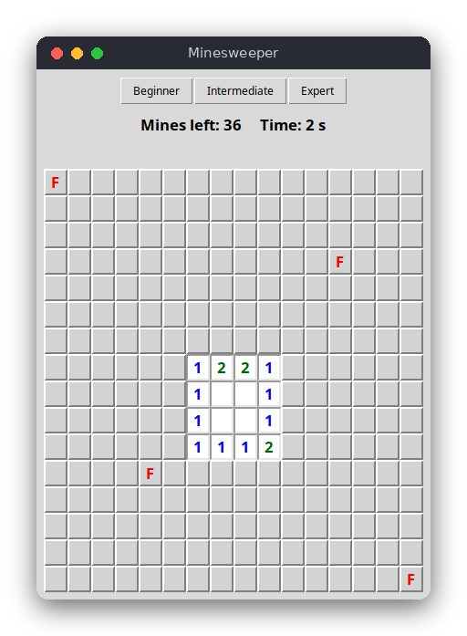

# Minesweeper (Python)

The classic Minesweeper game in a tkinter window. Uncover the cells without touching a mine: each opened cell shows how many of its eight neighbors hide a mine, and you use those numbers to find every safe cell. Written with the standard library only; the rules are in their own file, separate from the window code, and are tested with pytest.



## Features

- Three levels: Beginner 9x9 (10 mines), Intermediate 16x16 (40 mines), Expert 16x30 (99 mines)
- The first cell you open is never a mine, and neither are its neighbors
- Opening an empty cell opens the whole empty area around it (flood fill)
- Right-click flags, and a counter of mines left (mines minus flags)
- Timer, win when every safe cell is open, loss when you open a mine (all mines are then shown)

## How to play

Choose a level with the buttons at the top (this starts a new game).

- **Left click** a hidden cell to open it.
- **Right click** a hidden cell to put a flag on it, or to remove the flag.

The number in an open cell counts the mines in the eight cells around it. An empty open cell has no mines around it.

## How it works

**Data.** `Game` in `src/minesweeper.py` keeps four 2D lists of the same size: `mine` (True where a mine is), `neighbors` (the count of mines around each cell), `revealed` and `flagged`. It also keeps the counters (`revealed_count`, `flag_count`) and `state`, which is `"playing"`, `"won"` or `"lost"`.

**Random layout.** `Game` receives its random source as a parameter: `random.Random()` in the window, `random.Random(42)` in the tests. A seeded source always gives the same board, so the tests can check exact results.

**Mines after the first click.** The mines are placed by the first call to `reveal`, not when the game is created. `_place_mines` picks random cells and skips the clicked cell and its eight neighbors. The first click therefore always opens a cell with no mine and usually starts a large opening. Then it counts the mines around every cell.

**Flood fill.** `_reveal_cell` opens a cell and, if its number is 0, calls itself for each of the eight neighbors. A cell that is already open or flagged is skipped, which stops the recursion. The result is the connected empty area plus the numbered cells on its border. This is a flood fill: it starts from one cell and spreads through the connected empty cells, like water. It cannot reach a mine, because a cell next to a mine is never empty.

**Win and loss.** Opening a mine sets `state` to `"lost"` and marks all mines as revealed. After each opening, `reveal` compares `revealed_count` with the number of safe cells (`rows * cols - mines`); when they are equal, the state becomes `"won"`.

**Flags.** `toggle_flag` flips the flag of a hidden cell and changes `flag_count`. The property `mines_left` is `mine_total - flag_count`.

**The window (`src/main.py`).** `MinesweeperApp` creates a label for each cell and binds the left and right mouse buttons to `reveal` and `flag`. Each action calls the logic and then `refresh`, which updates the text and colors of every cell, the counter and the message. A timer calls `tick` once a second while the game is running.

## Project layout

```text
src/python/minesweeper/
├── .flake8               line length for flake8
├── .editorconfig         editor settings
├── pyproject.toml        tells pytest where the logic is
├── requirements.txt      packages for the tests
├── README.md             this file
├── screenshot.png        the game in progress
├── src/
│   ├── minesweeper.py    the rules: mines, numbers, flood fill, flags, win and loss
│   └── main.py           the tkinter window: buttons, labels, mouse events, timer
└── tests/
    └── test_minesweeper.py   tests of the rules
```

## Requirements

- Python 3.8 or newer, with tkinter (included with most Python installers; on Debian and Ubuntu install `python3-tk`)
- For the tests: pytest (see `requirements.txt`)

## Run

```sh
python3 src/main.py
```

## Test

```sh
pip install -r requirements.txt
pytest
```

The 13 tests cover: no mines before the first click, the first click and its neighbors being safe, neighbor counts, flood fill (opening an area and stopping at numbers), losing on a mine, winning when all safe cells are open, flags and the counter, and moves outside the board.

## Comparison with the other versions

- [C (terminal)](../../c/minesweeper)
- [JavaScript (browser)](../../vanilla_js/minesweeper)

| | C | Python | JavaScript |
|---|---|---|---|
| Interface | terminal (text commands) | tkinter window | browser page |
| Lines of logic | 113 | 75 | 100 |
| Lines of interface | 113 | 87 | 88 |
| Tests | 13 | 13 | 13 |

The rules are the same in all three versions, so the differences come from the language. C keeps the board in fixed-size arrays inside one struct, and the random generator state lives inside that struct, so there are no global variables. Python uses lists and the standard `random.Random`, which makes seeding easy. JavaScript has no seedable `Math.random`, so the logic brings a small seeded generator with it. The interface differs most: C reads a line and redraws the board, while the tkinter and browser versions react to clicks and need a timer.

## Ideas for extensions

- Play again after a game ends, without restarting the program
- Chording: clicking a number whose flags are complete opens its other neighbors
- Keep the best time for each level in a file
- Color the flags and show a question mark for "maybe a mine"
- Add a custom level that the player types in
