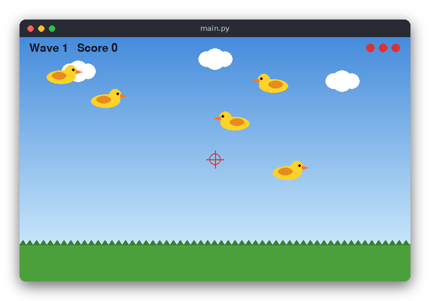

# Shooting Ducks (Python)

Ducks fly across a pygame sky, left to right or right to left, bobbing up and down. Click them to shoot. Each wave brings more and faster ducks. A duck that gets away costs a life, and the game ends when all three lives are gone.

The same game is also written in [C](../../c/shooting_ducks) (terminal) and [JavaScript](../../vanilla_js/shooting_ducks) (browser).



## Features

- Ducks fly in both directions and bob up and down.
- Click to shoot. Shots are checked against the duck's box.
- Waves: each wave has more ducks (3 + 2 × wave) that are faster and appear more often.
- Three lives: a duck that leaves the screen costs one life.
- 10 points per hit, shown with the wave number and lives.
- A short pause after each cleared wave, and a game over screen with restart.

## How to play

| Input | Action |
|---|---|
| Left click | Shoot at the mouse pointer |
| R or click | Play again (after game over) |
| Q | Quit |

Shoot the ducks before they leave the screen. When a wave is cleared, the next one starts after two seconds.

## How it works

The project has two files:

- `src/shooting_ducks.py` holds the rules. It does not import pygame, so it can be tested without a window.
- `src/main.py` draws the sky, grass and ducks, and runs the main loop.

**Random numbers.** `Rng` is a linear congruential generator. `next()` returns a number in [0, 1). The `Game` takes a seed, so the same seed always gives the same game.

**Spawning.** A wave starts with `ducks_in_wave(wave)` ducks to release. Every `spawn_interval(wave)` seconds (2.0 s at the start, down to 0.5 s) `_spawn_duck` adds one duck just outside the screen. It picks a direction, a speed, a height and a bobbing phase.

**Movement.** `Game.update(dt)` moves each duck by `speed * dt`, so the game runs at the same speed on any machine. The height follows a sine wave around `base_y`. The main loop limits `dt` to 0.1 s, so a slow frame does not make the ducks jump.

**Escapes.** A duck that has fully left the screen on the far side is removed and costs a life. When the lives reach zero, `game_over` becomes `True` and the game stops.

**Hits.** `Game.shoot(x, y)` finds the first duck whose box (10 × 6 field units) contains the point, removes it and adds 10 points. `main.py` converts the pixel position of the mouse to field coordinates.

**Waves.** When every duck of the wave has been spawned and removed, `break_timer` starts a two-second pause. Then the next wave begins.

The field is 100 × 40 units. `main.py` scales it to an 800 × 500 window.

## Project layout

```
shooting_ducks/
├── README.md
├── screenshot.png
├── requirements.txt        pygame and pytest
├── pyproject.toml          pytest settings
├── .flake8                 lint settings
├── src/
│   ├── shooting_ducks.py   the rules: spawning, movement, hits, waves
│   └── main.py             the pygame window and the main loop
└── tests/
    └── test_shooting_ducks.py  tests of the rules, no window needed
```

## Requirements

- Python 3.8 or newer
- pygame (see `requirements.txt`)

## Run

```sh
pip install -r requirements.txt
python3 src/main.py
```

## Test

```sh
pip install -r requirements.txt
pytest
flake8 src tests
```

The tests check the rules: the random source, spawning, movement over time, hits and misses, escapes, game over and waves.

## Comparison with the other versions

- [C](../../c/shooting_ducks) (terminal, ncurses)
- [Python](../../python/shooting_ducks) (pygame window)
- [JavaScript](../../vanilla_js/shooting_ducks) (browser canvas)

| | C | Python | JavaScript |
|---|---|---|---|
| Interface | ncurses terminal | pygame window | browser page |
| Lines of logic | 98 | 103 | 114 |
| Lines of interface | 135 | 103 | 156 |
| Tests | 10 | 11 | 10 |

The three versions use the same rules and the same random number generator, so a given seed produces the same ducks in each language. The C version keeps the ducks in a fixed array and removes a shot duck by shifting the rest down; Python and JavaScript just use a list, and removing an element is one call. C also has to draw the sky, grass and ducks cell by cell and convert between terminal cells and field coordinates, while the pygame and canvas versions draw shapes at pixel positions. JavaScript has no integer type, so the generator uses `Math.imul` to get the same 32-bit arithmetic that C gets for free from `uint32_t`.

## Ideas for extensions

- Add a bonus for shooting ducks quickly after they appear.
- Make some ducks worth more points, and draw them in a different colour.
- Add sound effects for shots and escapes.
- Save the high score to a file.
- Add a pause key.
