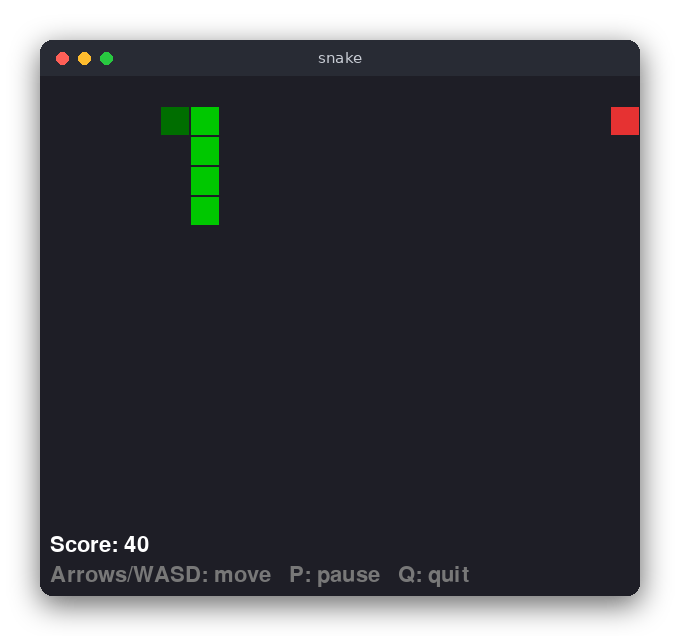

# Snake (Python)

Snake in a window: you steer a snake around a board, eat the food to grow and score points, and the game ends when the snake hits a wall or its own body. The window is drawn with pygame. The rules are in a separate file that has no input or output at all, so they can be tested without a screen.



## Features

- A 20 x 15 board with a wall around it
- Arrow keys or W, A, S, D steer the snake
- The snake cannot reverse into itself
- Eating food makes the snake longer and adds 10 points
- Hitting the wall or the snake's own body ends the game
- The game gets faster as the snake grows
- P pauses, R or Space restarts after game over, Q or Esc quits

## How to play

| Key | Action |
|---|---|
| Arrow keys or W A S D | Turn the snake (it keeps moving on its own) |
| P | Pause or continue |
| R or Space | Start a new game (after game over) |
| Q or Esc | Quit |

The head of the snake is dark green, the body is light green, and the food is red. The score and the status are shown under the board.

## How it works

### Data

The board is 20 x 15 cells. A cell is an `(x, y)` tuple. The snake is a list `body` of cells, where `body[0]` is the head and the last item is the tail. A direction is a pair `(dx, dy)`, for example `RIGHT = (1, 0)`, so a step is `(x + dx, y + dy)`.

### One step of the game

`SnakeGame.step()` does the following:

1. Use the direction the player asked for (`next_direction`) and work out the new head cell.
2. If the head is outside the board or on the snake's body, the game is over.
3. Otherwise insert the new head at the front of the list. If it is the food, the score goes up by 10 and new food is placed, so the tail stays and the snake grows. If not, `pop()` removes the tail, so the snake keeps its length.

### Turns

`turn()` stores the requested direction, but only if it is not the opposite of the last step. A turn from right to left is ignored, and two presses between two steps are checked against the last step too, so the snake never runs into its neck.

### Food

`place_food()` builds the list of free cells and picks one with `random_below(len(free))`. The random function is a parameter of `SnakeGame`. The game uses `random.randrange`, and the tests pass a function that always returns the same choice.

### The loop in main.py

`Gui.run()` handles the events from pygame: a key press calls `turn()` or changes the state, and the snake is moved when `pygame.time.get_ticks()` has reached the time of the next step. Then the screen is drawn and the loop waits to keep 60 frames per second. The delay between steps comes from `delay_ms()`, which gets shorter as the snake grows.

## Project layout

```
src/snake.py           the rules: the board, steps, turns, food and speed
src/main.py            the pygame window, keys and drawing
tests/test_snake.py    pytest tests of the rules
pyproject.toml         pytest settings (the tests find the code in src/)
requirements.txt       pytest and pygame
```

## Requirements

- Python 3.8 or newer
- pygame (`pip install pygame`)
- pytest, only for the tests

## Run

```sh
pip install -r requirements.txt
python3 src/main.py
```

## Test

```sh
pip install -r requirements.txt
pytest
```

The tests check the rules only: the start, moves, turns, walls, collisions with the body, eating, the random choice of food and the speed. They need no window.

## Comparison with the other versions

- [C version](../../c/snake)
- [JavaScript version](../../vanilla_js/snake)

| | C | Python | JavaScript |
|---|---|---|---|
| Interface | ncurses terminal | pygame window | browser page |
| Lines of logic | 128 | 55 | 79 |
| Lines of interface | 121 | 75 | 74 |
| Tests | 9 | 13 | 13 |

The rules are the same in all three versions. Python is the shortest: the body is a list of tuples and the free cells are found with a list comprehension, so no index arithmetic is needed. The random source is a constructor parameter, which makes the food easy to fix in tests. In C the snake is a fixed array and the game must manage the time and the key codes itself, while pygame does that work for the Python version.

## Ideas for extensions

- Show the high score in a file between games
- Draw the snake with rounded corners and an animation between cells
- Add obstacles that are placed at random on the board
- Let the walls wrap around, so the snake comes out on the other side
