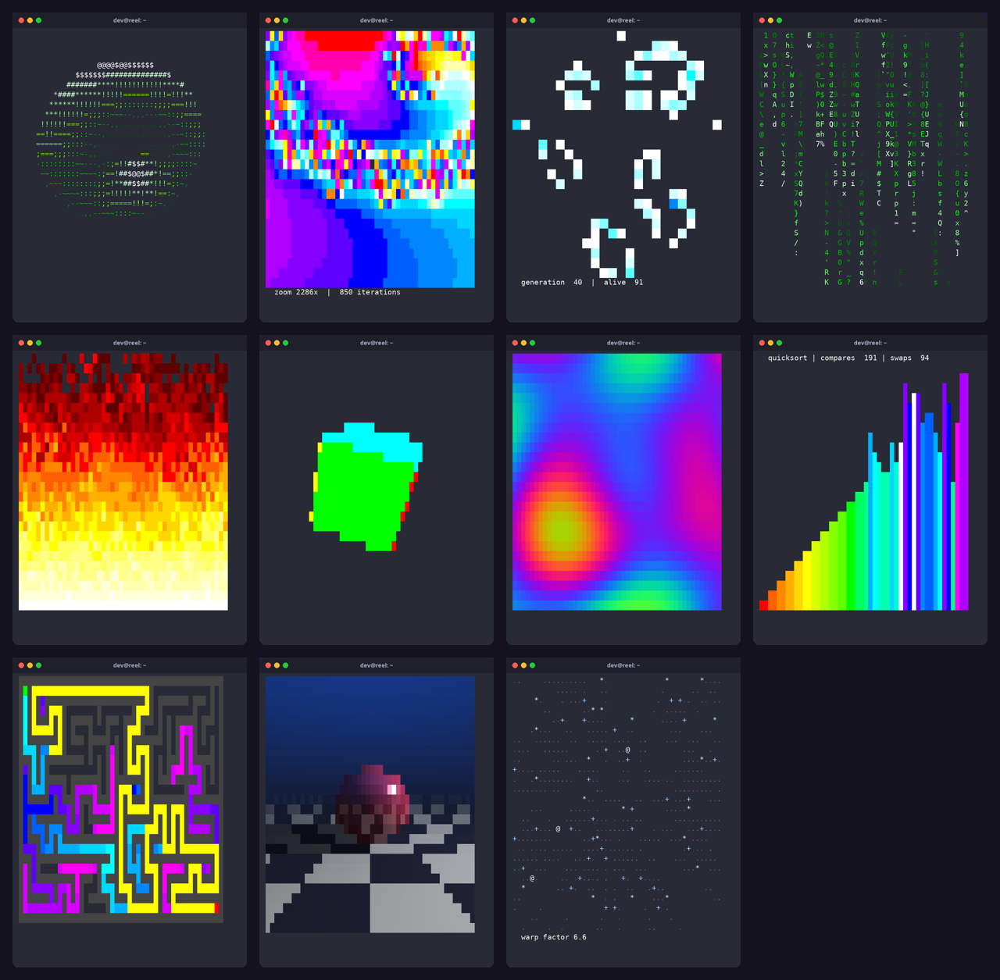

# Terminal Effects (Python)

Eleven small, self-contained Python scripts that turn the terminal into a canvas: 3D graphics, fractals, simulations and algorithm visualizations, using only the standard library and ANSI escape codes. They are ports of the [C versions](../../c/terminal_effects).



## Effects

| Script | What it shows | Ideas inside |
|---|---|---|
| `donut` | A spinning 3D torus drawn with ASCII shading | Rotation matrices, perspective projection, z-buffer, surface normals |
| `mandelbrot_zoom` | A nearly 19,000× zoom into the Mandelbrot set's "seahorse valley" | Complex numbers, escape-time algorithm, color cycling |
| `game_of_life` | Conway's Game of Life on a wrapping grid, cells colored by age | Cellular automata, double buffering, toroidal neighbors |
| `matrix_rain` | The Matrix "digital rain" | Per-column state, trails with color gradients |
| `doom_fire` | The PSX Doom fire effect | Heat propagation with random cooling and wind |
| `spinning_cube` | A solid cube with six colored faces | 3D rotation around three axes, z-buffer rasterization |
| `plasma` | Demoscene plasma in 24-bit color | Summed sine waves, truecolor escape codes |
| `quicksort_visualizer` | Quicksort, one frame per swap | Lomuto partitioning, recursion |
| `maze_solver` | A random maze carved live, then solved | Depth-first search with an explicit stack, BFS shortest path |
| `ray_tracer` | A reflective sphere on a checkered floor with an orbiting light | Ray-sphere and ray-plane intersection, diffuse/specular light, shadows, reflections |
| `warp_starfield` | A 3D starfield accelerating to warp speed | Perspective projection, depth sorting, motion streaks |

Each script is a single file in `src/`, short enough to read in one sitting. Every animation runs for 5 to 15 seconds and then exits.

## Requirements
- Python 3.8+ (no third-party packages; `pytest` is only needed for the tests)
- A terminal with UTF-8, 256 colors and truecolor support (most modern terminals), at least 50×28 characters

## Run

### Locally
```sh
python src/donut.py
python src/plasma.py
```

Or install all eleven as commands:
```sh
pip install .
donut
maze_solver
```

### With Docker
```sh
docker build -t terminal_effects .
docker run --rm -it terminal_effects
docker run --rm -it terminal_effects python src/maze_solver.py
```

## Test
Each test runs one animation for a few frames (or on a smaller board) with `time.sleep` switched off and checks what it drew. The whole suite takes well under a second:
```sh
pip install -r requirements.txt
pytest tests
flake8 src tests
```

## Differences from the C versions
- Python's `random` module produces different numbers than C's `rand()`, so the Game of Life, the Matrix rain, the fire, the starfield, the quicksort input and the maze look different from the C runs, even with the same seeds.
- `spinning_cube` samples each face every 0.5 units instead of 0.25 to keep a smooth frame rate in CPython. At this resolution the picture is practically the same.
