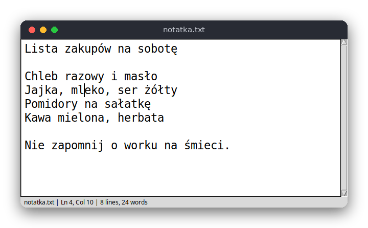

# Text Editor (Python)

A small plain-text editor with a window, written in Python with tkinter. You open a file, edit it, search it and save it. The text itself is kept by the built-in `Text` widget, so the code to read is mostly about the window, the keys and the status bar.

The same editor is also written in [C](../../c/text_editor) (ncurses terminal) and [JavaScript](../../vanilla_js/text_editor) (browser). The editor works with plain text only, without bold, italic or colors, so the three versions have the same features and can be compared line by line.



## Features

- Open a file from the command line (`python3 src/main.py notes.txt`) or with the Open dialog; a file that does not exist yet is created when you save
- Edit as in any text editor, with word wrapping, a scroll bar and Tab inserting 4 spaces
- Save with Ctrl+S; a new file asks for its name in a Save dialog
- Find text with Ctrl+F, find the next match with F3; the search wraps around to the start of the file
- Go to a line with Ctrl+G
- A status bar with the file name, a `(modified)` marker, line and column, and the number of lines and words
- Warns before you quit (Ctrl+Q or closing the window), start a new file (Ctrl+N) or open another file (Ctrl+O) with unsaved changes

## How to use

| Key | Action |
|---|---|
| Arrows, Home, End, PgUp, PgDn | Move the cursor (the mouse also works) |
| Letters, Enter, Tab | Type text, split the line, insert 4 spaces |
| Backspace, Delete | Delete the character before / after the cursor |
| Ctrl+S | Save (asks for a file name if the file has none) |
| Ctrl+O | Open a file |
| Ctrl+N | New empty file |
| Ctrl+F | Find text; the dialog remembers the last search |
| F3 | Find the next match |
| Ctrl+G | Go to a line number |
| Ctrl+Q | Quit |

## How it works

### The logic

`src/text_editor.py` has the parts that do not depend on the window, so they can be tested:

- `find_next(text, needle, start)` returns the index of the first match at or after `start`. When there is none, it starts again from the beginning of the text, so the search wraps around. It returns -1 when nothing matches.
- `line_col(text, offset)` turns a character offset into a line and column. The `Text` widget and the status bar count lines and columns from 1.
- `count_lines(text)` and `count_words(text)` give the numbers shown in the status bar. A final newline does not start a new line, which is the same rule as in the C version.

### The window

`src/main.py` defines `Editor`, a subclass of `tk.Tk` with a `Text` widget, a scroll bar and a label for the status bar. The text is stored in the widget, and its methods do the rest:

- `get("1.0", "end-1c")` returns all the text. `get("1.0", "insert")` returns the text before the cursor, whose length is the cursor's offset.
- Shortcuts are bound to the `Text` widget with `shortcut`, which returns `"break"` so the widget does not also handle the key (for example, Ctrl+O would otherwise insert a new line in Tk).
- `edit_modified()` is the widget's own flag for "changed since the last save". Loading and saving reset it.
- `find_again` searches from the cursor plus one character, selects the match and moves the cursor there. A match that starts before the old cursor position means the search wrapped around, and the status bar says so.
- `confirm_discard` asks with a message box before the text is replaced or the window is closed.

The status bar is updated after each key release, each click and each change of the text.

## Project layout

```
requirements.txt          pytest
pyproject.toml            tells pytest where the modules are
.flake8                   the line length limit
src/text_editor.py        the logic: search, line and column, counts (no tkinter)
src/main.py               the window: Text widget, keys, dialogs, status bar
tests/test_text_editor.py tests of the logic
```

## Requirements

- Python 3.8 or newer with tkinter (on Debian and Ubuntu: `sudo apt install python3-tk`)
- pytest for the tests (`pip install -r requirements.txt`)

## Run

```sh
python3 src/main.py
python3 src/main.py notes.txt
```

## Test

```sh
pip install -r requirements.txt
pytest
```

The tests use only the logic module, so they need no window or display.

## Comparison with the other versions

- [C](../../c/text_editor): ncurses terminal, [README](../../c/text_editor/README.md)
- [JavaScript](../../vanilla_js/text_editor): browser page, [README](../../vanilla_js/text_editor/README.md)

| | C | Python | JavaScript |
|---|---|---|---|
| Interface | ncurses terminal | tkinter window | browser page |
| Lines of logic | 298 | 22 | 35 |
| Lines of interface | 355 | 156 | 157 |
| Tests | 9 | 6 | 7 |

Python does not need a buffer of lines: the `Text` widget stores the text, the cursor, the selection and the undo history, and it wraps long lines and handles scrolling. What the program still has to do itself is the window logic, such as asking before losing changes. The same search and counting code is also in C, where each line is managed by hand, and in JavaScript, where it is a few lines of string functions.

## Ideas for extensions

- Show line numbers in a narrow column beside the text
- Highlight all matches of the search text, not only the next one
- Add Replace (Ctrl+H) with a choice of replacing one match or all of them
- Remember the window size and the last opened file between runs
- Add a Preferences dialog for the font size
