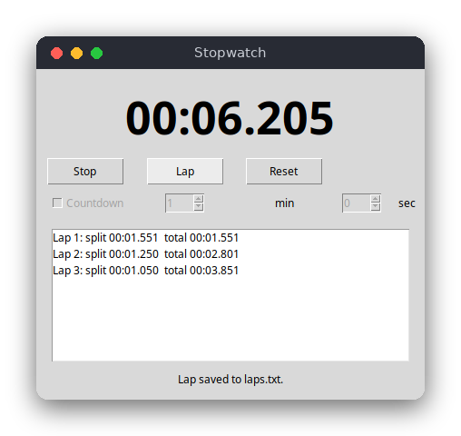

# Stopwatch and Countdown (Python)

A stopwatch with laps and a countdown, in a small tkinter window. The time is shown with milliseconds, and each lap is added to the list and written to `laps.txt`. When a countdown reaches zero it stops and the window rings the bell.

The same program is also written in [C](../../c/timer) (a terminal version) and [JavaScript](../../vanilla_js/timer) (a browser page). They have the same features and rules.



## Features

- Stopwatch with milliseconds: `mm:ss.mmm`, or `h:mm:ss.mmm` after an hour.
- Start, stop (pause), resume, and reset.
- Laps, each with its split time (since the previous lap) and total time.
- Countdown with minutes and seconds. It stops by itself at zero and shows "Time is up!" in red.
- Laps are written to `laps.txt` in the current directory.
- Timing uses the monotonic clock, so changes to the system time do not affect it.

## How to use

- **Start** starts the timer, and the same button then reads **Stop** to pause it. Start again to resume.
- **Lap** records a lap while the timer runs.
- **Reset** clears the time and the laps.
- **Countdown** switches the window to a countdown. Set the minutes and seconds before pressing Start. The settings are locked after the first start, until you press Reset.

Example session: press Start, then Lap three times while you do something, then Stop. The list shows each lap, and `laps.txt` contains the same lines:

```
Lap 1: split 00:01.542  total 00:01.542
Lap 2: split 00:01.257  total 00:02.799
Lap 3: split 00:01.036  total 00:03.835
```

## How it works

**Time values.** Every time is an integer number of milliseconds. The logic in `timer.py` never reads a clock. Each method takes `now` as an argument. The tests therefore pass fixed numbers and do not wait.

**The stopwatch state.** The class `Timer` keeps three values: the time of the finished running periods (`_accumulated_ms`), the clock value when the current period began (`_started_at_ms`), and whether it is `running`. `elapsed(now)` adds the current period while running. `start(now)` and `stop(now)` update these values, and they do nothing when the timer is already in the requested state. Pausing and resuming therefore keep the total correct.

**Laps.** `lap(now)` stores the total time now. The split is the total minus the total of the previous lap. `lap` returns `None` when the timer is not running.

**Countdown.** `Timer(limit_ms)` makes a countdown. `display(now)` returns the remaining time instead of the elapsed time, and `elapsed` never goes past the limit. `tick(now)` stops the timer when it reaches zero. A finished countdown cannot be started again until `reset()`.

**Why a monotonic clock.** The wall clock is the time of day. The operating system sets it, and it can jump when network time sync corrects it, when the time zone or daylight saving time changes, or when someone changes it. A stopwatch that subtracts two wall-clock readings could show a negative or a huge time. `time.monotonic_ns()` never goes backwards, so `main.py` uses it and only ever subtracts two readings.

**The interface loop.** `main.py` builds the window in `StopwatchApp`. Every 20 ms, `_tick` reads the monotonic time, calls `timer.tick`, shows the time with `format_time`, and rings the bell once when the countdown finishes. Buttons call `toggle`, `lap` and `reset`, which change the `Timer` and then call `refresh`. Tkinter runs the window loop, and `after` schedules the next tick, so the window never blocks.

## Project layout

```
README.md             this file
screenshot.png        a running stopwatch with three laps
requirements.txt      pytest, the only package to install (tkinter is in the standard library)
pyproject.toml        tells pytest where to find the logic
.flake8               the style checker settings (lines up to 120 characters)
src/timer.py          the logic: Timer, countdown_ms, format_time, laps_text
src/main.py           the tkinter window and the 20 ms update loop
tests/test_timer.py   tests of the logic with fixed times
```

## Requirements

- Python 3.8 or newer, with tkinter (on Debian and Ubuntu: `sudo apt install python3-tk`)
- pytest, only for the tests

## Run

```sh
python3 src/main.py
```

## Test

```sh
pip install -r requirements.txt
pytest
```

## Comparison with the other versions

- [C version](../../c/timer): terminal program
- [JavaScript version](../../vanilla_js/timer): browser page

| | C | Python | JavaScript |
|---|---|---|---|
| Interface | terminal (ANSI codes) | tkinter window | browser page |
| Lines of logic | 136 | 73 | 75 |
| Lines of interface | 199 | 105 | 102 |
| Tests | 9 | 11 | 9 |

The Python version is the shortest because the standard library does the work: `dataclass` makes the `Lap` record, lists grow on their own, and `tkinter` provides the window and the timer callback (`after`). The logic is almost the same as in JavaScript, which shows that the rules are the same in both languages. The C version needs more code for the same rules, because it has to manage its own array of laps and read the keys without blocking.

## Ideas for extensions

- Add keyboard shortcuts (`s`, `l`, `r`) with `root.bind`.
- Let the countdown repeat (pomodoro: 25 minutes work, 5 minutes rest).
- Play a sound file when the countdown ends, instead of the window bell.
- Save laps as CSV, so spreadsheets can open them.
- Keep the window on top with `root.attributes("-topmost", True)`.
