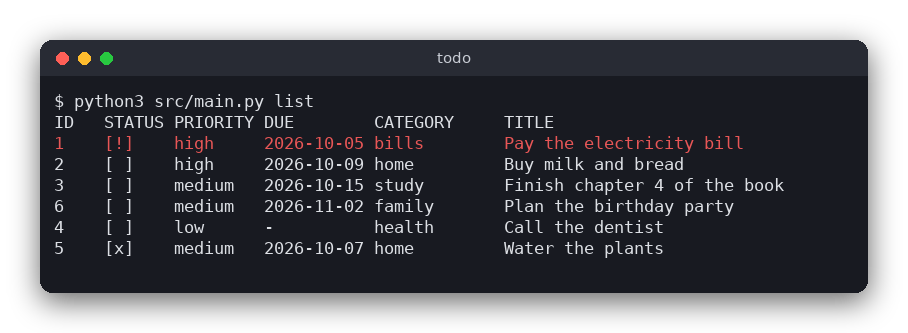

# Todo List (Python)

A terminal todo list. Each task has a title, a priority (low, medium or high), an optional due date and an optional category. Tasks are saved in a plain text file, `tasks.txt`, so there is no database to install.



## Features

- Add, edit, delete, mark done and mark not done
- Priorities, due dates (checked against the calendar) and categories
- The list is sorted by done status, then due date, then priority
- Filter by category, or show all, active or done tasks
- Overdue tasks (not done, due before today) are red and marked `[!]`
- The tasks are stored in `tasks.txt` in the current directory

## How to use

Every command is one run of the program. Run it without arguments to see the list.

| Command | What it does |
|---|---|
| `todo list` (or no command) | show the tasks; add `--category NAME` and `--status all\|active\|done` to filter |
| `todo add TITLE [--due YYYY-MM-DD] [--priority low\|medium\|high] [--category NAME]` | add a task (the default priority is medium) |
| `todo edit ID [--title T] [--due DATE\|none] [--priority P] [--category NAME\|none]` | change a task; `none` removes the due date or the category |
| `todo done ID` / `todo undone ID` | mark a task as done or not done |
| `todo rm ID` | delete a task |
| `todo -h` | show the usage |

Example session:

```sh
$ python3 src/main.py add "Buy milk" --due 2026-10-20 --priority high --category home
Added task 1.
$ python3 src/main.py add "Call the dentist" --priority low
Added task 2.
$ python3 src/main.py done 1
Task 1 is now done.
$ python3 src/main.py list --status active
ID   STATUS PRIORITY DUE        CATEGORY     TITLE
2    [ ]    low      -          -            Call the dentist
```

The `ID` of a task never changes. A new task gets the largest id plus one.

## How it works

### The data

A task is an immutable `Task` dataclass (`src/todo.py`) with an id, a title, a priority (a string from `PRIORITIES`), a due date and a category (an empty string means "none"), and a `done` flag. The list is a plain Python list of tasks. Titles can be up to 255 bytes and categories up to 63 bytes. There are at most 200 tasks.

### The file format

`tasks.txt` has one task per line. The six fields are separated by tab characters:

```
1	0	high	2026-10-20	home	Buy milk
2	1	low		work	Send the report
```

The fields are: id, done (`1` or `0`), priority, due date, category, title. The due date and category are empty when they are not set.

The format uses tabs and new lines as separators, so a title or category cannot contain a tab or a new line. The program refuses such values instead of escaping them. This keeps the format trivial: a line is split at the tabs and nothing else. Plain text was chosen instead of SQLite because it needs no library, the file can be read and edited by hand, and a small list does not need a database. If the file contains a line that is not valid, the program stops and reports the line number, so no task is lost silently.

### Rules and checks (`src/todo.py`)

- `is_valid_date` checks the `YYYY-MM-DD` form, the month range, and the number of days in the month (leap years included).
- `is_valid_task` checks the title (not empty), the category, the priority and the due date. The commands use it before they change anything.
- `is_overdue` is true when the task is not done, has a due date, and the date is earlier than today. The program passes today's date in, which keeps this function testable.
- `visible_tasks` selects the tasks that match the filters and sorts them. The sort key puts active tasks first, then tasks with a due date (earliest first, tasks without a date last), then high priority first, and finally the id. Dates are written as `YYYY-MM-DD`, so comparing them as strings gives the calendar order.

### The terminal interface (`src/main.py`)

`argparse` reads the command and its options. `main` loads `tasks.txt` into a list, runs one command (a `cmd_...` function that returns the new list), and writes the file back when the command changes something. Overdue rows are printed in red with ANSI escape codes. Errors stop the program with a message and exit code 1; a wrong command line exits with code 2, which is what `argparse` does.

## Project layout

```
src/todo.py            the logic: validation, dates, sorting, filtering, the text format
src/main.py            the terminal interface: commands, reading and writing tasks.txt
tests/test_todo.py     tests of the logic (no files, no terminal needed)
pyproject.toml         tells pytest where the modules are
requirements.txt       the packages needed for the tests
```

## Requirements

- Python 3.8 or newer
- No packages are needed to run the program. The tests need `pytest`.

## Run

```sh
python3 src/main.py add "Buy milk" --due 2026-10-20 --priority high
python3 src/main.py list
```

## Test

```sh
pip install -r requirements.txt
pytest
```

## Comparison with the other versions

- [C version](../../c/todo)
- [JavaScript version](../../vanilla_js/todo)

| | C | Python | JavaScript |
|---|---|---|---|
| Interface | terminal commands | terminal commands | browser page |
| Lines of logic | 239 | 76 | 79 |
| Lines of interface | 273 | 136 | 180 |
| Tests | 7 | 10 | 7 |

Python does the same job with far less code, mainly because the standard library does the work: `argparse` turns the command line into a namespace, `dataclasses.replace` makes a changed copy of a task, and string comparison orders the `YYYY-MM-DD` dates. Nothing has to be freed or sized in advance, so the list is just a Python list. Because the `Task` is immutable, the commands return a new list instead of changing the old one, which makes the rules easy to test without any setup.

## Ideas for extensions

- Add `todo search TEXT` to find tasks by part of the title.
- Sort the list by a chosen field with `--sort`.
- Repeat tasks: a weekly task that moves its due date forward when it is marked done.
- Add a `--json` output option for other programs to read.
