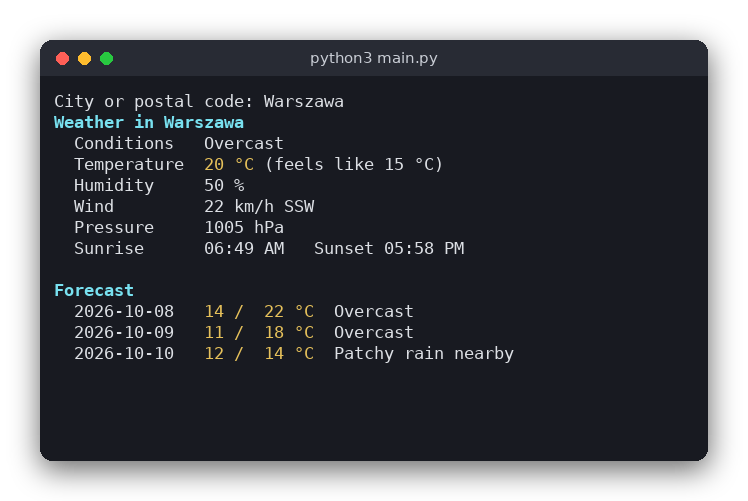

# Weather (Python)

A command-line weather report. You type a city name or postal code, and the program downloads the current weather and a 3-day forecast from [wttr.in](https://wttr.in), a free service that needs no API key. The program uses only the standard library, and its logic is tested without touching the network.

The same program is also written in [C](../../c/weather) and [JavaScript](../../vanilla_js/weather). All three print the same report.



## Features

- Current temperature, feels-like temperature, conditions, humidity, wind speed and direction, pressure, sunrise and sunset
- A 3-day forecast with the minimum and maximum temperature and the conditions for each day
- Works with city names (`Warszawa`, `New York`, `Kraków`) and postal codes (`00-001`)
- Clear error messages for an unknown city, no network connection, or an empty reply
- Colors for the title, the temperatures and the section headings

## How to use

Give the city as an argument:

```sh
python3 src/main.py Warszawa
```

Several words are joined into one name, so `python3 src/main.py New York` also works. Without an argument the program asks for the city:

```text
$ python3 src/main.py
City or postal code: Warszawa
Weather in Warszawa
  Conditions   Overcast
  Temperature  20 °C (feels like 15 °C)
  Humidity     50 %
  Wind         22 km/h SSW
  Pressure     1005 hPa
  Sunrise      06:49 AM   Sunset 05:58 PM

Forecast
  2026-10-08  14 /  22 °C  Overcast
  2026-10-09  11 /  18 °C  Overcast
  2026-10-10  12 /  14 °C  Patchy rain nearby
```

Errors are printed to standard error and the program exits with status 1:

```text
$ python3 src/main.py zzzzqqq
City not found: zzzzqqq (HTTP 500)
```

## How it works

**Getting the data.** `urllib.request.urlopen()` downloads the reply. The reply is a JSON document, so the program makes one request with `?format=j1` and reads the whole result. wttr.in answers HTTP 500 for a place it does not know, which `urllib` reports as an `HTTPError`. Other failures (no connection, a timeout) are `OSError`s, and the program reports them as network errors.

**Building the URL.** `build_url()` uses `urllib.parse.quote(city, safe='')`. This turns spaces into `%20` and Polish letters into their UTF-8 bytes (`ó` becomes `%C3%B3`). The `safe=''` argument also encodes `/`, so a city name can never change the path of the URL.

**Parsing the reply.** `parse_weather()` turns the JSON text into a `Weather` dataclass. It reads `current_condition[0]` for the current values, and the `weather` list for the sunrise and sunset and for the three forecast days. Each forecast day stores its minimum and maximum temperature and the description of the 12:00 slot (`hourly[4]`, since wttr.in gives eight 3-hour slots per day). If the JSON has no weather data, the function raises `ValueError`. The main program turns that into a message.

**Formatting.** `format_report()` returns the report as one string. It contains ANSI color codes, so the text looks colored in a terminal, and the tests can check the text.

**The user interface.** `main.py` only asks for the city, calls the functions in `weather.py` and prints or reports errors. `sys.exit(message)` prints the message to standard error and exits with status 1.

## Project layout

```
weather/
├── .flake8               the maximum line length for flake8
├── pyproject.toml        tells pytest where the source files are
├── requirements.txt      the packages needed for the tests (pytest)
├── README.md             this file
├── screenshot.png        the program running for Warszawa
├── src/
│   ├── weather.py        URL building, parsing of the JSON reply, report formatting
│   └── main.py           asks for the city, downloads the reply, prints the report
└── tests/
    ├── test_weather.py   tests of the logic, using warszawa.json
    └── warszawa.json     a saved wttr.in reply (format=j1) for Warszawa
```

## Requirements

- Python 3.8 or newer
- No extra packages to run the program
- pytest, to run the tests (`requirements.txt`)
- An internet connection to run the program (the tests do not need one)

## Run

```sh
python3 src/main.py Warszawa
```

## Test

```sh
pip install -r requirements.txt
pytest
```

The tests check the URL encoding, the parsing of the saved reply (current conditions and the forecast), the rejection of bad replies, and the report text.

## Comparison with the other versions

- [C version](../../c/weather)
- [JavaScript version](../../vanilla_js/weather)

| | C | Python | JavaScript |
|---|---|---|---|
| Interface | Terminal, `curl` through `popen()` | Terminal, `urllib` | Terminal, `fetch` |
| Lines of logic | 177 | 77 | 62 |
| Lines of interface | 100 | 33 | 50 |
| Tests | 9 | 9 | 7 |

Python needs the least code for this task because its standard library reads JSON and downloads web pages. `json.loads()` gives a dictionary in one line, so no key searching is needed, and a `dataclass` holds the results without any size limits. The price is that a missing field in the reply only shows up as a `KeyError` at run time, which the program catches and turns into a `ValueError`. The C version has to search the text by hand, and the JavaScript version uses the same kind of objects as Python, but its `fetch` call returns a promise, so the program waits with `async` and `await`.

## Ideas for extensions

- Add a `--units imperial` option to show Fahrenheit and mph
- Show how many hours of daylight there are, computed from the sunrise and sunset times
- Cache the last reply in a file and show it when the network is down
- Show the hourly forecast for the rest of the day
- Read the default city from an environment variable
