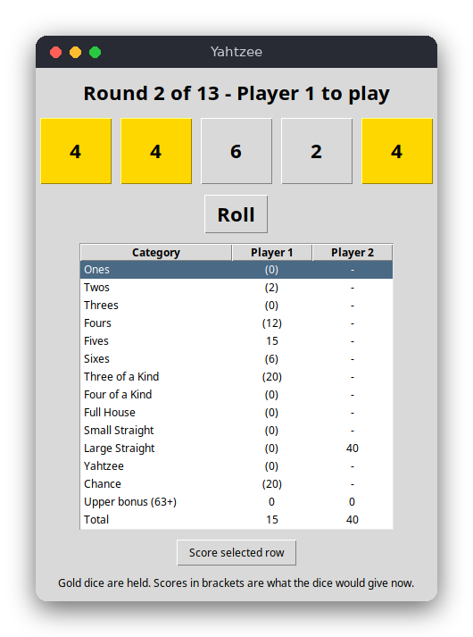

# Yahtzee (Python)

Yahtzee is a dice game for 1 to 4 players who take turns on one computer. In each turn you roll five dice up to three times, hold the dice you like between rolls, and then write the result into one free category of your score card. This version is a window built with tkinter, the standard Python GUI library.

The same game is also written in [C](../../c/yahtzee) (terminal) and [JavaScript](../../vanilla_js/yahtzee) (browser page).



## Features

- 1 to 4 players, taking turns, 13 rounds
- Up to three rolls per turn, holding any dice between rolls
- The 13 standard categories: Ones to Sixes, Three of a Kind, Four of a Kind, Full House (25), Small Straight (30), Large Straight (40), Yahtzee (50) and Chance
- The score card shows, in brackets, what the current dice would score in every free category
- Upper bonus: 35 points when the upper section reaches 63
- The winner is shown at the end
- Not included: the optional Yahtzee bonus and joker rules

## How to play

When the program starts, choose the number of players (1 to 4).

1. Press **Roll** to roll all five dice.
2. Click a die to hold it (held dice turn gold). Click it again to release it.
3. Press **Roll** again to roll the dice that are not held. You have three rolls in total.
4. Click a category row on the score card, then press **Score selected row**. The turn ends and the next player starts.

The score card shows what the current dice would score in each free category in brackets, for the player whose turn it is. Filled cells are fixed. The game ends after 13 rounds and shows the winner.

## How it works

The game is split into two files:

- `src/yahtzee.py` contains the rules. It does not import tkinter and does not print or read input, so the tests can run it.
- `src/main.py` contains the window: the dice buttons, the roll button and the score card.

**Data.** A `Game` object keeps one card per player. A card is a list of 13 values, where `None` means the category is still free. The object also keeps the five dice, which of them are held, the number of rolls in this turn, the current player and the round.

**Scoring.** `score_for(dice, category)` counts the faces with `dice.count(face)`. The upper categories add up the dice showing their face. Three and Four of a Kind add all dice when there are enough equal faces. Full House needs exactly three of one face and two of another. The straights use sets: a small straight is any run of four faces, and a large straight is any run of five. Yahtzee needs five equal dice. Chance adds all dice.

**Turn flow.** `Game.roll(face)` rolls the dice that are not held. It takes a function `face()` that returns a number from 1 to 6, so the tests can pass fixed values. `Game.toggle_hold(die)` works only after the first roll. `Game.choose(category)` writes the score, resets the dice and moves to the next player. When the last player has finished, the round number goes up. `Game.is_over` is true after round 13.

**Window loop.** tkinter calls the handler functions when a button is pressed. Each handler changes the `Game` object and then calls `refresh()`, which updates the status text, the dice and the table. The `main()` function asks for the number of players and starts `mainloop()`.

## Project layout

```
requirements.txt        packages needed for the tests (pytest)
pyproject.toml          pytest settings: look for modules in src/
.flake8                 style checker settings (line length 120)
.editorconfig           indentation and line endings for editors
src/yahtzee.py          the rules: scoring, turns, rounds, upper bonus, winner
src/main.py             the tkinter window
tests/test_yahtzee.py   tests of the rules with fixed dice
```

## Requirements

- Python 3.8 or newer
- tkinter (included with most Python installers; on Linux install the `python3-tk` package)
- pytest, only for the tests

## Run

```
python3 src/main.py
```

## Test

```
pip install -r requirements.txt
pytest
```

The tests check the score of each category with a table of dice, the upper bonus threshold, the totals, holding and rolling limits, the turn order, the rule that a category is used once, a full game of 13 rounds, and the winner. The 24 tests include 15 cases in one table-driven test.

## Comparison with the other versions

- [C](../../c/yahtzee)
- [Python](../../python/yahtzee) (this version)
- [JavaScript](../../vanilla_js/yahtzee)

| | C | Python | JavaScript |
|---|---|---|---|
| Interface | terminal (stdin/stdout) | tkinter window | browser page |
| Lines of logic | 212 (159 + 53 header) | 107 | 139 |
| Lines of interface | 171 | 121 | 110 (+ 45 HTML) |
| Tests | 10 | 24 | 10 |

Python is the shortest version of the rules, because lists, `None` and `set` comparisons express the scoring directly, and `Game` is one class. The window code is also short: tkinter's `Treeview` shows the score card, and the handlers only call the game and refresh the widgets. The C version has to lay out the table with `printf` widths and keep everything in structs. The JavaScript version is the same design again, but it does not use classes, so the rules are plain functions that change a plain object.

## Ideas for extensions

- Add the optional Yahtzee bonus (100 points per extra Yahtzee) and the joker rules.
- Ask for the player names in a dialog.
- Save the game to a JSON file and load it later.
- Add a dice roll animation with `after()` calls.
