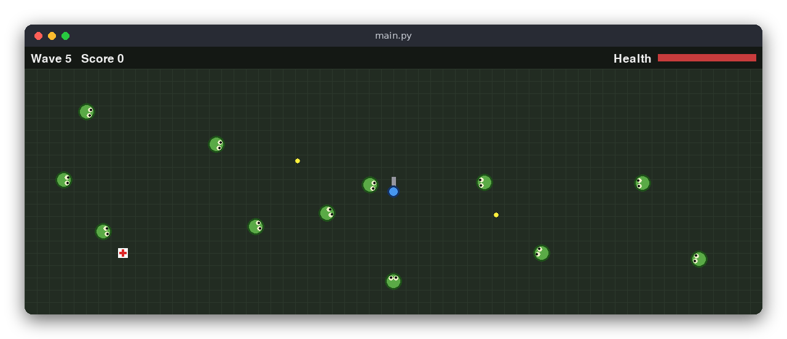

# Zombie Apocalypse (Python)

A small top-down survival game in a pygame window. You stand in the middle of a field, zombies walk in from the edges, and you shoot them before they touch you. Every wave brings more and faster zombies, and health packs appear now and then.

The same game is also written in [C](../../c/zombie_apocalypse) (ncurses terminal) and [JavaScript](../../vanilla_js/zombie_apocalypse) (browser canvas). All three follow the same rules.



## Features

- Move with **WASD** or the arrow keys; you cannot leave the field
- Shoot with the **mouse**: a click fires a bullet towards the cursor
- Zombies appear on the edges of the field and walk towards you
- Each wave has more zombies (5, then 8, 11, ...) and they are faster
- Touching a zombie costs 10 health and destroys the zombie
- Health packs (white squares with a red cross) appear every 12 seconds (at most two on the field) and restore 25 health
- Each zombie you shoot gives 10 points
- The top bar shows the wave, the score and the health bar
- The screen flashes red when you get hurt
- Game over when health reaches 0; press **R** to play again

## How to play

Start the game, then:

| Key or mouse | Action |
|---|---|
| `W` `A` `S` `D` or arrows | Move |
| Left click | Shoot towards the cursor (one bullet per click, with a short pause between shots) |
| `R` | Play again (after game over) |
| `Esc` or closing the window | Quit |

The blue circle is you, with a gray gun barrel pointing at the cursor. Green circles with eyes are zombies, yellow dots are bullets and white squares with a red cross are health packs.

## How it works

The project has two parts. `src/zombie_apocalypse.py` holds the rules and does no drawing or input. `src/main.py` reads the keyboard and mouse, calls the rules once per frame and draws the game with pygame.

**Data.** The state is a `Game` dataclass. Positions are `(x, y)` tuples in cells: the field is 60 x 20 cells, and each cell is 20 pixels on the screen. Bullets are `Bullet` objects with a position and a velocity, and `Input` holds one step's requests: a movement direction, an aim direction and a fire flag.

**One step.** Every frame the interface builds an `Input` and calls `update(game, input, dt)`, where `dt` is the time since the last frame (at most 0.05 seconds). `update` does these things in order:

1. `_move_player`: move by `PLAYER_SPEED * dt` in the chosen direction. The direction is normalized, so diagonals are not faster, and the player stays inside the field. The direction is also stored as `facing`.
2. `_try_fire`: when fire is requested and the cooldown has ended, add a bullet at the player's position, flying towards the aim point. With no aim, it flies in the `facing` direction.
3. `_move_bullets`: move the bullets and drop the ones that left the field.
4. `_spawn_zombies`: during a wave, one zombie appears on a random edge every `_spawn_interval` seconds until all the wave's zombies are out.
5. `_move_zombies`: each zombie moves towards the player at the wave's speed.
6. `_resolve_bullet_hits`: a zombie closer than 0.6 to a bullet is removed together with the bullet, and the score goes up by 10.
7. `_resolve_zombie_touches`: a zombie closer than 1.0 to the player is removed and costs 10 health. At 0 health `game_over` is set, and `update` does nothing more.
8. `_resolve_pickups` and `_spawn_pickups`: a health pack heals 25 (up to 100) when touched, and a new one appears every 12 seconds.
9. `_update_waves`: when the field is empty, a 3-second break starts; then the next wave begins with more zombies and a higher speed (`wave_size`, `zombie_speed`).

**Randomness.** `next_random(game)` is a 32-bit linear congruential generator whose state is stored in the game. `new_game(seed)` sets the seed. The same seed gives the same spawns, which the tests rely on. `main.py` seeds it with `random.randrange`.

**The interface loop.** `main()` runs a loop at 60 frames per second. Each frame it handles the window events (quit, `R`, mouse clicks), reads the arrow and letter keys from `pygame.key.get_pressed()`, computes the aim from the mouse position relative to the player, calls `update` and then `draw_game`. Mouse clicks are read as events, so a very short click is never missed. When the health goes down, `flash` is set and the overlay fades out over 0.3 seconds.

## Project layout

```
README.md                          this file
screenshot.png                     a wave in progress
requirements.txt                   pytest and pygame
pyproject.toml                     tells pytest where the modules are
.flake8                            line length limit for the linter
.editorconfig                      indentation and line-ending settings
src/zombie_apocalypse.py           the rules: movement, shooting, zombies, waves, pickups
src/main.py                        the pygame window: input and drawing
tests/test_zombie_apocalypse.py    15 tests of the rules
```

## Requirements

- Python 3.8 or newer
- pygame (installed from `requirements.txt`)
- pytest, only to run the tests (also in `requirements.txt`)

## Run

```sh
pip install -r requirements.txt
python3 src/main.py
```

## Test

The tests use only the rules module, so they need no window and no input:

```sh
pytest
```

## Comparison with the other versions

- [C](../../c/zombie_apocalypse)
- [Python](../../python/zombie_apocalypse) (this version)
- [JavaScript](../../vanilla_js/zombie_apocalypse)

| | C | Python | JavaScript |
|---|---|---|---|
| Interface | ncurses terminal | pygame window | browser page |
| Lines of logic | 232 | 202 | 224 |
| Lines of interface | 155 | 138 | 218 |
| Tests | 15 | 15 | 15 |

The rules are the same in all three versions, and so is the random generator, so a given seed produces the same zombie spawns in each. Python is the shortest version because the game state is a dataclass and lists are rebuilt with comprehensions, with no memory handling at all. Pygame makes input easy: the keyboard is read as a state each frame, and a click is an event that is never lost, while the terminal has to work around key repeats. The mouse aim, which needs a window, is the one feature the terminal version cannot offer.

## Ideas for extensions

- Show a short explosion or blood splat where a zombie dies
- Add a second kind of zombie that is slower but takes two hits
- Save the best score to a file between runs
- Add sound effects with `pygame.mixer`
- Add a pause key that stops calling `update`
