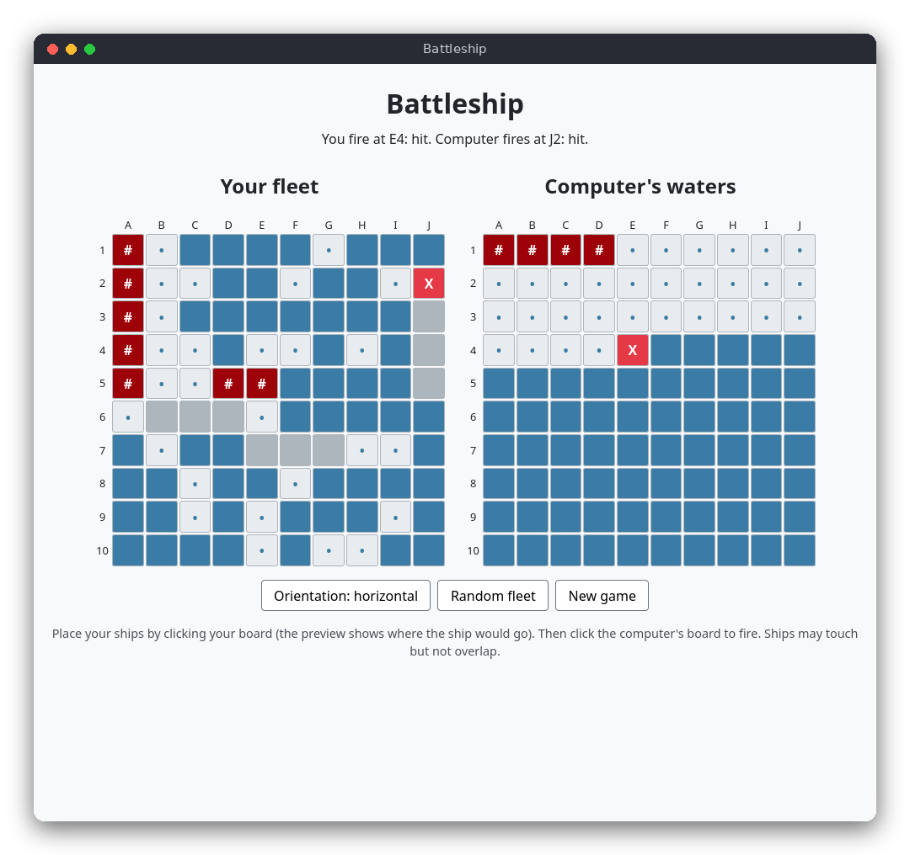

# Battleship (JavaScript)

Battleship in the browser. You place a classic fleet of five ships on a 10×10 board, then take turns with the computer, which fires at your board. The first side to sink the whole fleet wins. The page is plain HTML, CSS and JavaScript, with no libraries and no build step.



## Features

- Two 10×10 boards with the classic fleet: ships of length 5, 4, 3, 3 and 2
- Place ships yourself: click a cell with the chosen orientation, or use **Random fleet** to place the whole fleet at once
- A preview shows where the next ship would go when you move the mouse over your board (green if it fits, red if not)
- Ships may touch but never overlap or leave the board
- Hits, misses and sunk ships are reported after every shot
- The computer hunts your ships with a hunt-and-target strategy
- A win or lose message at the end, and **New game** at any time

## How to play

1. Move the mouse over your board (left). The outline shows where the next ship would go. Click to place it.
2. Use **Orientation** to switch between horizontal and vertical before you click.
3. Or click **Random fleet** to place all five ships at random and start the battle.
4. Click a cell on the computer's board (right) to fire. Your shot and the computer's answer are written above the boards.
5. Marks: `X` is a hit, `#` (dark red) is a sunk ship, `•` is a miss. The computer's ships stay hidden until the game is over, then they are shown.

Example message:

```
You fire at F4: miss. Computer fires at A10: hit.
```

## How it works

**Logic and page are separate.** `src/battleship.js` has the rules and no DOM code, so the tests can run in Node.js. `src/main.js` draws the boards and handles the clicks. The logic file ends with a line that exports its functions, but only when it runs under Node.js, so the same file works in the browser.

**Board.** A `Board` has five ship objects (`length`, `hits`, `placed`) and two 10×10 arrays: `shipAt[y][x]` is the index of the ship on a cell (or `null` for water), and `shot[y][x]` says whether the cell was fired at.

**Placement.** `Board.place()` checks that each cell of the ship is on the board and empty (`canPlace()`). Touching is allowed, because only occupied cells are checked. A ship can be placed only once. The preview uses the same `canPlace()` check to colour the cells.

**Random placement.** `Board.placeRandomly(random)` clears the board and tries to put each ship at a random cell with a random orientation. If a ship cannot be placed after 1000 tries, the whole fleet starts again. The random source is a function that returns a number from 0 to 1. The page passes `Math.random`, and the tests pass a seeded function, so the tests always get the same layout.

**Firing.** `Board.fire(x, y)` returns a string:

- `'invalid'`: outside the board (nothing changes)
- `'repeat'`: the cell was already fired at (nothing changes)
- `'miss'`: water
- `'hit'`: a ship was hit, but it is not sunk yet
- `'sunk'`: the hit sank the ship (its hits equal its length)

`Board.allSunk()` is true when every ship is sunk. That is the win and lose check.

**The computer (hunt and target).** `Computer` keeps a list of cells to try (`targets`).

1. **Hunt:** while the list is empty, the computer fires at a random cell it has not fired at yet.
2. **Target:** after a `'hit'`, the four neighbours (up, down, left, right) of that cell that are on the board and not yet fired at are added to the list. The next shot is taken from the end of the list, so the computer follows the ship it found.
3. **Sunk:** after `'sunk'`, the list is cleared and the computer hunts again.

`Computer.choose()` does steps 1 and 2, and `Computer.report()` does steps 2 and 3.

**The page.** `src/main.js` keeps one `game` object (both boards, the computer, the phase: `'placing'`, `'battle'` or `'over'`, the preview and the message). Every click calls `refresh()`, which changes the game and then `render()` sets the class of each of the 200 cells (`water`, `ship`, `miss`, `hit`) from the board data. The CSS in `src/style.css` gives the classes their colours. Clicking the computer's board fires your shot, and the computer fires back at once.

## Project layout

```
battleship/
├── README.md               this file
├── screenshot.png          a game in progress
├── package.json            the test script (node --test)
├── src/
│   ├── index.html          the page: the two boards and the buttons
│   ├── style.css           colours and layout
│   ├── battleship.js       the rules: boards, placement, shots, computer
│   └── main.js             the page: drawing the boards and handling clicks
└── tests/
    └── battleship.test.js  tests of the rules with node:test
```

## Requirements

- A modern browser (Firefox, Chrome, Edge or Safari) to play
- Node.js 18 or newer, only to run the tests (no npm packages are needed)

## Run

Open `src/index.html` in a browser by double-clicking it. No server is needed.

## Test

```sh
npm test
```

The tests check placement, touching and overlapping ships, the four shot results, repeated and invalid shots, the random fleet, the computer's targeting and a whole computer game that finishes without repeated shots. They run in Node.js without a browser.

## Comparison with the other versions

- [C](../../c/battleship): the same rules and computer strategy, in an ncurses terminal
- [Python](../../python/battleship): the same rules, in a tkinter window

| | C | Python | JavaScript |
|---|---|---|---|
| Interface | ncurses terminal | tkinter window | browser page |
| Lines of logic | 180 | 89 | 119 |
| Lines of interface | 210 | 134 | 150 |
| Tests | 9 | 10 | 9 |

The page shows a hover preview of the next ship, which is easy here because the browser gives mouse events for free. The random source is a plain function, so the tests can pass a seeded one and the game passes `Math.random`. Each shot returns a string such as `'sunk'`, which is easy to read but would not catch a typo at compile time, as the C constants do. The data is organised the same way in all three versions: a grid of cells that stores the ship index and whether each cell was fired at.

## Ideas for extensions

- Show the sunk ships in a different colour from a hit
- Let the computer use a checkerboard pattern while hunting, since every ship is at least two cells long
- Add a two-player mode where both boards are placed by people
- Remember the number of shots needed to win in `localStorage`
