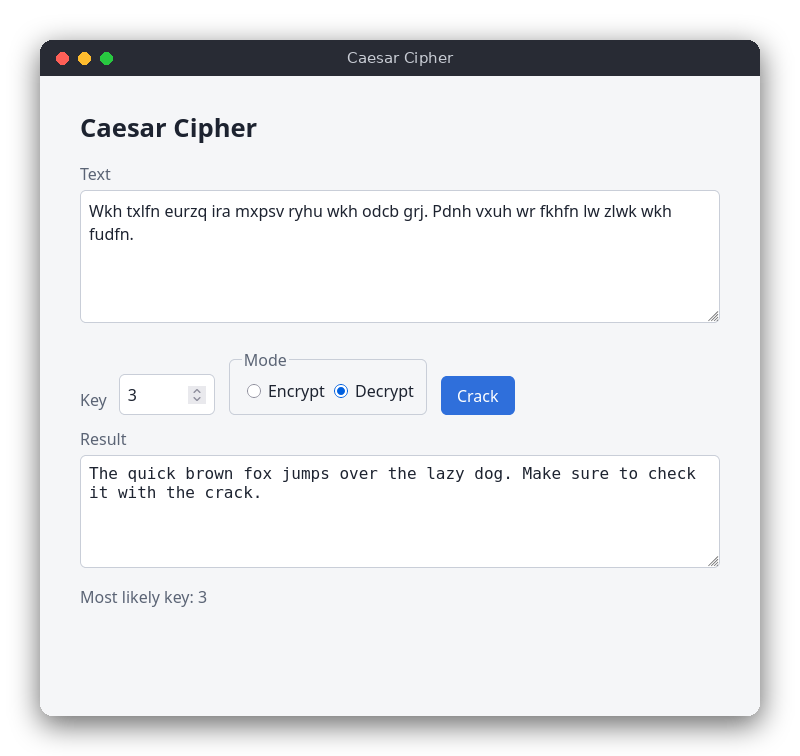

# Caesar Cipher (JavaScript)

A web page that encrypts and decrypts text with the Caesar cipher and can crack an encrypted message by trying all 26 keys. The result updates while you type. The page needs no server and no packages: open `src/index.html` in a browser.



## Features

- Encrypt and decrypt with any whole-number key, including negative numbers and numbers above 26 (`52` works like `0`).
- The result updates on every keystroke and whenever the key or the mode changes.
- Upper and lower case letters keep their case. Digits, spaces, punctuation and Polish letters stay unchanged.
- **Crack** tries all 26 keys, sets the most likely key in the key field and switches to Decrypt.

## How to use

1. Type or paste the text into the **Text** box. The **Result** box updates at once.
2. Change the **Key**, for example to `3`, or switch between **Encrypt** and **Decrypt**.
3. If you do not know the key, press **Crack**. The status line shows the most likely key, and the result is the decrypted text.

## How it works

- **Scripts, not modules.** `index.html` loads two classic scripts: `caesar_cipher.js` (the logic) and `main.js` (the page). Classic scripts work when the file is opened from disk (`file://`), while ES modules would be blocked there.
- **Data.** Text is a JavaScript string. The logic iterates it with `[...text]`, so each character is one code point.
- **Shifting one letter.** `shiftChar` finds the index of an ASCII letter with `letterIndex`, which compares character codes. It then returns `base + mod(index + key, 26)`, where `base` is 65 for capitals and 97 for small letters. Other characters are returned unchanged.
- **Negative keys.** In JavaScript `%` keeps the sign of the left operand: `-1 % 26` is `-1`. The helper `mod(n, m)` computes `((n % m) + m) % m`, which gives `25`. Decryption is `encrypt(text, -key)`.
- **Cracking.** `crack` calls `letterScore` for each key from 0 to 25. The score is the sum of the English frequency of each letter the text would have after decryption with that key. The frequencies are the usual percentages for English letters (`e` is 12.7 %, `t` 9.1 %, `z` 0.07 %). The key with the largest sum wins; text without letters gets the key 0.
- **Page.** `main.js` listens for `input` and `change` events and calls `update()`, which reads the key and the mode and writes the result. A key that is not a whole number produces an error message instead of a result.
- **Tests.** The logic file ends with `module.exports`, guarded by `typeof module`, so Node can load it while the browser ignores that line.

## Project layout

```
README.md                    this file
package.json                 test script (node --test), no dependencies
src/index.html               the page
src/style.css                colors, layout and dark mode
src/caesar_cipher.js        the logic: shifting, encrypting, decrypting, cracking
src/main.js                  the page: reads the form, shows the result
tests/caesar_cipher.test.js  tests of the logic (node:test)
```

## Requirements

- A modern browser to run the page
- Node.js 18 or newer to run the tests (no npm packages are needed)

## Run

Open `src/index.html` in a browser. There is nothing to install and no server to start.

## Test

```sh
npm test
```

The tests check letter shifts, case, unchanged characters, negative and large keys, decryption, round trips, cracking a known sentence and cracking text without letters.

## Comparison with the other versions

- [C](../../c/caesar_cipher)
- [Python](../../python/caesar_cipher)
- [JavaScript](../../vanilla_js/caesar_cipher)

| | C | Python | JavaScript |
|---|---|---|---|
| Interface | terminal, command-line arguments | tkinter window | browser page |
| Lines of logic | 70 | 30 | 52 |
| Lines of interface | 62 | 60 | 34 |
| Tests | 7 | 7 | 7 |

The C version works on bytes: it must keep its own buffer, change the text in place, and check for ASCII letters by value, because `isalpha()` is undefined for the negative `char` values of UTF-8 bytes. Python works on Unicode strings, so it builds a new string and needs an explicit `isascii()` check. In JavaScript the `%` operator has the same negative-number problem as in C, and the page recalculates the result on every keystroke, while the other two versions act only when a button is pressed.

## Ideas for extensions

- Read the text from a file or from standard input, so that long messages can be processed.
- Add a Vigenere cipher, which uses a keyword instead of a single shift.
- Score candidates with a list of common English words, which works better on short texts.
- Show all 26 candidates in a list, so the user can choose the right one.
