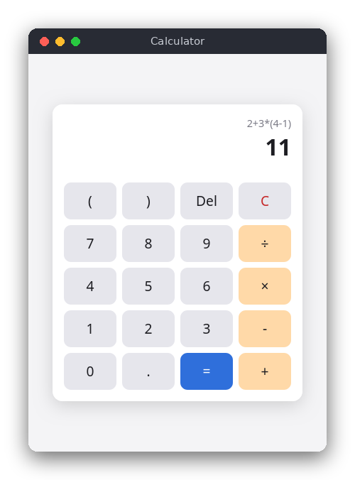

# Calculator (JavaScript)

A calculator page that runs in the browser. Click the buttons or type on the keyboard to build an
expression such as `2+3*(4-1)`. The page shows the expression and its result, and it reports mistakes
such as division by zero or unbalanced parentheses.



## Features

- Buttons for digits, `+ - × ÷`, parentheses, a decimal point, `=`, `Del` (delete last character) and
  `C` (clear).
- The same keys work on the keyboard: `0`-`9`, `.`, `+`, `-`, `*`, `/`, `(`, `)`, `Enter`, `Backspace`,
  `Escape`.
- Unary minus, decimal numbers and operator precedence.
- The last calculation is shown above the result.
- Error messages in red below the display. The expression stays on the screen so you can fix it.
- Works when `index.html` is opened directly from disk (no server, no build step, no npm packages for
  the page itself).

## How to use

1. Click or type an expression, for example `2+3*(4-1)`.
2. Press `=` (or `Enter`). The expression moves to the small line at the top and the result is shown big.
3. Type a number to start a new calculation. Type an operator (`+`, `*`, ...) to continue with the result.
4. `Del` or `Backspace` removes the last character. `C` or `Escape` clears everything.

If the expression is wrong, the message appears in red, for example `Division by zero` for `1/0`.

## How it works

### Two scripts, two jobs

- `src/calculator.js` is the logic. It does not touch the page, so the tests can load it with Node.js.
- `src/main.js` is the page. It reads the buttons and keys, changes the expression, and writes the
  result into the display.

The page loads both as ordinary scripts (not ES modules), so it also works from `file://`. The logic
file ends with one line that exports its functions only when a module system is present:
`if (typeof module !== 'undefined') module.exports = {...}`.

### The grammar

The logic is a recursive-descent parser for this grammar:

```text
expression := term (('+' | '-') term)*
term       := factor (('*' | '/') factor)*
factor     := '-' factor | number | '(' expression ')'
```

Each rule is a function in `src/calculator.js`: the `Parser` class has the methods `expression()`,
`term()` and `factor()`. A rule calls the rule below it for each of its parts, so a lower rule binds more
tightly.

### Step by step: `2 + 3 * (4 - 1)`

`tokenize` first turns the text into tokens: `2`, `+`, `3`, `*`, `(`, `4`, `-`, `1`, `)`, and an `end`
marker.

1. `expression()` calls `term()`, which calls `factor()`. The token is the number `2`, so `factor`
   returns 2. `term` sees `+`, which is not `*` or `/`, and returns 2.
2. `expression()` sees `+`, moves past it and calls `term()` again.
3. `term()` calls `factor()`, which returns 3. It sees `*`, moves past it and calls `factor()`.
4. The token is `(`. `factor()` moves past it and calls `this.expression()` **recursively** for the
   text inside the parentheses. That call handles `4 - 1` exactly like steps 1 and 2 and returns 3. It
   stops at `)`.
5. `factor()` checks for the closing `)`, moves past it and returns 3. The `term` that started with 3
   computes `3 * 3 = 9`. The next token is `end`, so `term()` returns 9.
6. The outer `expression()` computes `2 + 9 = 11`. The next token is `end`, so `evaluate` accepts
   the result.

### The page

`src/main.js` keeps two variables: the text of the expression and the last expression that produced a
result. `press(key)` changes the expression. `=` calls `calculate()`, which calls `evaluate` and writes the
result with `toPrecision(10)`, so `0.1 + 0.2` shows `0.3` instead of `0.30000000000000004`. Buttons
and keys both call `press`; the keyboard handler also calls `preventDefault` so that `/` does not open
the browser's quick find.

### Errors

Each place that expects a certain token throws a `CalculatorError` with a message if it finds something
else:

- `(2 + 3` reaches `end` where `)` was expected: "Unbalanced parentheses".
- `2 3` leaves a number after a complete expression: "Unexpected '3' at position 3".
- `2 +` needs a term but finds `end`: "Unexpected end of expression".
- `1 / 0`: the division checks the divisor first: "Division by zero".
- Characters that are not numbers or operators, such as `$` or `e`, are rejected by the tokenizer.

### Why not `eval`?

`eval("2+3*(4-1)")` would give the same answer, but `eval` runs any JavaScript it is given. Typing
`fetch(...)` or `document.cookie` into a calculator would then run that code in the page. The parser
accepts only numbers, the four operators, unary minus and parentheses, so anything else becomes an error
message. The Python version follows the same rule for the same reason.

## Project layout

```text
calculator/
├── README.md                  this file
├── screenshot.png             picture of the page with an expression and its result
├── package.json               scripts for npm test (no dependencies)
├── src/
│   ├── index.html             the page; loads the two scripts and the stylesheet
│   ├── style.css              colors (light and dark), layout and buttons
│   ├── calculator.js          tokenizer, recursive-descent parser and evaluator (logic only)
│   └── main.js                buttons, keyboard and display
└── tests/
    └── calculator.test.js     tests of the logic, using node:test
```

## Requirements

- A modern web browser (Chrome, Firefox, Safari, Edge) to use the page.
- Node.js 18 or newer, only to run the tests. There are no npm packages to install.

## Run

Open the page directly:

```sh
cd src/vanilla_js/calculator
xdg-open src/index.html   # or double-click the file in your file manager
```

## Test

```sh
npm test
```

The tests load `src/calculator.js` and check precedence, parentheses, unary minus, decimals and each
error message.

## Comparison with the other versions

- [C (terminal)](../../c/calculator)
- [Python (tkinter)](../../python/calculator)

| | C | Python | JavaScript |
|---|---|---|---|
| Interface | terminal (stdin/stdout) | tkinter window | browser page |
| Lines of logic | 221 | 105 | 111 |
| Lines of interface | 31 | 77 | 52 |
| Tests | 32 | 31 | 23 |

All three versions use the same three recursive functions and the same error messages. C has no
exceptions, so each function returns -1 and writes the message into a buffer the caller passes in, while
Python and JavaScript throw an error that travels up the call stack. C also manages its memory by hand:
the token array is a variable-length array on the stack, sized from the length of the text, so nothing
has to be freed. Python and JavaScript convert number text with their own library functions, but they
must not call `eval`, which would run any code typed into the calculator. C has no `eval` at all.

## Ideas for extensions

- Add the power operator `**` and a percent button.
- Keep a history list of earlier calculations under the display.
- Support the keyboard `Delete` key as well as `Backspace`.
- Add square root with a named function token, such as `sqrt(16)`.
- Save the last expression in `localStorage` so it survives a page reload.
