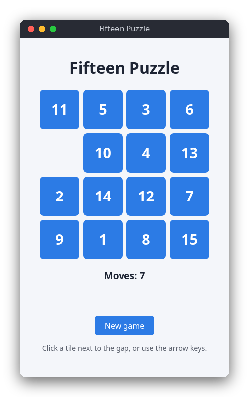

# Fifteen Puzzle (JavaScript)

The fifteen puzzle: fifteen numbered tiles and one gap on a 4×4 board. Slide the tiles into the gap until they are in order from 1 to 15. It runs as a web page with no libraries, it counts your moves and announces the win.



## Features

- 4×4 board, shuffled so that the puzzle can always be solved
- Click a tile next to the gap, or press an arrow key, to slide tiles
- Move counter and a win message when the tiles are in order
- New game button

## How to play

- **Click** a tile that is next to the gap. It slides into the gap.
- **Arrow keys** move the gap in that direction: the tile on that side slides into it. For example, when the gap is in the bottom-right corner, pressing **Up** slides the tile above the gap down into it.
- **New game** shuffles the tiles and resets the move counter.

When the tiles are in order, the page shows `Solved in N moves!`, and clicks and arrow keys stop working until you start a new game.

## How it works

### The board

The board is an array of 16 numbers, read row by row. The number `0` is the gap. `solvedBoard()` returns `[1, 2, …, 15, 0]`. The functions in `src/fifteen_puzzle.js` change the array in place and return `true` when a move happened.

### Moves

- `slide(board, cell)` moves the tile in `cell` into the gap, but only when the two cells are next to each other. A tile diagonal to the gap cannot move.
- `moveGap(board, direction)` finds the neighbor of the gap in the direction (`'up'`, `'down'`, `'left'`, `'right'`) and slides it in with `slide`. At the edge of the board there is no neighbor, so nothing happens.

`main.js` counts a move only when one of these functions returns `true`.

### Shuffle

`shuffle(board, random)` does not place the tiles at random. It starts from the solved board and makes 500 random legal moves with `moveGap`. Every legal move keeps the puzzle solvable, so the result is always solvable. The random source is a parameter: it defaults to `Math.random`, and the tests pass a seeded generator, so the same seed gives the same shuffle. (If the walk ends on the solved board, the shuffle starts again.)

### Solvability rule

Not every arrangement of the tiles can be solved. For a board with an even width (4 columns), a board is solvable when

> **inversions + row of the gap (counted from the top, starting at 0) is odd**

An *inversion* is a pair of tiles where the larger number comes before the smaller one, reading row by row. The gap is ignored. The solved board has no inversions and the gap is in row 3, so 0 + 3 = 3 is odd: it is solvable. Swapping tiles 14 and 15 gives one inversion, and the gap is still in row 3, so 1 + 3 = 4 is even: that position can never be solved. `isSolvable()` checks this rule. The shuffle does not need it, but the tests use it to check the shuffle and the swap example.

### Solved check

`isSolved(board)` compares the array with `solvedBoard()`.

### The page

The logic is in `src/fifteen_puzzle.js` and does not touch the page. `src/main.js` builds one button per cell after every move, from the current board. Clicks call `slide`, and a `keydown` listener on the document calls `moveGap` for the arrow keys. Both then redraw the board, the counter and the message. The two scripts are classic scripts, not ES modules, so the page also works when you open `index.html` straight from disk. The logic file ends with a `module.exports` line that is used only by the Node tests.

## Project layout

```
README.md
package.json                 the test command (no dependencies)
screenshot.png
src/index.html               the page; loads the logic first, then main.js
src/style.css                the layout and colors (light and dark)
src/fifteen_puzzle.js        the rules: moves, shuffle, solved and solvable checks
src/main.js                  the page: draws the board, clicks, arrow keys
tests/fifteen_puzzle.test.js tests of the rules, using node:test
```

## Requirements

- A modern web browser (Chrome, Firefox, Safari or Edge)
- To run the tests: Node.js 18 or newer

## Run

Open `src/index.html` in your browser. There is nothing to install.

## Test

```sh
npm test
```

The tests do not use the browser. They check the moves at the edges, the rule for sliding tiles, the solved check, the unsolvable swap, and that every shuffle is solvable and reproducible from its seed.

## Comparison with the other versions

- [C version](../../c/fifteen_puzzle) (ncurses terminal)
- [Python version](../../python/fifteen_puzzle) (tkinter window)

| | C | Python | JavaScript |
|---|---|---|---|
| Interface | ncurses terminal | tkinter window | browser page |
| Lines of logic | 112 | 45 | 64 |
| Lines of interface | 68 | 60 | 38 |
| Tests | 8 | 9 | 9 |

The rules are the same in all three versions, and so are the names of the functions. In the browser the events come for free: a click on a button and a `keydown` on the document are all the input handling needed, and the page is redrawn from the board rather than updated piece by piece. C has to do everything by hand: it switches the terminal into keypad mode, reads the arrow keys and redraws the screen. Python sits in between, with tkinter handling the clicks and the key bindings, and the logic is the shortest because lists and `random.choice` do most of the work.

## Ideas for extensions

- Show a timer next to the move counter
- Add a 3×3 or 5×5 board (the solvability rule for odd widths is different, so check the new rule)
- Add an undo button that remembers the moves
- Save the best (fewest) moves in `localStorage` and show them at the start
- Add a hint that shows the next move of a solution found by breadth-first search
