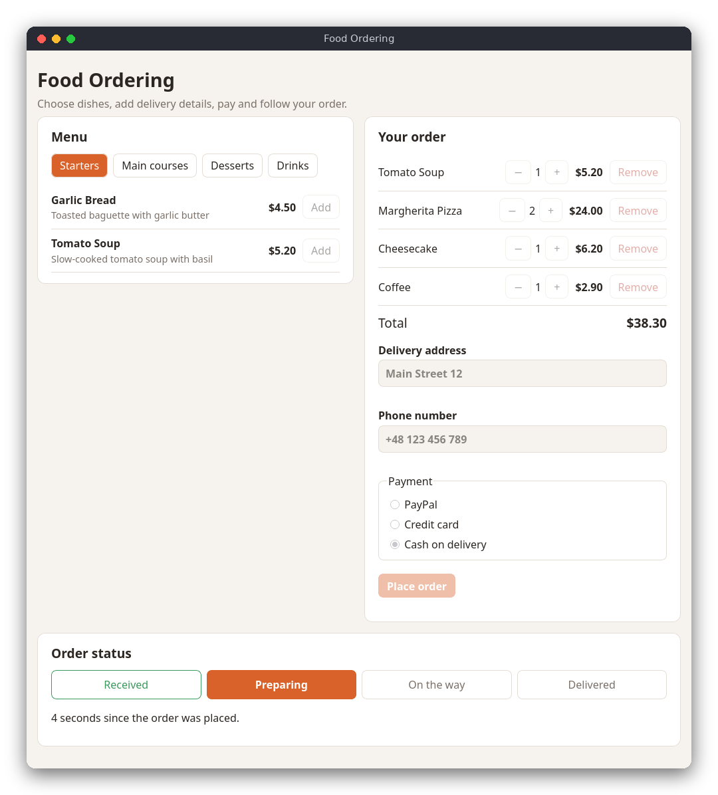

# Food Ordering (JavaScript)

A food ordering web page. You browse a menu of ten dishes by category, build an order, enter a delivery address and phone number, choose a way to pay (PayPal, a credit card or cash on delivery) and place the order. The page then simulates the delivery: the order goes from *Received* to *Preparing*, *On the way* and *Delivered*.

The same program is also written in [C](../../c/food_ordering) and [Python](../../python/food_ordering). The three versions have the same menu and the same rules.



## Features

- Ten dishes in four categories (starters, main courses, desserts, drinks), each with a description and a price
- Add dishes to the order, change quantities (up to 20 per dish) with the − and + buttons, and remove them
- Totals are computed in whole cents, so no rounding errors appear
- Validated delivery address and phone number, with messages under each field
- Payment by PayPal, by credit card (the number is checked with the Luhn algorithm) or in cash
- A status panel that moves through *Received*, *Preparing*, *On the way* and *Delivered*, updated every second

## How to use

Open `src/index.html` in a web browser. You do not need a web server or an internet connection: the page works straight from your disk.

1. Choose a category (for example *Main courses*) and press **Add** next to a dish.
2. Use **+** and **−** in *Your order* to change the quantity, or **Remove** to delete the dish. The total is always shown.
3. Type a delivery address such as `Main Street 12` and a phone number such as `+48 123 456 789`.
4. Choose a payment method. For a credit card, type a number such as `4539 1488 0343 6467`.
5. Press **Place order**. The status panel appears and the steps change every few seconds. When the order is delivered, press **Start a new order**.

After the order is placed, the order and the delivery details cannot be changed.

## How it works

**Files.** `food_ordering.js` holds the rules and has no page code in it. `main.js` draws the page and reacts to clicks. The two files are *classic* scripts loaded one after the other from `index.html`, not ES modules: browsers refuse to load modules from `file://` pages, and classic scripts work everywhere. The rules file ends with a line that exports its functions only when Node.js runs the tests (`typeof module !== 'undefined'`).

**Data.** `MENU` is an array of objects such as `{ id: 3, name: 'Margherita Pizza', priceCents: 1200, category: 'main' }`. Prices are integers in cents, so `$9.90` is `990`. An order is a plain object: `lines` maps a dish id to its quantity, `address` and `phone` are strings, `payment` is `'paypal'`, `'card'`, `'cash'` or `null`, `cardLast4` keeps the last four digits of a card, and `placedAt` is the time in milliseconds (from `Date.now()`) or `null` before placing.

**Order rules.** `setQuantity` sets the quantity of a dish and removes the dish when the quantity is 0. `addDish` adds to the current quantity. `totalCents` multiplies each price by its quantity and adds the results. `formatMoney` turns cents into text such as `$4.50`. Once an order is placed (`isPlaced`), every change function returns `false`.

**Validation.**
- `validateAddress` trims the text. It must have 5 to 100 characters, at least one digit (the house number) and at least one letter (the street name).
- `validatePhone` removes spaces, `-`, `(` and `)`. It may start with `+` and must contain 9 to 15 digits. A regular expression `^\d{9,15}$` checks the digits.
- Both functions return the cleaned value, or `null` when the input is not valid.

**Luhn check.** The Luhn algorithm finds typing mistakes in card numbers. Starting from the last digit and moving left, every second digit is doubled. If a doubled digit is greater than 9, subtract 9. Add all the digits. A valid number gives a total that ends in 0. For example, the valid number `4111 1111 1111 1111` gives a total of 30. Changing its last digit to `2` gives a total of 31, so the number is rejected. `luhnIsValid` does this.

**Placing the order.** `placeOrder(order, nowMs)` checks in turn that the order is not empty, that there is an address and a phone number, and that a payment method is chosen. It returns the reason as a string, or `null` when the order is placed. In `main.js`, the **Place order** button first checks the fields and shows a message under each wrong one. Then it saves the values with the rules and calls `placeOrder`.

**Status.** `statusAt(elapsedSeconds)` is a pure function that returns the index of a status in `STATUS_NAMES`. Each status lasts `STATUS_STEP_SECONDS` (3 seconds), so an order is delivered after 9 seconds. The tests call it with fixed numbers.

**Page.** `main.js` keeps one variable, `order`, and one for the selected category. `renderAll()` draws the menu, the order, the delivery fields and the status from these variables, so every click ends with a redraw. The buttons do not have their own handlers: `init` listens to clicks on the containers and finds the button with `closest('[data-add]')` and similar calls. While the order is placed, `setInterval(renderStatus, 1000)` redraws the status panel once a second, and the timer stops when the order is delivered.

## Project layout

```text
food_ordering/
├── README.md                    this file
├── screenshot.png               picture of the page
├── package.json                 the test command (npm test); no dependencies
├── src/
│   ├── index.html               the page: menu, order, delivery form and status
│   ├── style.css                layout, colors (light and dark) and the phone layout
│   ├── food_ordering.js         the rules: menu, order, validation, Luhn check, status
│   └── main.js                  drawing the page and handling clicks
└── tests/
    └── food_ordering.test.js    tests of the rules with node:test
```

## Requirements

- A modern web browser (Firefox, Chrome, Edge or Safari) to use the page
- Node.js 18 or newer, only to run the tests (no packages are installed)

## Run

Open the page in a browser:

```sh
xdg-open src/index.html        # Linux; on macOS use: open src/index.html
```

or drag `src/index.html` into a browser window.

## Test

```sh
npm test
```

The tests check the menu, quantities and limits, totals in cents, address and phone validation, the Luhn check, card payment, the rules for placing an order and the status over time. They use `node:test` and do not need a browser.

## Comparison with the other versions

- [C version](../../c/food_ordering)
- [Python version](../../python/food_ordering)

| | C | Python | JavaScript |
|---|---|---|---|
| Interface | terminal, numbered menu | terminal, numbered menu | browser page |
| Lines of logic | 257 | 152 | 140 |
| Lines of interface | 237 | 168 | 158 (plus 59 lines of HTML and 229 of CSS) |
| Tests | 10 | 12 | 11 |

The browser version is the only one with a page to redraw, so the code is split: the rules know nothing about the page, and `main.js` only copies the rules' results to the screen. The order is a plain object with a few fields, which keeps the rules short. Input from the browser comes as text, so numbers from the page are converted with `Number()` before they reach the rules. The status also uses the clock differently: `Date.now()` gives milliseconds and a timer redraws the page, while the other two versions compute the status only when the user asks for it.

## Ideas for extensions

- Save the order in `localStorage`, so that a page reload does not lose it
- Add a discount code that lowers the total
- Check the expiry date of the card as well as the number
- Let the user choose a time for the delivery
- Show the status with an animated progress bar
