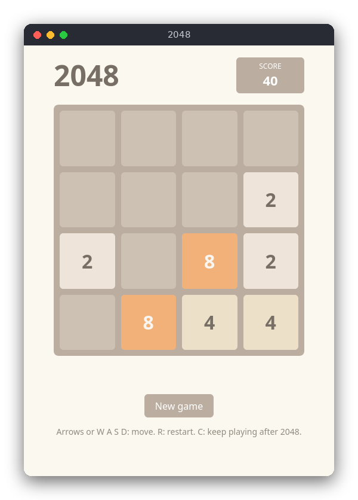

# 2048 (JavaScript)

2048 is a sliding-tile puzzle on a 4×4 board. Each move slides every tile in one direction; equal tiles that meet merge into their sum. It runs in the browser with no libraries, and the goal is to make a tile with the value 2048.



## Features

- Slide the tiles with the arrow keys or W, A, S, D
- Equal tiles merge once per move and add their value to the score
- After each move that changes the board, a new 2 (90%) or 4 (10%) appears on a random empty cell
- Win message at 2048, with the option to keep playing
- Game over when no move is possible
- Restart with R or the New game button

## How to play

Open `src/index.html` in a browser. Move the tiles with the arrow keys or W A S D.

| Key | Action |
|---|---|
| ↑ ↓ ← → or W A S D | Slide all tiles |
| R or the New game button | Start a new game |
| C | Keep playing after reaching 2048 |

Example: the board has `2 2 0 0` in the first row. Pressing `A` (left) turns it into `4 0 0 0`, adds 4 to the score and places a new 2 or 4 on a random empty cell.

## How it works

The code is split in two. `src/game_2048.js` contains the rules and has no DOM access. `src/main.js` draws the board and handles the keys.

### Board and game state

A game is a plain object: `board` is an array of four rows, each an array of four numbers (`0` means an empty cell), `score` is the total score, and `keepPlaying` is set when the player chooses to continue after 2048. `newGame()` creates one with two tiles.

### Sliding one line

`slideRow(line)` handles one array of four numbers, always sliding towards index 0:

1. Keep the non-zero values in `tiles`, in order. This closes the gaps.
2. Walk through `tiles` from the start. If two neighbours are equal, push their sum to `merged` and move past both. Otherwise push the single tile.
3. Pad `merged` with zeros and return it with the points gained.

Moving past both tiles after a merge is what makes a merge happen only once per move. For `[4, 4, 8, 0]` the two 4s merge into 8, and that 8 does not merge with the 8 after it, so the result is `[8, 8, 0, 0]`.

### The four directions from one slide

`slideRow` only slides towards the start of a line. `lineCells(direction, index)` returns the `[row, column]` pairs of one row or column in the order of the direction: for `'right'` the first pair is the rightmost cell, for `'up'` it is the top cell, and so on.

`slideBoard` does the same for each of the four lines in the chosen direction:

1. Read the values of the cells in direction order.
2. Call `slideRow` on those values.
3. Write the result back to the same cells.

The board itself is never rotated or transposed. The order of the cells decides which way the tiles move, so one slide function serves all four directions.

### A move

`move(game, direction)` does nothing if the game is won (and not continued) or lost. Otherwise it slides the board and compares the board with its copy from before the move, using `JSON.stringify`. If nothing changed, it returns `false` and no tile appears. If the board changed, `spawnTile` picks one of the empty cells with `randomBelow(count)` and then draws the value with `randomBelow(10)`: 0 gives a 4, anything else gives a 2.

### Win and lose

`gameStatus(game)` returns `'won'` when a tile of 2048 or more exists and the player has not chosen to continue. It returns `'lost'` when `canMove(board)` finds no empty cell and no two equal neighbours. Otherwise it returns `'playing'`.

### The page

`main.js` listens for `keydown` on the document. It maps the key to a direction, calls `move`, and then `render`, which rebuilds the 16 cells as `div` elements. Each tile gets a CSS class such as `tile-64`, and the colors are in `style.css`. The page uses two classic scripts, not ES modules, so it works when opened from disk (`file://`).

## Project layout

```
package.json               the test command (node --test); no dependencies
README.md
screenshot.png
src/index.html             the page: loads game_2048.js, then main.js
src/style.css              layout, colors and the tile styles
src/game_2048.js           the rules: slide, merge, spawn, win and lose checks
src/main.js                the page: drawing, keys and the New game button
tests/game_2048.test.js    tests of the rules, with a scripted random source
```

## Requirements

- A modern browser to play
- Node.js 18 or newer to run the tests (no npm packages are needed)

## Run

Open `src/index.html` in a browser. There is no build step and no server.

## Test

```sh
npm test
```

The tests check the classic merge cases, every direction, the spawn rules, and the win and lose states. They use the built-in `node:test` runner and need no browser.

## Comparison with the other versions

- [C](../../c/game_2048) (ANSI terminal)
- [Python](../../python/game_2048) (tkinter window)

| | C | Python | JavaScript |
|---|---|---|---|
| Interface | ANSI terminal | tkinter window | browser page |
| Lines of logic | 132 | 87 | 107 |
| Lines of interface | 116 | 79 | 56 |
| Tests | 10 | 13 | 10 |

C needs the most explicit code: the board is a fixed array, the random source is a function pointer, and the direction logic works on indices. Python expresses the same logic with lists and `zip`, so the slide code is shorter, and its tests can replace the random source with any function. JavaScript does the board copy and comparison with `JSON.stringify`, and its page runs straight from disk because it uses classic scripts. In all three versions the rules do not know about the screen, so the tests run without a terminal, a window or a browser.

## Ideas for extensions

- Save the best score in `localStorage`
- Add undo: keep a stack of previous games
- Animate the sliding tiles with CSS transitions
- Support a board size other than 4×4 (the code uses `SIZE`)
- Add a swipe gesture for touch screens
