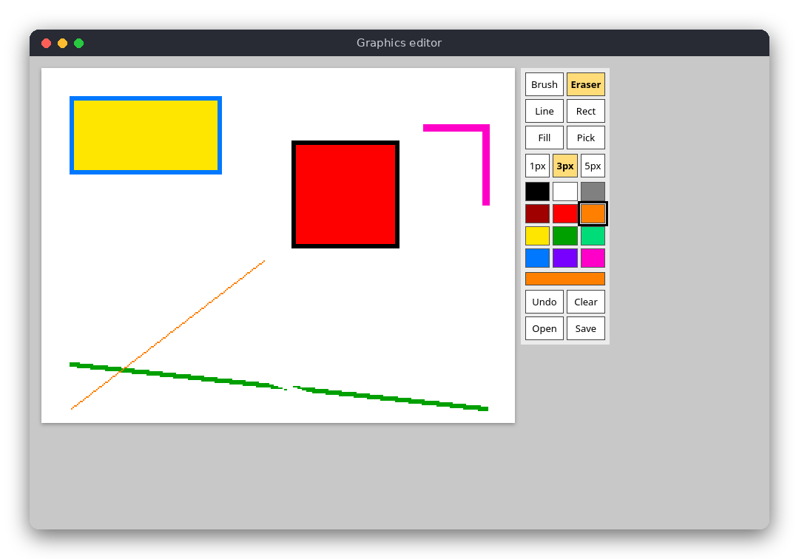

# Graphics Editor (JavaScript)

A small paint program that runs in the browser. You draw on a 320×240 canvas (shown at twice its size) with a brush, an eraser, a straight line, a rectangle, a flood fill and a color picker, you can undo your steps, and you can save a PNG download or open an image file.

The same program is also written in [C](../../c/graphics_editor) and [Python](../../python/graphics_editor). All three have the same tools and the same rules.



## Features

- Brush with three sizes (1, 3 and 5 pixels), eraser (a brush that paints white)
- Straight line and rectangle outline, shown while you drag the mouse
- Flood fill of an enclosed region
- Color picker and a palette of 12 colors
- Undo (the last 20 steps) and clear canvas
- Save a PNG (`Ctrl+S`, a download) and open an image file (`Ctrl+O`)
- Keyboard shortcuts for all tools

## How to use

Open `src/index.html` in a browser (double-click it; no server is needed). Drag the left mouse button on the canvas to draw with the selected tool. Use the buttons on the right to choose a tool, a brush size, a color, or to undo, clear, open or save.

| Key | Action |
|---|---|
| `B` / `E` | brush / eraser |
| `L` / `R` | line / rectangle |
| `F` / `P` | fill / color picker (click a pixel to take its color) |
| `1` / `2` / `3` | brush size 1, 3 or 5 pixels |
| `N` | clear the canvas |
| `Ctrl+Z` | undo |
| `Ctrl+S` | save the picture as `drawing.png` (a download) |
| `Ctrl+O` | open an image file |

The image you open is drawn at its top-left corner and cut off at 320×240 pixels.

## How it works

### The logic and the page

The project has two script files, loaded in order by `index.html`:

- `src/graphics_editor.js` is the logic. It does not touch the page, so the tests can run it with Node.js.
- `src/main.js` is the page: it reads the buttons, the mouse and the keyboard, calls the logic and draws the result.

The page uses classic scripts, not ES modules, so it also works when opened straight from disk (`file://`).

### The canvas

A canvas is an object `{ width, height, pixels }`, where `pixels` is a `Uint8Array` with three bytes per pixel (r, g, b), row by row: the pixel `(x, y)` starts at byte `(y * width + x) * 3`. `setPixel` ignores positions outside the canvas, so a line or a brush stroke can run past the edge.

### The brush and the eraser

A brush of width 1, 3 or 5 is a square of pixels centred on the mouse position (`stamp`). While you drag, the program draws a line from the previous mouse position to the current one, stamping the brush at every step, so a fast movement does not leave gaps. The eraser is the same brush painted in white.

### The line: Bresenham's algorithm

Bresenham's algorithm chooses the pixels of a line on a grid with additions and comparisons only:

1. Let `dx = |x1 - x0|` and `dy = -|y1 - y0|`, and let `err = dx + dy`.
2. Paint `(x0, y0)`. Stop when it equals `(x1, y1)`.
3. Let `e2 = 2 * err`. If `e2 >= dy`, step in x (`err += dy`). If `e2 <= dx`, step in y (`err += dx`).
4. Go back to step 2.

`err` measures how far the pixels chosen so far are from the ideal line. Each step moves in the direction that keeps them closest to it. The function is `drawLine` in `src/graphics_editor.js`.

### The rectangle

`drawRect` draws four lines between the two corners. It is an outline: the inside keeps its colors.

### The flood fill: an explicit stack

Flood fill starts at the clicked pixel and paints every pixel that has the same old color and can be reached through up, down, left and right steps. A recursive version would call itself for every neighbour, and a big canvas could overflow the call stack. `floodFill` keeps an array of pixels still to visit and uses it as a stack:

1. If the clicked color already equals the new color, stop.
2. Paint the clicked pixel and push it onto `stack`.
3. While `stack` is not empty: pop a pixel, and for each neighbour that has the old color, paint it and push it.

A pixel is painted when it is pushed, so it is never pushed twice. Pixels of other colors (walls) are never entered, so the fill stops at the borders of the region.

### Undo

`pushHistory` stores a copy of the canvas before each change, keeping at most 20 copies. `undoHistory` returns the newest copy, or `null` when there is nothing to undo, and `main.js` shows it.

### Saving and opening

`downloadPng` paints the canvas onto a hidden `<canvas>`, turns it into a PNG blob with `toBlob`, and clicks a link with the `download` attribute. `Open` clicks a hidden `<input type="file">`; the chosen image is drawn into a 320×240 canvas, and its pixels are copied into the logic canvas.

### The page loop

Mouse events on the canvas call `pressCanvas`, `dragCanvas` and `releaseCanvas`. Each call changes `state.canvas` (or, while you drag a line or rectangle, `state.preview`, a copy that shows the shape), and then `render` paints the canvas with `ImageData` and `putImageData`. The screen position is divided by the 2× display size to get the canvas pixel.

## Project layout

```
package.json              the test command (no dependencies)
src/index.html            the page; loads the two scripts and the stylesheet
src/style.css             layout and colors of the page
src/graphics_editor.js    the logic: canvas, brush, Bresenham line, rectangle, flood fill, undo
src/main.js               the page: buttons, mouse, keyboard, drawing, files
tests/graphics_editor.test.js  tests of the logic (Node.js built-in test runner)
```

## Requirements

- A modern browser (Firefox, Chrome, Edge or Safari) to run the editor
- Node.js 18 or newer to run the tests (no npm packages are needed)

## Run

Open `src/index.html` in the browser.

## Test

```sh
npm test
```

The tests check that a line has the right endpoints and pixel count (also when drawn backwards), that a steep line has one pixel per row, that a brush is clipped at the border, that a rectangle outline has the expected border pixels, that flood fill stops at the walls and does nothing with the same color, that a fill of the whole 320×240 canvas works, that undo restores the previous image and drops the oldest snapshot when full, and that a copy is independent of the original.

## Comparison with the other versions

- [C](../../c/graphics_editor)
- [Python](../../python/graphics_editor)

| | C | Python | JavaScript |
|---|---|---|---|
| Interface | SDL2 window | tkinter window | browser page |
| Lines of logic | 175 | 86 | 130 |
| Lines of interface | 389 | 187 | 249 |
| Tests | 13 | 13 | 14 |
| File format | BMP (SDL2 only) | PNG (Tk PhotoImage) | PNG (download, file input) |

The browser does a lot of the work here: the file dialog, the PNG download and the mouse coordinates come from the page, so the JavaScript version needs no file-format code. Its logic is still plain arrays and typed arrays, so it reads like the other two versions. The C version has to free every canvas and undo snapshot itself, and it draws its buttons from rectangles and lines, which is why its window code is the longest. The Python version sits in between: tkinter handles PNG and events, and the logic is a simple list of tuples.

## Ideas for extensions

- Add a circle tool (the midpoint circle algorithm, a relative of Bresenham's)
- Add a zoom slider and scrolling for bigger pictures
- Add a selection rectangle that can be copied and moved
- Support touch screens with pointer events
- Add undo for the color picker and redo (`Ctrl+Y`) with a second history stack
