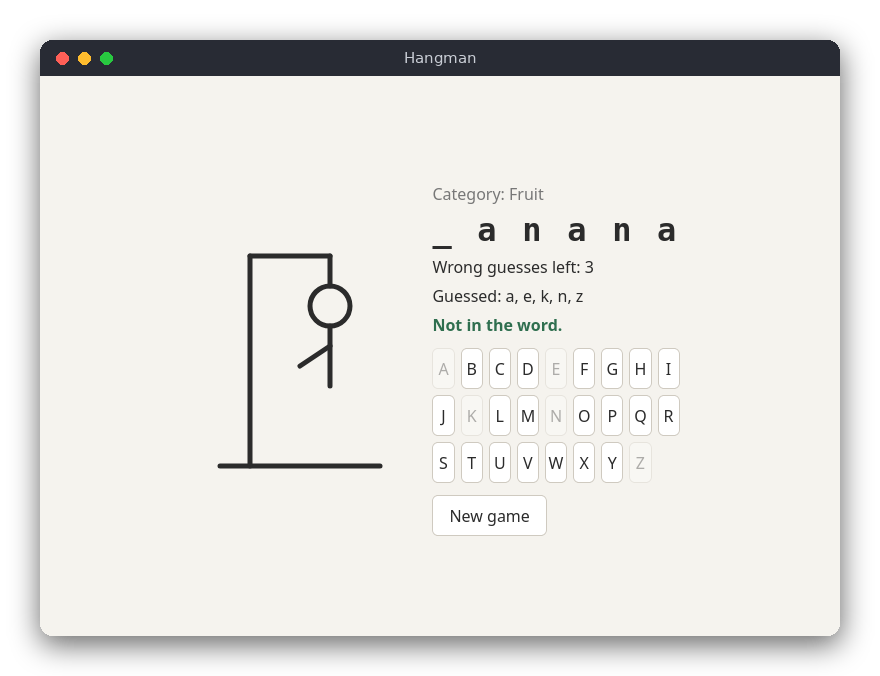

# Hangman (JavaScript)

Hangman (Polish: *szubienica*) in the browser. The computer picks a secret word from a list and shows it as underscores. You guess letters with the on-screen keys or the real keyboard: correct guesses reveal every matching position, and each wrong guess draws one more part of the hanged figure in SVG. Six wrong guesses and the game is lost.



## Features

- A random word from 20 built-in English words, in four categories (Animal, Fruit, Country, Coding)
- The category is shown as a hint
- Correct guesses reveal all occurrences of the letter
- Six wrong guesses allowed, one per part of the figure
- Repeated guesses are ignored with a message; used letters are greyed out
- Win and lose messages reveal the word, then you can start a new game
- No dependencies: no npm packages and no build step

## How to play

Open `src/index.html` in a browser (you can double-click it). Then either:

- click a letter on the on-screen keyboard, or
- press the letter on your keyboard.

The page shows the category, the word with `_` for unknown letters, the number of wrong guesses left, the letters you have guessed and a message about the last guess. Press **New game** to start again.

## How it works

The project is split into the rules (`src/hangman.js`), which know nothing about the page, and the page (`src/main.js`), which does the drawing and handles events.

- **Word list** (`WORD_LIST`): an array of `{ category, word }` objects.
- **Choosing a word**: `chooseEntry(list, random)` takes a function that returns a number in `[0, 1)`. The page passes `Math.random`; the tests pass a fixed function, so the choice is repeatable.
- **Game state**: `createGame(entry)` returns a plain object with `category`, `word`, a `Set` of guessed letters and the number of `misses`.
- **Applying a guess** (`applyGuess()`): returns one of the `GUESS` values. Anything that is not a single letter a-z is `INVALID`. The letter is lowercased; a letter already in `guessed` is `REPEAT`. Otherwise it is added to `guessed`; if the word contains it the result is `HIT`, else `misses` goes up and the result is `MISS`.
- **Masked word** (`maskedWord()`): maps each letter to itself if guessed, or to `_`, and joins them with spaces.
- **Game status** (`gameStatus()`): `LOST` after `MAX_MISSES` (6) misses, `WON` when every letter is guessed, `PLAYING` otherwise.

In `main.js`, the on-screen keys are created in a loop and the `keydown` listener sends letters to `handleGuess()`. `render()` updates the text and then shows or hides the parts of the figure: each `<circle>` or `<line>` in `index.html` has a `data-stage` number, and parts with a stage above the miss count get the `hidden` class. The figure is plain SVG, so it needs no canvas code.

The scripts are classic scripts, not ES modules, so `index.html` also works when opened directly from disk (`file://`). `hangman.js` exports its functions with `module.exports` only when `module` exists, which lets `node --test` load it.

## Project layout

```text
hangman/
├── README.md             this file
├── screenshot.png        a game in progress
├── package.json          the test command (no dependencies)
├── src/
│   ├── index.html        the page: SVG figure, text, keys
│   ├── style.css         colors (light and dark) and layout
│   ├── hangman.js        the rules: word list, guesses, game state (no DOM)
│   └── main.js           the page: drawing, buttons, keyboard events
└── tests/
    └── hangman.test.js   tests of the rules with node:test
```

## Requirements

- A modern browser (Chrome, Firefox, Edge, Safari)
- Node.js 18 or newer, only to run the tests

## Run

Open `src/index.html` in a browser.

## Test

```sh
npm test
```

The tests cover choosing a word with a fixed random source, masking, hits that reveal every occurrence, misses, repeated and invalid guesses, uppercase letters, winning and losing.

## Comparison with the other versions

- [C](../../c/hangman) (terminal)
- [Python](../../python/hangman) (tkinter window)

| | C | Python | JavaScript |
|---|---|---|---|
| Interface | terminal (stdio, ANSI codes) | tkinter window | browser page |
| Lines of logic | 63 | 58 | 46 |
| Lines of interface | 108 | 92 | 53 |
| Tests | 9 | 14 | 10 |

The browser gives the figure for free: the six body parts are ordinary SVG elements that are shown or hidden with a CSS class, instead of being drawn by hand as in the other two versions. Guesses come from two sources (buttons and the keyboard), which in JavaScript are just two event listeners calling the same function. Objects and `Set` are enough for the state, so there is no class and no memory to manage, unlike the `bool` array in C.

## Ideas for extensions

- Add a "hint" button that reveals one random letter at the cost of an attempt.
- Save the score of wins and losses in `localStorage`.
- Let the player choose a category before the game starts.
- Animate the part that is added on each miss.
