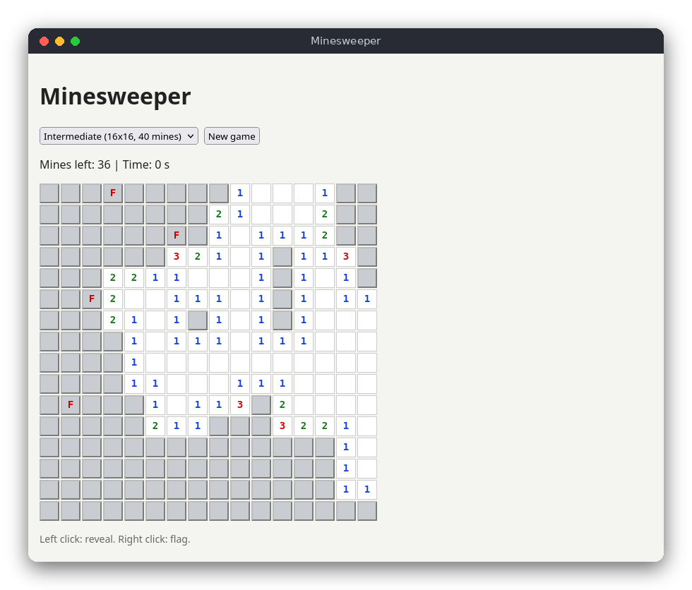

# Minesweeper (JavaScript)

The classic Minesweeper game in the browser. Uncover the cells without touching a mine: each opened cell shows how many of its eight neighbors hide a mine, and you use those numbers to find every safe cell. Plain HTML, CSS and JavaScript with no libraries; the rules are in their own file, separate from the page code, and are tested with Node.js.



## Features

- Three levels: Beginner 9x9 (10 mines), Intermediate 16x16 (40 mines), Expert 16x30 (99 mines)
- The first cell you open is never a mine, and neither are its neighbors
- Opening an empty cell opens the whole empty area around it (flood fill)
- Right-click flags, and a counter of mines left (mines minus flags)
- Timer, win when every safe cell is open, loss when you open a mine (all mines are then shown)

## How to play

Open `src/index.html` in a browser and choose a level in the drop-down list (this starts a new game). Use **New game** to start again with the same level.

- **Left click** a hidden cell to open it.
- **Right click** a hidden cell to put a flag on it, or to remove the flag.

The number in an open cell counts the mines in the eight cells around it. An empty open cell has no mines around it.

## How it works

**Data.** `Game` in `src/minesweeper.js` keeps four 2D arrays of the same size, one row of arrays per board row: `mine` (true where a mine is), `neighbors` (the count of mines around each cell), `revealed` and `flagged`. It also keeps the counters (`revealedCount`, `flagCount`) and `state`, which is `'playing'`, `'won'` or `'lost'`.

**Random layout.** `Game` takes its random source as a parameter. The page uses `Math.random`; the tests use `makeRandom(seed)`, a small seeded generator (mulberry32), so the same seed always gives the same board.

**Mines after the first click.** The mines are placed by the first `reveal`, not in the constructor. `placeMines` picks random cells and skips the clicked cell and its eight neighbors. The first click therefore always opens a cell with no mine and usually starts a large opening. Then `countMinesAround` fills in the numbers.

**Flood fill.** `revealCell` opens a cell and, if its number is 0, calls itself for each of the eight neighbors. A cell that is already open or flagged is skipped, which stops the recursion. The result is the connected empty area plus the numbered cells on its border. This is a flood fill: it starts from one cell and spreads through the connected empty cells, like water. It cannot reach a mine, because a cell next to a mine is never empty.

**Win and loss.** Opening a mine sets `state` to `'lost'` and marks all mines as revealed. After each opening, `reveal` compares `revealedCount` with the number of safe cells (`rows * cols - mines`); when they are equal, the state becomes `'won'`.

**Flags.** `toggleFlag` flips the flag of a hidden cell and changes `flagCount`. The getter `minesLeft` returns `mineTotal - flagCount`.

**The page (`src/main.js`).** `newGame` creates a `Game` for the chosen level, builds one `<button>` per cell and starts a one-second timer. Clicks call `reveal` or `toggleFlag` on the logic, and then `render` updates the text, the classes and the status line of every cell. `src/index.html` loads `minesweeper.js` before `main.js`, so the page can use the `Game` class. The page is a set of ordinary scripts (not modules), so it also works when opened straight from disk.

## Project layout

```text
src/vanilla_js/minesweeper/
├── package.json          the test command (npm test); no dependencies
├── README.md             this file
├── screenshot.png        the game in progress
├── src/
│   ├── index.html        the page
│   ├── style.css         colors and layout
│   ├── minesweeper.js    the rules: mines, numbers, flood fill, flags, win and loss
│   └── main.js           the page: buttons, clicks, status line, timer
└── tests/
    └── minesweeper.test.js   tests of the rules
```

## Requirements

- A modern web browser (Chrome, Firefox, Safari or Edge) to play
- Node.js 18 or newer to run the tests. No npm packages are needed.

## Run

Open `src/index.html` in your browser. There is no build step and no server.

## Test

```sh
npm test
```

The 13 tests cover: no mines before the first click, the first click and its neighbors being safe, neighbor counts, flood fill (opening an area and stopping at numbers), losing on a mine, winning when all safe cells are open, flags and the counter, and moves outside the board.

## Comparison with the other versions

- [C (terminal)](../../c/minesweeper)
- [Python (tkinter)](../../python/minesweeper)

| | C | Python | JavaScript |
|---|---|---|---|
| Interface | terminal (text commands) | tkinter window | browser page |
| Lines of logic | 113 | 75 | 100 |
| Lines of interface | 113 | 87 | 88 |
| Tests | 13 | 13 | 13 |

The rules are the same in all three versions, so the differences come from the language. C keeps the board in fixed-size arrays inside one struct, and the random generator state lives inside that struct, so there are no global variables. Python uses lists and the standard `random.Random`, which makes seeding easy. JavaScript has no seedable `Math.random`, so the logic brings a small seeded generator with it. The interface differs most: C reads a line and redraws the board, while the tkinter and browser versions react to clicks and need a timer.

## Ideas for extensions

- Play again after a game ends, without restarting the program
- Chording: clicking a number whose flags are complete opens its other neighbors
- Keep the best time for each level in `localStorage`
- Color the flags and show a question mark for "maybe a mine"
- Add a custom level with width, height and mine inputs
